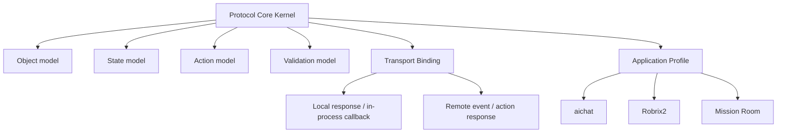
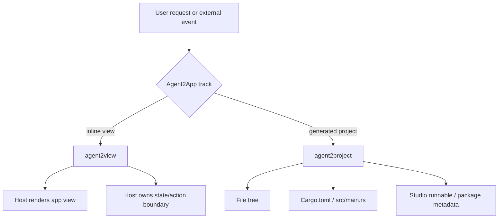

# Goals and Boundaries

The core goal of Agent2App is to define how an Agent hands a structured app view to a Host for rendering, and how user operations inside that view return to the Host or Agent.

This specification currently covers only `agent2view`.

## Core Goals

`agent2view` must solve five problems:

1. How an Agent declares the app view it wants rendered.
2. How the Host validates app type, state, template, and action.
3. How the Host stores state so authoritative state is not lost when widgets are destroyed.
4. How user actions return to the Host or Agent while keeping shared-fact boundaries clear.
5. How the same protocol semantics fit both local Agents and remote Agents.

## Layer Boundaries

The protocol kernel does not care whether the Agent is local or remote, nor whether the transport is an LLM response, Matrix event, HTTP, WebSocket, or a future event system. The kernel defines only stable semantics: AppType, AppInstance, Scope, Snapshot, Template, Action, ActionResult, Capability, and Validation.

The transport binding maps those semantics to concrete carriers. For example, aichat puts the view in a `runsplash` block inside an assistant message; Robrix2 puts the view in an `org.octos.app` envelope inside a Matrix event.

The application profile defines a specific Host's capabilities, restrictions, and UX policy. aichat and Robrix2 are profiles, not two mutually exclusive protocols.

## Two Product Tracks

## Agent2View

`agent2view` means the Agent output becomes a live view inside the Host. It is not an independent project and does not own a full process, file tree, or packaging lifecycle.

It fits:

- aichat inline `runsplash` demos.
- Robrix2 weather/news cards.
- Robrix2 mission room control surfaces.

## Agent2Project

`agent2project` means the Agent generates an independent Makepad project or app artifact.

It must at least define:

- file tree;
- `Cargo.toml`;
- `src/main.rs`;
- resource files;
- state modules;
- event/action handlers;
- Studio runnable item;
- export and packaging metadata.

Agent2Project must not reuse the Agent2View runtime capability manifest. The former is a build artifact contract; the latter is a Host runtime capability boundary.

## Out of Scope for This Edition

This edition does not define:

- a code-generation project protocol;
- a plugin marketplace;
- an execution protocol for LLM-generated templates in the Robrix2 production path;
- multi-Agent resolver/template-author role separation;
- an automatic repair loop.
