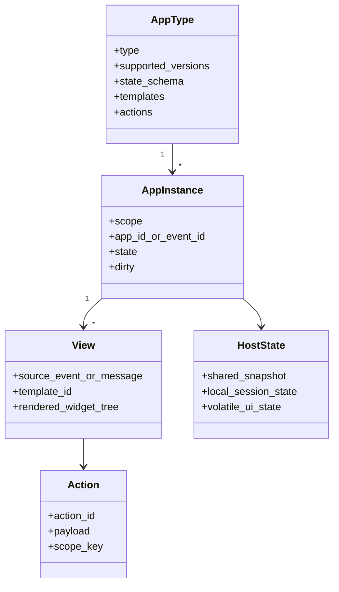

# Domain Model

The core objects in the Agent2View protocol are shown below.

## AppType

AppType is the global definition of an application type, for example:

- `counter`
- `timer`
- `calculator`
- `collection`
- `weather`
- `news`
- `mission_room`
- `mission_dashboard`

AppType determines:

- supported protocol versions;
- schema for `initial_state`;
- available templates;
- available actions;
- routing rules for local reducers or shared action responses.

## AppInstance

AppInstance is a concrete runtime entity of an AppType under a scope.

It is not the same as a single message. A `room` scoped app may be rendered by multiple messages while pointing to the same instance.

## View

View is one visible rendering of an AppInstance.

In aichat, a `runsplash` block inside an assistant message is a view.

In Robrix2, a Splash card rendered from a Matrix timeline item is a view.

## HostState

HostState is state owned by the Host.

It can be:

- aichat's `APP_DEMO_STATE`;
- Robrix2's `AgentViewSession.state`;
- session state projected from a Matrix event snapshot.

Widget-internal state is not HostState and must not be treated as a source of shared truth.

## Template

Template describes how state is rendered into UI.

aichat supports LLM-generated `runsplash`.

Robrix2 v1 allows only local static `.splash` templates. Matrix events and LLMs must not directly provide runtime templates.

## Action

Action is an intent emitted by a user or view.

There are two action classes:

- Local View Action: affects only the current local view/session.
- Shared Fact Action: changes shared truth and must be validated by the Agent/producer before a new snapshot is produced.
