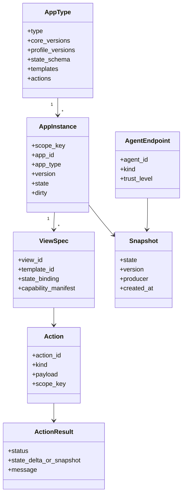
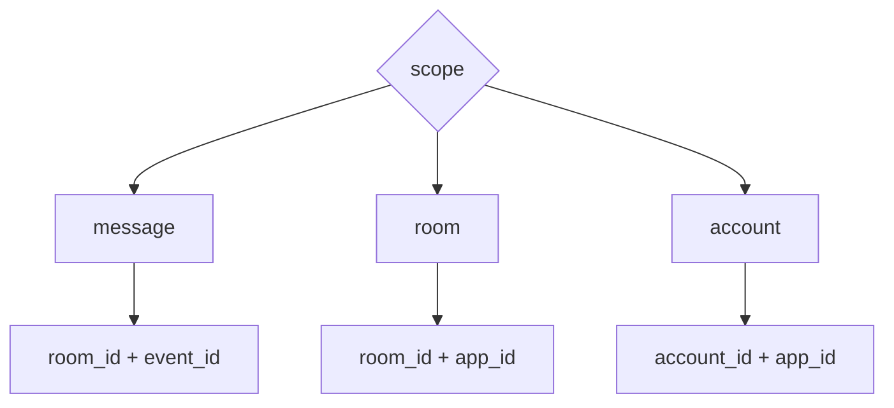

# Shared Protocol Kernel

The Agent2App Core Kernel is the protocol kernel shared by local Agents and remote Agents. It defines the object model, state model, action semantics, and validation order, but does not bind to a specific transport.

## AgentEndpoint

AgentEndpoint represents the Agent endpoint that produces an app view or handles a shared action.

It can be:

- a local LLM session;
- a local tool Agent;
- a remote Agent in a Matrix room;
- a server-side producer.

The location of the AgentEndpoint does not change the protocol object model. Remote Agents and local Agents both produce the same semantic `ViewSpec`, `Snapshot`, and `Action`.

## AppType

AppType is the global definition of an application type, for example:

- `counter`
- `timer`
- `calculator`
- `collection`
- `weather`
- `news`
- `mission_room`
- `mission_dashboard`

AppType determines:

- supported core protocol versions;
- supported profile versions;
- the schema of `initial_state` or snapshot;
- available templates;
- available actions;
- routing rules for local reducers or shared action responses.

## AppInstance

AppInstance is a concrete running entity of an AppType under a specific scope.

It is not the same as a single message. A `room` scoped app can be rendered by multiple messages and point to the same instance.

## ScopeKey

ScopeKey is the stable identity of an AppInstance.

A local scenario can map `room_id` to a local workspace or session id; a remote scenario can directly use Matrix room/account/event ids. The mapping differs, but ScopeKey semantics do not.

## ViewSpec

ViewSpec is the view description the Agent wants the Host to render.

ViewSpec contains at least:

- AppType;
- ScopeKey;
- Template or template id;
- State binding;
- Capability manifest;
- list of triggerable actions.

aichat can encode ViewSpec as `appplan json` + `runsplash`. Robrix2 can encode ViewSpec as an `org.octos.app` envelope + local template id.

## Snapshot

Snapshot is the authoritative state snapshot of an AppInstance.

In a local Agent scenario, Snapshot can be maintained by HostState and projected into the view on every render.

In a remote Agent scenario, Snapshot is usually written by a remote producer into a shared event log such as a Matrix timeline.

Regardless of source, Snapshot must satisfy the AppType state schema.

## Template

Template is the description that renders state into UI.

The protocol kernel only requires Template to be preflightable by the Host and bindable to state. It does not require Template to be generated by an LLM or to be locally static.

The concrete profile decides the Template source:

- the aichat profile allows LLM-generated `runsplash`, but it must be constrained by a capability manifest;
- the Robrix2 v1 profile allows only local static `.splash` templates and does not allow Matrix events or LLMs to directly provide runtime templates.

## Action

Action is the intent emitted by the user or view.

There are two Action categories:

- Local View Action: affects only the current local view/session.
- Shared Fact Action: changes shared facts and must be validated by an Agent/producer before producing a new Snapshot.

The Action type is determined by the AppType action schema and profile policy, not by the transport. `agent.notify` can carry local actions; `org.octos.action_response` can carry shared actions; future transports should carry the same Action semantics.
