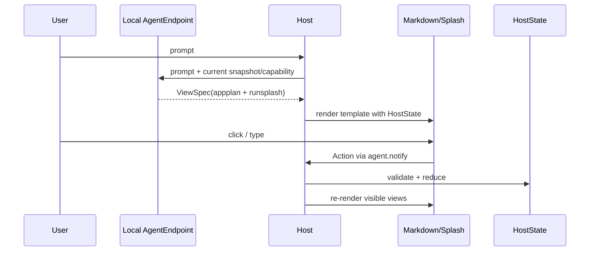
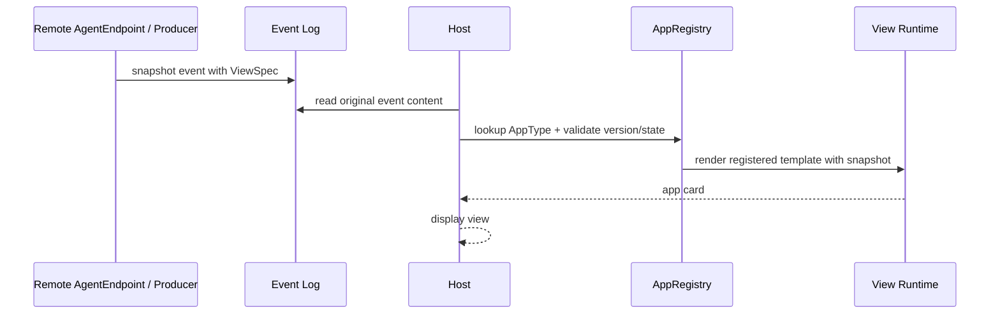

# Transport Binding

Transport binding maps the shared protocol kernel to concrete message carriers. It does not change protocol semantics. It only changes how data is transmitted, who can observe it, and how failure degrades.

## Kernel-to-Binding Mapping

| Core Concept | Local Binding | Remote/Event Binding |
|---|---|---|
| AgentEndpoint | current LLM session / local tool Agent | Matrix room Agent / server-side producer |
| ViewSpec | `appplan json` + `runsplash` | `org.octos.app` envelope + template id |
| Snapshot | HostState / APP_DEMO_STATE | Matrix event content |
| Template | LLM-generated runsplash or local template | locally registered static template |
| Action | `agent.notify(event_id, payload)` | `org.octos.action_response` |
| ActionResult | Host local reducer result | new snapshot event produced by Agent |
| Failure | log/ignore or show error view | fall back to `body` |

## Local Binding

Local binding is used by local AppGen scenarios such as aichat.

Characteristics:

- The Agent and Host are in the same local interaction loop.
- The Host owns the current Agent session.
- The Host can directly maintain HostState.
- The Host can immediately handle local actions and update UI.
- `agent.notify` is the reverse channel of the local binding, not the shared protocol kernel itself.

## Remote/Event Binding

Remote/Event binding is used by remote, auditable, event-sourced scenarios such as Robrix2.

Characteristics:

- The shared event log is the audit source.
- The Agent/producer is the source of shared truth.
- The Host is an event consumer, not the Agent's private RPC peer.
- Shared changes must go through action response, then the Agent sends a new Snapshot.
- The Host may perform optimistic local view updates, but must not treat optimistic state as shared truth.

## Binding Is Not an Application Scenario

Local binding and Remote/Event binding are transport bindings, not business scenarios. aichat uses Local binding; Robrix2 uses Remote/Event binding; future Hosts can use the same kernel with HTTP, WebSocket, or file synchronization.

## Application Scenario Matrix

| Scenario | Kernel | Binding | Profile Focus |
|---|---|---|---|
| aichat AppGen | Agent2View Core | Local Binding | LLM-generated UI, local HostState, fast interaction |
| Robrix2 IM Card | Agent2View Core | Remote/Event Binding | Matrix timeline, static templates, plain text fallback |
| Mission Room | Agent2View Core | Remote/Event Binding | room-scoped state, shared actions, human supervision |
