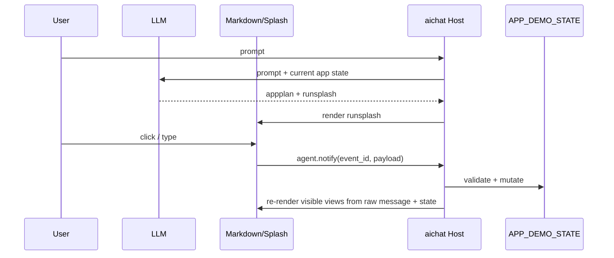
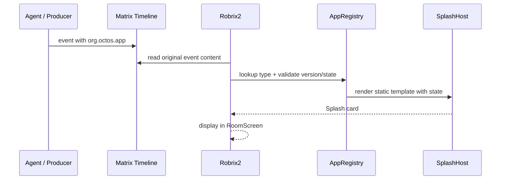

# Two Runtime Modes

Agent2View has two modes that are either implemented or planned.

## Local Runtime

Local Runtime is used by aichat.

Characteristics:

- Agent and Host are in the same local interaction loop.
- Host owns the current LLM session.
- Host owns local state.
- Host can handle button events immediately and update UI.
- `agent.notify` is an acceptable local reverse channel.

## Matrix Event-Sourced

Matrix Event-Sourced mode is used by Robrix2.

Characteristics:

- The Matrix timeline is the shared audit log.
- The Agent/producer is the source of shared truth.
- Robrix2 is an event consumer, not the Agent's private RPC peer.
- Shared changes must flow through Matrix/OctOS action responses, after which the Agent sends a new snapshot event.
- Robrix2 v1 does not accept LLM-generated runtime Splash templates.

## Mode Differences

| Dimension | aichat Local Runtime | Robrix2 Matrix Event-Sourced |
|---|---|---|
| View source | `runsplash` in LLM response | `org.octos.app` in Matrix event |
| Template source | LLM-generated | Local static template |
| State authority | Local HostState | Agent-produced Matrix event |
| Action loop | `agent.notify` | `org.octos.action_response` |
| Failure strategy | log/ignore or show error | fallback to `body` |
| Best fit | local demos, fast interactive prototypes | auditable and replayable app cards inside IM |
