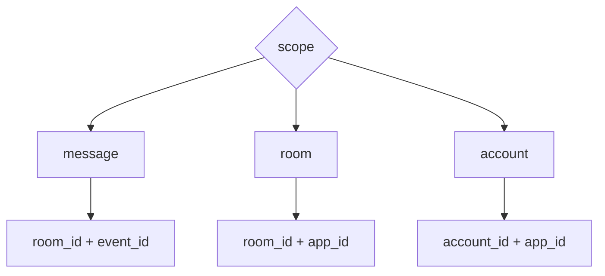

# Envelope and Scope

Robrix2 / Matrix Event-Sourced mode uses the `org.octos.app` envelope.

## Standard Envelope

```json
{
  "body": "Plain text fallback",
  "msgtype": "m.text",
  "org.octos.app": {
    "type": "mission_room",
    "version": 1,
    "scope": "room",
    "app_id": "mission.main",
    "initial_state": {}
  }
}
```

## Field Semantics

`body` is required. It is the fallback when rich rendering fails, and it should also summarize the message by itself.

`org.octos.app.type` must match a locally registered AppType.

`org.octos.app.version` is the protocol version of that AppType. The Host must reject unsupported versions and fall back to `body`.

`org.octos.app.scope` is optional and defaults to `message`. Allowed values:

```text
message | room | account
```

`org.octos.app.app_id` may be omitted for `message` scope. It is required for `room` and `account` scopes.

`org.octos.app.initial_state` must be a complete snapshot, not a patch.

## ScopeKey



## Message Scope

`message` scope means one Matrix event owns one independent app instance.

It fits:

- weather cards;
- news cards;
- static information views inside one message.

## Room Scope

`room` scope means multiple messages in the same room can point to the same app instance.

It fits:

- `mission_room`;
- room-level task boards;
- room-level agent rosters.

## Account Scope

`account` scope means one app instance is shared across rooms under the same account.

It fits:

- `mission_dashboard`;
- global agent operations overview.
