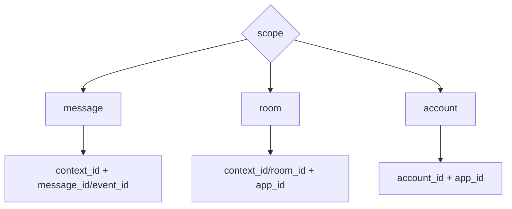
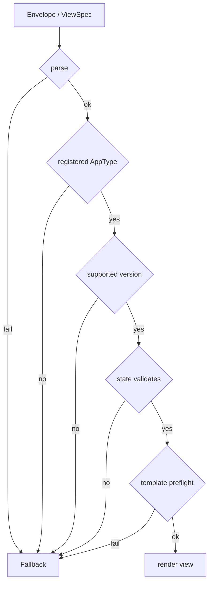

# Envelope and Scope

Envelope is the concrete encoding of ViewSpec/Snapshot by a Transport Binding. Scope is a protocol-kernel concept and does not belong to any specific transport.

## Shared Envelope Semantics

An Agent2View envelope must express at least:

```json
{
  "type": "mission_room",
  "core_version": 1,
  "profile_version": 1,
  "scope": "room",
  "app_id": "mission.main",
  "snapshot": {},
  "template_id": "mission_room.v1",
  "capabilities": {}
}
```

Field semantics:

- `type` must match a locally registered AppType.
- `core_version` identifies the shared protocol kernel version.
- `profile_version` identifies the AppType/profile version.
- `scope` defines the identity range of the AppInstance.
- `app_id` must be present under `room` and `account` scope.
- `snapshot` must be a complete state snapshot, not a patch.
- `template_id` points to a template allowed by the profile.
- `capabilities` declares the state paths, actions, and helpers available to the view.

Different bindings may encode these semantics with different field names, but they must not change the semantics.

## Matrix Binding Envelope

Robrix2 / Matrix binding uses the `org.octos.app` envelope:

```json
{
  "body": "Plain text fallback",
  "msgtype": "m.text",
  "org.octos.app": {
    "type": "mission_room",
    "version": 1,
    "scope": "room",
    "app_id": "mission.main",
    "initial_state": {}
  }
}
```

`body` is required. It is the fallback when rich rendering fails, and it should also summarize the message by itself.

The current `version` is the AppType/profile version. If an explicit `core_version` is added later, older Hosts can continue to treat `version` as the compatible profile version.

## Local Binding Envelope

aichat / Local binding splits the envelope into:

- `appplan json`: describes AppType, state paths, actions, and required controls.
- `runsplash`: describes Template.
- HostState: provides the current Snapshot.

Together, these three parts are equivalent to the shared ViewSpec.

When `appplan` chooses the A2UI-compatible format, `runsplash` is no longer a required protocol part. `appplan` can carry an A2UI `createSurface`, `updateComponents`, and `updateDataModel` message bundle under `view.messages`. In that case, `appplan` still owns the Agent2App outer semantics, while A2UI only owns view encoding.

## ScopeKey



## Message Scope

`message` scope means one message or response owns an independent app instance.

It fits:

- weather cards;
- news cards;
- static information views inside one message;
- independent demo views in aichat assistant messages.

## Room Scope

`room` scope means multiple messages in the same room can point to the same app instance.

It fits:

- `mission_room`;
- room-level task boards;
- room-level agent rosters.

## Account Scope

`account` scope means one app instance is shared across rooms under the same account.

It fits:

- `mission_dashboard`;
- global agent operations overview.

Account scope should not replace room-scoped truth. It can only aggregate state from multiple rooms.

## Fallback Rules

If any step fails, the Host must render the safe representation defined by the profile.


