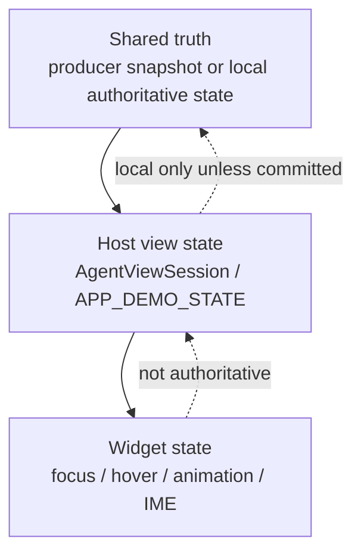
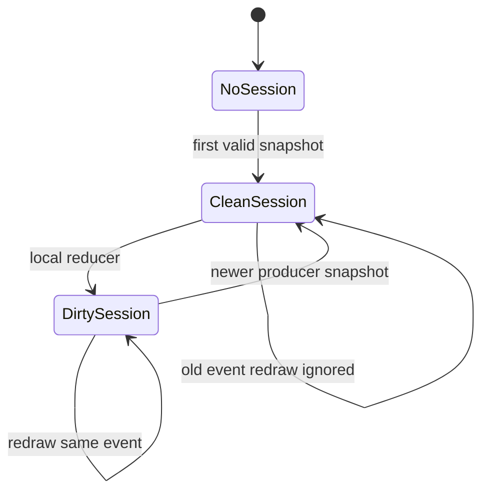

# State Model

Agent2View must distinguish three layers of state.

## Shared Truth

Shared truth is a fact that participants can audit, synchronize, or reproduce.

In a remote/event binding, shared truth must come from a producer snapshot, such as the original content of a Matrix event.

In a local binding, shared truth can temporarily be held by HostState, such as aichat's `APP_DEMO_STATE`. Even then, widget state must not become shared truth.

Shared state changes must go through AppType policy. Remote scenarios must use a new snapshot event sent by an Agent/producer; local scenarios can update the local snapshot through a Host reducer.

## Host View State

Host view state is the local state kept by the Host for rendering and interaction.

It is used to:

- withstand widget destruction caused by `PortalList` virtualization;
- support local UI reducers;
- re-render visible views that point to the same room/account scoped instance;
- store volatile input, selection, filters, expanded/collapsed flags, and other UI state.

Robrix2 v1 may keep Host view state only in memory. Persistence is future work.

## Widget State

Widget state can only be temporary rendering state, for example:

- IME composition;
- hover/focus;
- scroll offset;
- animation progress.

Widget state must not become the authoritative state of an AppInstance.

## Snapshot Projection

For `room` and `account` scoped apps, producer events should provide complete snapshots.

Projection rules:

- A newer valid snapshot replaces session shared state.
- Redrawing an older timeline item must not roll the session back.
- Repeated redraw of the same event must not clear local dirty reducer state.
- When a new producer snapshot arrives, dirty is cleared because shared truth has advanced.

## Volatile Input

Draft state in an input field belongs to Host view state, not Template source.

In aichat, `{{state.input.*.value}}` should not be replaced with new source on every display render; otherwise every character would trigger Markdown/Splash `set_text` and rebuild the UI.

The correct model is:

- TextInput writes draft text into HostState.
- Template remains stable.
- Add/Submit actions read draft text from HostState.
- The rendering layer projects display values only when needed.
