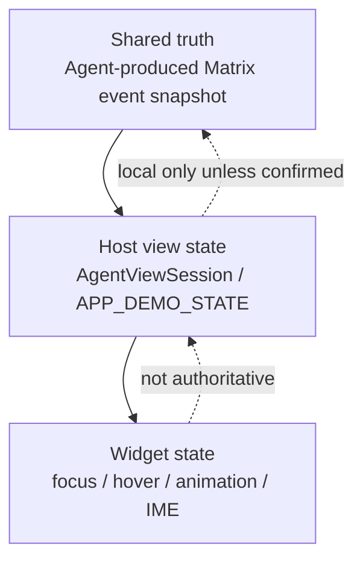
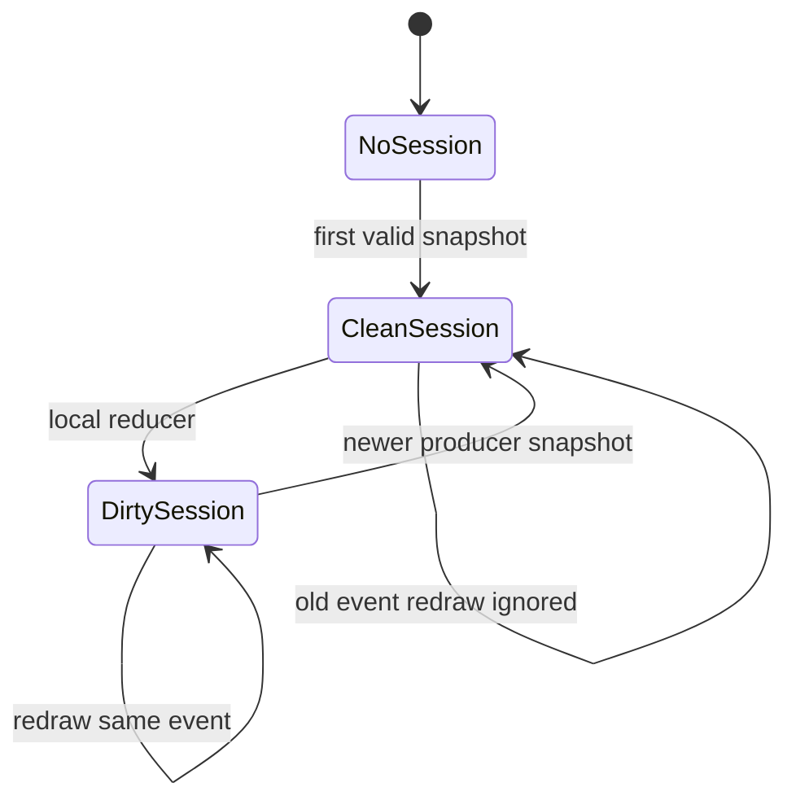

# State Model

Agent2View must distinguish three layers of state.

## Shared Truth

Shared truth is the set of facts that room participants can audit and synchronize.

In Robrix2, shared truth must come from the original content of a Matrix event.

Shared state changes must be produced as new snapshot events by the Agent/producer. A local widget must not silently rewrite Matrix history.

## Host View State

Host view state is local state retained by the Host for rendering and interaction.

It is used to:

- survive widget destruction caused by `PortalList` virtualization;
- support local UI reducers;
- synchronize redraws for visible views that point to the same room/account scoped instance;
- store volatile input, selection, filter, expanded/collapsed state, and similar UI state.

Robrix2 v1 may keep Host view state in memory only. Persistence is future work.

## Widget State

Widget state is temporary rendering state, such as:

- IME composition;
- hover/focus;
- scroll offset;
- animation progress.

Widget state must not be the authoritative state of an AppInstance.

## Snapshot Projection

For `room` and `account` scoped apps, the Matrix event is a complete snapshot.

Projection rules:

- A newer valid snapshot replaces session shared state.
- Redrawing an older timeline item must not roll the session back.
- Repeated redraw of the same event must not clear local dirty reducer state.
- When a new producer snapshot arrives, clear dirty state because shared truth has advanced.
