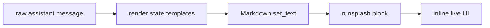
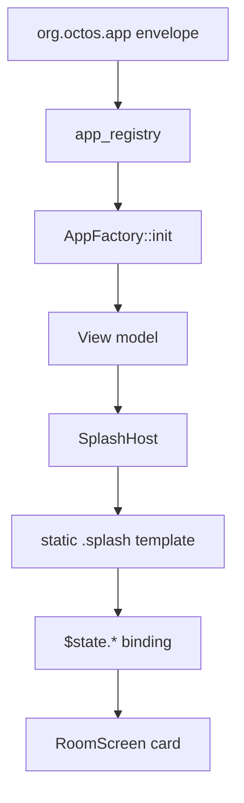

# Rendering and Templates

Agent2View has two rendering paths: dynamic `runsplash` in aichat, and static Splash templates in Robrix2.

## aichat Rendering

aichat supports LLM-generated UI:

````markdown
```runsplash
View {
    Label { text: "Count: {{state.count}}" }
    Button { text: "+1" on_click: || agent.notify("inc", {}) }
}
```
````

Rendering flow:



Rules:

- Preserve the raw assistant message.
- Replace `{{state.path}}` at display time.
- After state mutation, redraw only visible assistant messages.
- When an offscreen message re-enters the viewport, `PortalList` renders it from raw message plus current state.

## Volatile Input

Draft state in an input field must not rewrite the `runsplash` source on every character.

```splash
TextInput {
    text: "{{state.input.new_item.value}}"
    on_change: |text| agent.notify("app.input.set", {key: "new_item", text: text})
}
```

During display rendering, the Host should treat `{{state.input.*.value}}` as a volatile placeholder. This prevents every keystroke from changing the source observed by Markdown/Splash `set_text`, which would rebuild the whole UI.

HostState still stores draft text. Actions such as adding an item can read that input from HostState.

## Robrix2 Rendering

Robrix2 v1 uses local static `.splash` templates.



Templates may:

- use Makepad widgets allowed by `widget_manifest`;
- use `$state.path` values declared by the AppType;
- use registered local render helpers.

Templates must not:

- come from a Matrix event;
- be generated by an LLM at runtime;
- reference unknown widgets;
- reference unknown helpers;
- reference undeclared state paths;
- set host-owned attribution fields such as `capability_id`, `display_name`, `icon`, or `trust_badge`.
