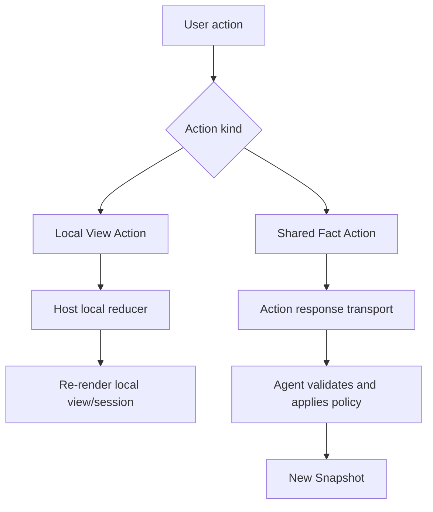
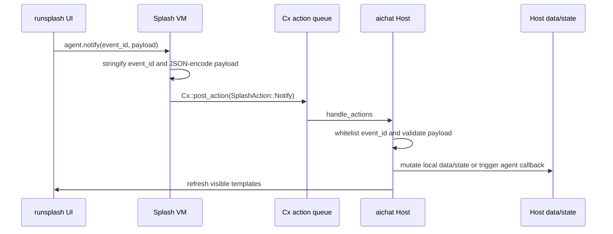

# Action Protocol

Action is the intent emitted by the user or view. The protocol kernel first defines action semantics, then transport binding decides how to carry those semantics.



## Core Action

A shared Action contains at least:

```json
{
  "action_id": "approve_plan",
  "kind": "shared_fact",
  "scope_key": {
    "scope": "room",
    "app_id": "mission.main"
  },
  "payload": {}
}
```

`action_id` must be registered in the AppType action schema.

`kind` is decided by AppType policy and can be:

```text
local_view | shared_fact | agent_callback
```

`scope_key` points to the AppInstance being operated on.

`payload` must validate against the action schema.

## Local View Action

Local View Action fits:

- expanding/collapsing task details;
- selecting an agent;
- switching filters, sorting, or tabs;
- aichat counter/timer/calculator/collection operations.

Local reducer lookup must dispatch by the AppType + action id whitelist.

Local View Action can update HostState, but it must not automatically become shared truth.

## Shared Fact Action

Shared Fact Action changes shared facts. It must be validated by the Agent/producer and then produce a new Snapshot.

Examples in Mission Room:

```text
approve_plan
request_plan_changes
pause_mission
resume_mission
```

These actions must not silently modify mission truth through a local reducer alone.

## Local Binding: agent.notify

aichat uses `agent.notify(event_id, payload)` to carry Action:

```splash
agent.notify("inc", {})
agent.notify("app.collection.add_from_input", {collection: "items", input: "new_item"})
```

`agent.notify` is the reverse channel of the aichat Local Binding. It is not the shared protocol kernel itself; it is the local carrier that maps user intent inside a Template back to the Host action dispatcher.

Implementation boundary:

- `agent.notify` is registered in `widgets/src/splash.rs`.
- `SplashAction` is defined in `widgets/src/splash.rs`.
- `SplashAction::Notify` is a bare action, not a widget action.
- aichat directly iterates `actions` and casts in `handle_actions`.

Call contract:

- The first argument is `event_id`. It must be convertible to a string; a missing or invalid value becomes an empty string.
- The second argument is `payload`. It can be any Splash value, and the runtime serializes it into a JSON string.
- `agent.notify` does not return a business value. It returns `nil`.
- It can be used inside generated `runsplash` callbacks such as `Button.on_click` and `TextInput.on_change`.

Runtime path:



The Host must:

- validate event id;
- validate payload JSON;
- log and ignore unknown events;
- log and ignore invalid payloads.

State refresh rules:

- The Host is the data/state owner. `runsplash` is only the current view template.
- After a valid action changes Host data/state, the Host projects the current data/state back into the visible template.
- Draft state in input fields must not rewrite the `runsplash` source on every keypress. Input should call `agent.notify("app.input.set", ...)` into HostState, and a submit action should consume it.

Boundary:

- `agent.notify` can carry `local_view` actions and aichat-local `agent_callback` actions.
- It must not be used as the production protocol for remote shared fact actions in scenarios such as Robrix2.
- Remote shared actions should use the corresponding transport binding, such as `org.octos.action_response` in Matrix.

## Remote Binding: action_response

Robrix2 uses `org.octos.action_response` to carry Shared Fact Action.

```json
{
  "org.octos.action_response": {
    "action_id": "approve_plan",
    "source_event_id": "$mission123",
    "app": {
      "type": "mission_room",
      "version": 1,
      "scope": "room",
      "app_id": "mission.main"
    }
  }
}
```

Rules:

- `source_event_id` points to the original Matrix event that produced the action.
- The `app` field explicitly routes the action when multiple app instances exist in the same room.
- The producer validates the action response.
- After applying policy, the producer sends a new app snapshot event.
- Robrix2 may perform optimistic local view updates, but must not treat optimistic state as shared truth.
