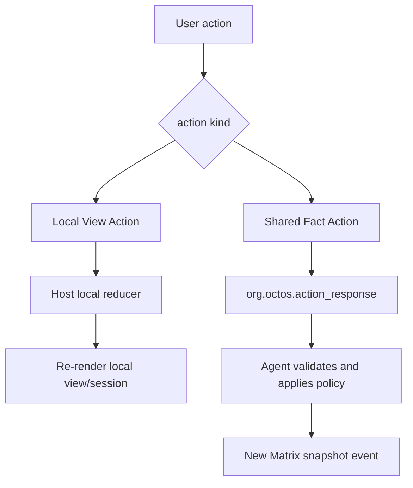

# Action Protocol

An Action is an intent emitted by the user or view. The protocol must distinguish local view actions from shared fact actions.



## Local View Action

Local View Action applies to:

- expanding or collapsing task details;
- selecting an agent;
- switching filter/sort/tab state;
- aichat counter/timer/calculator/collection operations.

Local reducer lookup must dispatch through an AppType plus action id whitelist.

Robrix2 should not use an unbounded global `agent.notify("anything")` string surface as its production action API.

## aichat agent.notify

aichat uses `agent.notify(event_id, payload)`:

```splash
agent.notify("inc", {})
agent.notify("app.collection.add_from_input", {collection: "items", input: "new_item"})
```

Implementation boundary:

- `agent.notify` is registered in `widgets/src/splash.rs`.
- `SplashAction` is defined in `widgets/src/splash.rs`.
- `SplashAction::Notify` is a bare action, not a widget action.
- aichat directly iterates `actions` in `handle_actions` and casts them.

The Host must:

- validate event id;
- validate payload JSON;
- log and ignore unknown events;
- log and ignore invalid payloads.

## Robrix2 Shared Action

Robrix2 uses `org.octos.action_response` for shared actions.

```json
{
  "org.octos.action_response": {
    "action_id": "approve_plan",
    "source_event_id": "$mission123",
    "app": {
      "type": "mission_room",
      "version": 1,
      "scope": "room",
      "app_id": "mission.main"
    }
  }
}
```

Rules:

- `source_event_id` points to the original Matrix event that produced the action.
- `app` explicitly routes the action when a room contains multiple app instances.
- The producer validates the action response.
- After applying policy, the producer sends a new app snapshot event.
- Robrix2 may perform optimistic local view updates, but it must not treat optimistic state as shared truth.
