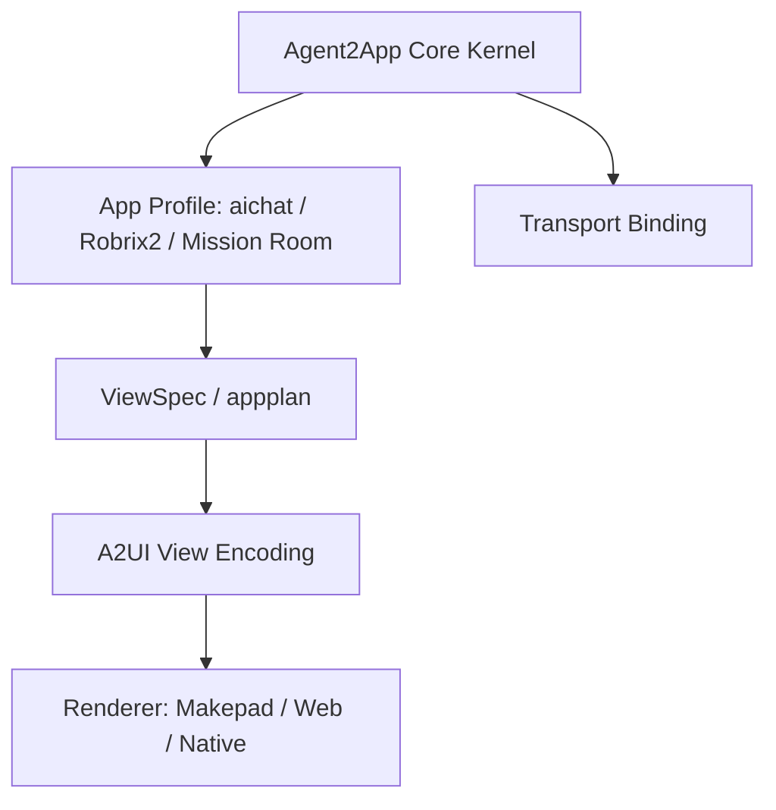
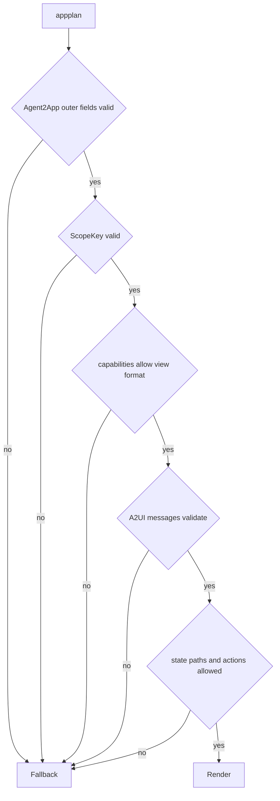

# A2UI Compatibility Profile

[A2UI](https://github.com/google/A2UI/) can serve as the Agent2App View Encoding. It does not replace the Agent2App Core Kernel.

Agent2App defines app-instance semantics: AppType, Scope, Snapshot, Action, Capability, Validation, and application profiles. A2UI defines streamable UI representation: Surface, Component, Data Model, and user action.

The compatibility strategy is:

```text
Agent2App appplan = Agent2App outer semantics + A2UI message bundle
```

Do not put Agent2App fields such as `scope`, `app_type`, profile policy, or permission boundaries directly inside A2UI messages. The [A2UI v0.9 server-to-client envelope](https://github.com/google/A2UI/blob/main/specification/v0_9/json/server_to_client.json) is a strict message structure; each message can express only one A2UI operation.

## Reference Links

- [A2UI GitHub repository](https://github.com/google/A2UI/)
- [A2UI v0.9 Protocol](https://github.com/google/A2UI/blob/main/specification/v0_9/docs/a2ui_protocol.md)
- [A2UI v0.9 Server-to-Client Schema](https://github.com/google/A2UI/blob/main/specification/v0_9/json/server_to_client.json)
- [A2UI v0.9 Client-to-Server Schema](https://github.com/google/A2UI/blob/main/specification/v0_9/json/client_to_server.json)
- [A2UI v0.9 Common Types](https://github.com/google/A2UI/blob/main/specification/v0_9/json/common_types.json)
- [A2UI v0.9 Standard Catalog](https://github.com/google/A2UI/blob/main/specification/v0_9/json/standard_catalog.json)
- [A2UI v0.9 Evolution Guide](https://github.com/google/A2UI/blob/main/specification/v0_9/docs/evolution_guide.md)

## Layering



The three responsibilities must stay separate:

- Agent2App Core Kernel: defines protocol semantics shared by local Agents and remote Agents.
- A2UI View Encoding: defines UI surface, component tree, data model update, and client action.
- Application Profile: defines how a Host interprets AppType, Scope, permissions, template source, and state submission path.

## A2UI v0.9 Mapping

A2UI v0.9 server-to-client messages include:

- `createSurface`: creates a renderable surface.
- `updateComponents`: updates the component list of that surface.
- `updateDataModel`: updates the data model of that surface.
- `deleteSurface`: deletes the surface.

Recommended Agent2App to A2UI mapping:

| Agent2App Concept | A2UI Concept | Notes |
| --- | --- | --- |
| `app_id` | `surfaceId` | `message` scope may be assigned by the Host; `room`/`account` scope should use a stable app id. |
| `Snapshot` | `updateDataModel.value` | Prefer committing the full snapshot at `/`; partial patches fit only bindings with strong ordering guarantees. |
| `Template` / `ViewSpec` | `updateComponents.components` | Use the A2UI component catalog for a validated UI structure. |
| `CapabilityManifest` | `catalogId` + client capabilities | A2UI catalog expresses component/function capability; Agent2App manifest still expresses state/action permissions. |
| Local View Action | `action.functionCall` | Use only for Host-registered local functions such as `openUrl`. |
| Shared Fact Action | `action.event` | Send to the Host/Agent for validation, then produce a new Snapshot. |
| `ActionResult` | new envelope after client-to-server `action` | An A2UI action itself is not shared truth; truth still converges through Agent2App Snapshot. |

## appplan Format

When `appplan` is A2UI-compatible, it is still an Agent2App artifact, not a single A2UI message.

Recommended format:

```json
{
  "agent2app": {
    "core_version": 1,
    "binding_version": 1,
    "profile": "aichat",
    "profile_version": 1,
    "app_type": "todo",
    "scope": "message",
    "app_id": "todo.main"
  },
  "view": {
    "format": "a2ui",
    "version": "v0.9",
    "messages": [
      {
        "version": "v0.9",
        "createSurface": {
          "surfaceId": "todo.main",
          "catalogId": "https://a2ui.org/specification/v0_9/standard_catalog.json",
          "sendDataModel": true
        }
      },
      {
        "version": "v0.9",
        "updateComponents": {
          "surfaceId": "todo.main",
          "components": [
            {
              "id": "root",
              "component": "Column",
              "children": ["new_item", "add_button", "items"]
            },
            {
              "id": "new_item",
              "component": "TextField",
              "label": "New item",
              "value": {
                "path": "/inputs/new_item/value"
              },
              "variant": "shortText"
            },
            {
              "id": "add_button_label",
              "component": "Text",
              "text": "Add"
            },
            {
              "id": "add_button",
              "component": "Button",
              "child": "add_button_label",
              "variant": "primary",
              "action": {
                "event": {
                  "name": "app.collection.add_from_input",
                  "context": {
                    "collection": "items",
                    "input": "new_item"
                  }
                }
              }
            },
            {
              "id": "items",
              "component": "List",
              "children": {
                "path": "/collections/items/rows",
                "componentId": "item_template"
              }
            },
            {
              "id": "item_template",
              "component": "Text",
              "text": {
                "path": "text"
              }
            }
          ]
        }
      },
      {
        "version": "v0.9",
        "updateDataModel": {
          "surfaceId": "todo.main",
          "path": "/",
          "value": {
            "inputs": {
              "new_item": {
                "value": ""
              }
            },
            "collections": {
              "items": {
                "rows": []
              }
            }
          }
        }
      }
    ]
  },
  "permissions": {
    "state_paths": [
      "/inputs/new_item/value",
      "/collections/items/rows"
    ],
    "actions": [
      "app.collection.add_from_input"
    ]
  }
}
```

This structure has two important boundaries:

- `view.messages[*]` must be valid A2UI v0.9 messages.
- `agent2app` and `permissions` are Agent2App outer semantics; an A2UI renderer is not required to understand them natively.

## Input and Local Data Model

A2UI input components use local two-way binding: `TextField`, `CheckBox`, `Slider`, `ChoicePicker`, and similar components immediately update the client-side data model when the user interacts with them.

This matches Agent2App input principles:

- Input should not rewrite template source.
- Each keypress should not regenerate `runsplash` or `updateComponents`.
- On user submit, the current data model is passed to the Host/Agent through action context or `sendDataModel`.

For aichat, the A2UI-compatible path avoids rebuilding the UI after each typed character. Input draft state belongs to Host/client data model; the template only binds paths.

## aichat Compatibility Path

aichat can support two local view encodings:

| `view.format` | Template Source | Rendering Path |
| --- | --- | --- |
| `runsplash` | LLM-generated Splash | existing Markdown + SplashHost path |
| `a2ui` | A2UI component tree | map A2UI component tree to Makepad widgets |

`runsplash` can remain the current implementation path. A2UI is the more general appplan format and is easier to share across renderers.

When `view.format = "a2ui"`:

1. The Host validates Agent2App outer fields.
2. The Host validates the A2UI message bundle.
3. The Host selects a renderer based on `catalogId`.
4. The Host maps A2UI components to Makepad widgets.
5. The Host maps A2UI actions back to the Agent2App action dispatcher.

## Robrix2 Compatibility Path

Robrix2 should not directly trust arbitrary Makepad templates carried by remote events.

If A2UI is used:

- A Matrix event can carry an Agent2App envelope.
- The `view` part of the envelope can be an A2UI message bundle or a profile-registered `template_id`.
- The Host must validate `catalogId`, component catalog, state paths, and actions.
- Shared actions still write back to the event system, then an Agent/producer validates them and generates a new Snapshot.

Robrix2 can keep local static templates as the production default. A2UI is better as a safe dynamic UI representation, provided the renderer supports only trusted catalogs.

## Mission Room Compatibility Path

Mission Room is a room-scoped shared app. Its `surfaceId` should stably map to:

```text
room_id + app_id
```

Recommended:

- `scope = "room"`.
- `app_id = "mission.main"`.
- A2UI `surfaceId = "mission.main"`, while the Host internally isolates different rooms with ScopeKey.
- `updateDataModel` uses the complete Mission Room Snapshot.
- User operations use A2UI `action.event`, then map to Agent2App shared fact actions.

## Validation Order

Validation order for the A2UI compatibility profile:



The Host must validate Agent2App outer semantics before validating inner A2UI messages. Otherwise, an A2UI renderer may render a syntactically valid but unauthorized UI.

## Compatibility Conclusion

`appplan` can be compatible with A2UI, but compatibility should mean "contains an A2UI message bundle", not "becomes an A2UI message".

This satisfies all of the following:

- strict A2UI schema validation;
- Agent2App modeling of Scope, permissions, profiles, and shared truth;
- the same protocol kernel for aichat local Agents and Robrix2 remote Agents;
- one declarative UI encoding shared by Makepad, Web, and Native renderers.
