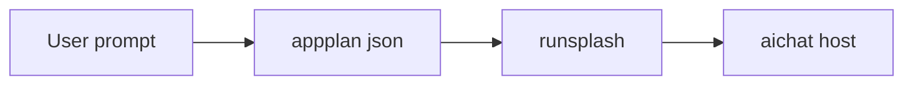
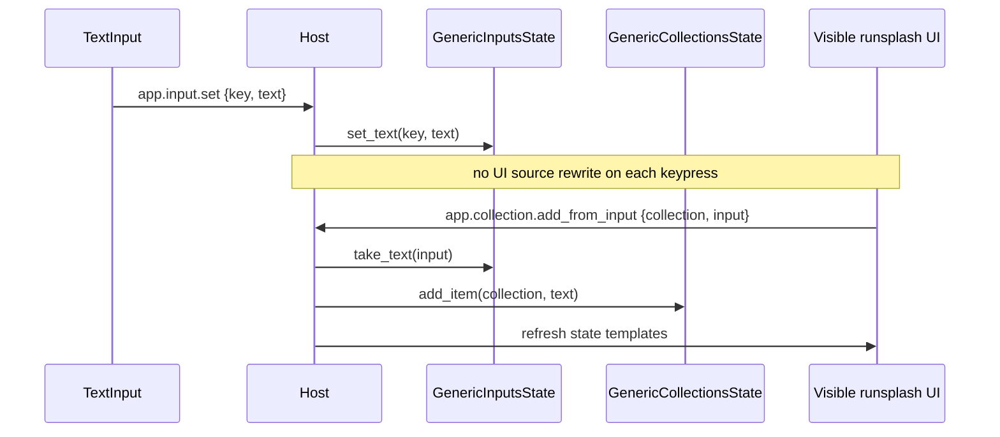

# aichat Profile

aichat is the Local Runtime profile. It demonstrates the smallest live wire from LLM-generated UI to host state mutation.

## Response Contract

An aichat AppGen response should contain one `appplan json` block and one `runsplash` block.

`appplan` is the plan and capability declaration for generated UI. It is not an independent project artifact.



## Host State

Current aichat HostState contains:

- `count`
- `timer`
- `calculator`
- `collections`
- `inputs`

Example state paths:

```text
{{state.count}}
{{state.timer.display}}
{{state.calculator.display}}
{{state.collection.items.rows}}
{{state.collection.items.count}}
{{state.input.new_item.value}}
```

## Actions

Counter:

```text
inc
dec
reset
```

Timer:

```text
timer.start
timer.pause
timer.toggle
timer.reset
timer.add_minute
timer.subtract_minute
```

Calculator:

```text
calculator.digit.0 ... calculator.digit.9
calculator.decimal
calculator.operator.add
calculator.operator.subtract
calculator.operator.multiply
calculator.operator.divide
calculator.equals
calculator.clear
calculator.backspace
calculator.sign
calculator.percent
```

Collection:

```text
app.input.set
app.collection.add_from_input
app.collection.add
app.collection.toggle
app.collection.delete
app.collection.clear
```

AI callback:

```text
ask_ai
```

## Collection Flow



## Boundary

aichat may accept LLM-generated `runsplash`, but it must use a host capability manifest to restrict actions and state paths.

Unknown actions must be logged and ignored.

Invalid payloads must be logged and ignored.
