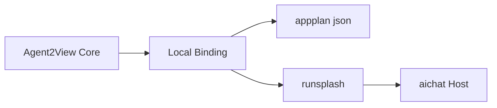
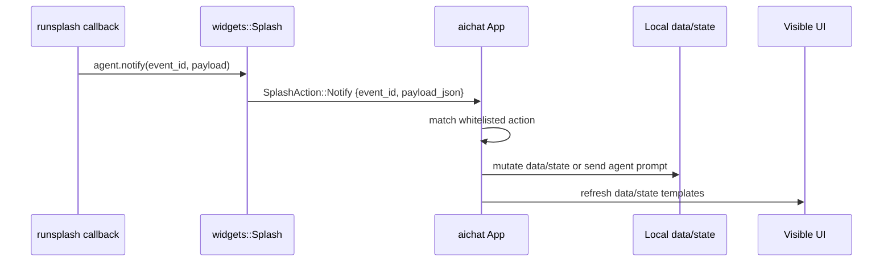
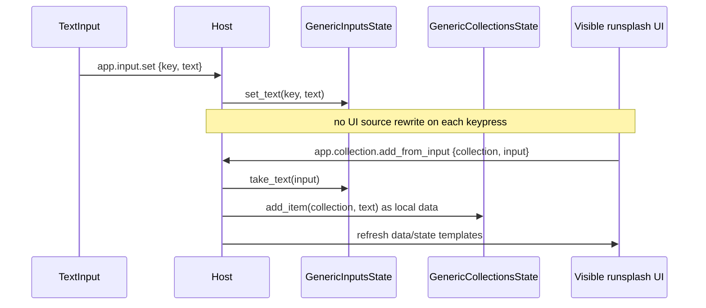

# aichat Application Scenario

aichat is a Local AppGen scenario on top of the Agent2App Core Kernel. It is not a separate protocol; it is a Host profile using the shared kernel through Local Binding.

## Scenario Positioning

aichat proves the smallest live wire from LLM-generated UI to HostState mutation.



## Response Contract

An aichat AppGen response should contain one `appplan json` block and one `runsplash` block.

`appplan` is the local encoding of ViewSpec. It describes the generated UI plan, AppType, available state paths, available actions, and required controls.

`runsplash` is the local encoding of Template. It can be generated by an LLM, but must be constrained by the capability manifest.

For future A2UI compatibility, `appplan` can contain `view.format = "a2ui"` and an A2UI message bundle. In that case, `runsplash` is the aichat legacy/local renderer binding and is no longer a required part of the shared protocol.

## Data and Host State

In the current aichat demo, the Host maintains both local data and Host state.

Local data contains:

- `count`
- `timer`
- `calculator`
- `collections`

Host state contains:

- `inputs`

Example data/state paths:

```text
{{data.count}}
{{data.timer.display}}
{{data.calculator.display}}
{{data.collection.items.rows}}
{{data.collection.items.count}}
{{state.input.new_item.value}}
```

These paths are concrete expressions of the shared-kernel Data Binding and State Binding in the aichat profile. The current legacy `runsplash` binding may continue to support old aliases such as `{{state.count}}`, but protocol documentation should prefer the separated data/state paths.

## Actions

Counter:

```text
inc
dec
reset
```

Timer:

```text
timer.start
timer.pause
timer.toggle
timer.reset
timer.add_minute
timer.subtract_minute
```

Calculator:

```text
calculator.digit.0 ... calculator.digit.9
calculator.decimal
calculator.operator.add
calculator.operator.subtract
calculator.operator.multiply
calculator.operator.divide
calculator.equals
calculator.clear
calculator.backspace
calculator.sign
calculator.percent
```

Collection:

```text
app.input.set
app.collection.add_from_input
app.collection.add
app.collection.toggle
app.collection.delete
app.collection.clear
```

AI callback:

```text
ask_ai
```

## Notify Live Wire

Generated `runsplash` cannot directly mutate aichat internals. It can only send user intent through `agent.notify(event_id, payload)`, and the Host decides what to do through an action whitelist and payload schema.

```splash
Button {
    text: "+1"
    on_click: || agent.notify("inc", {})
}

TextInput {
    text: "{{state.input.new_item.value}}"
    on_change: |text| agent.notify("app.input.set", {key: "new_item", text: text})
}
```

aichat handles the live wire as follows:



Typical aichat dispatch includes:

- `inc`, `dec`, and `reset` update the counter.
- `timer.*` updates the timer.
- `calculator.*` updates the calculator.
- `app.input.set` updates input draft state in HostState.
- `app.collection.*` updates local collection data.
- `ask_ai` wraps the current interaction as a prompt and sends it to the selected backend.

The key design point is: the Template emits intent, while the Host owns state mutation. This allows LLM-generated UI to be interactive without promoting arbitrary script output to Host authority.

## Collection Flow



## Scenario Boundary

aichat may accept LLM-generated `runsplash`, but it must:

- restrict actions and state paths through a host capability manifest;
- validate event id;
- validate payload;
- log and ignore unknown actions;
- log and ignore invalid payloads;
- never promote arbitrary Agent output to system authority.

These constraints belong to the aichat application scenario. The shared kernel only requires Template to be preflightable, Action to be validatable, and State to be projectable.
