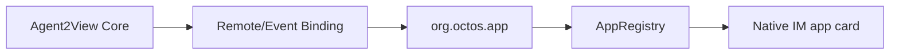
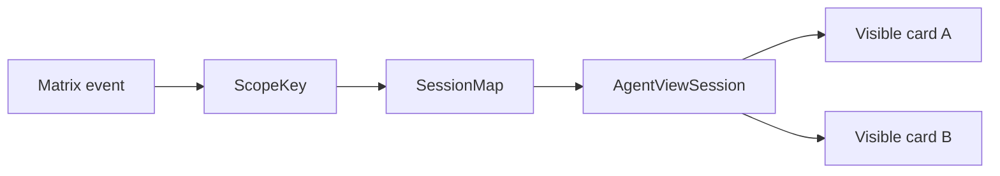

# Robrix2 Application Scenario

Robrix2 is the Matrix IM app-card scenario on top of the Agent2App Core Kernel. It uses Remote/Event Binding to render Matrix event history and does not own a private RPC session with the producing Agent.

## Scenario Positioning



Robrix2's responsibility is to consume events, validate AppType, project Snapshot, render local templates, and write user shared actions back into the event system.

## V1 Display Cards

Robrix2 v1 cards should remain display-only:

- Weather.
- News.
- Static mission room phase 1.

These apps do not need LLM-generated templates or local reducers.

## AgentViewSession

Robrix2 interactive runtime should use a structure similar to:

```rust
struct AgentViewSession {
    scope_key: AgentViewScopeKey,
    source_event_id: OwnedEventId,
    app_type: String,
    version: u32,
    template_id: String,
    state: serde_json::Value,
    dirty: bool,
}
```

The session map stores state while a room is open.



## Local Reducer Loop

Robrix2 may support local view reducers, but the first reducers should remain narrow:

```text
counter.inc
counter.dec
counter.reset
timer.toggle
timer.reset
```

Click loop:

```text
button action
  -> action carries scope key + action_id + payload
  -> lookup AgentViewSession
  -> run whitelisted local reducer
  -> re-render affected views
```

`message` scope redraws only one card.

`room` scope redraws all visible cards that point to the same `room_id + app_id`.

## Relationship to aichat

Robrix2 can borrow the narrow live wire from aichat, but it must not copy `agent.notify` as the production shared action protocol.

The aichat loop works because it owns all of the following:

- LLM session.
- local state.
- Splash VM.
- immediate event loop.

Robrix2 shared truth must remain in the Matrix timeline. The extra constraints for the Robrix2 scenario are: do not accept event-supplied templates, do not read `m.replace` edits to change app state, and do not silently modify shared truth with local reducers.
