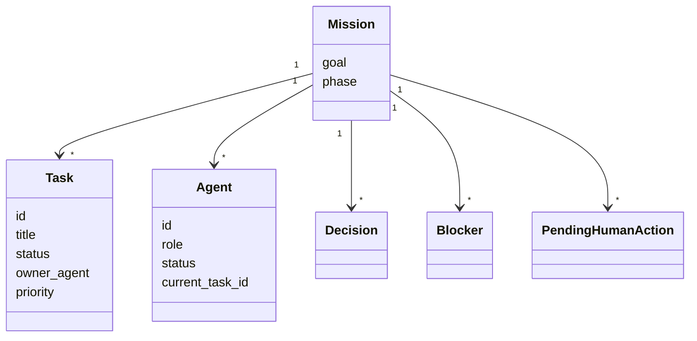
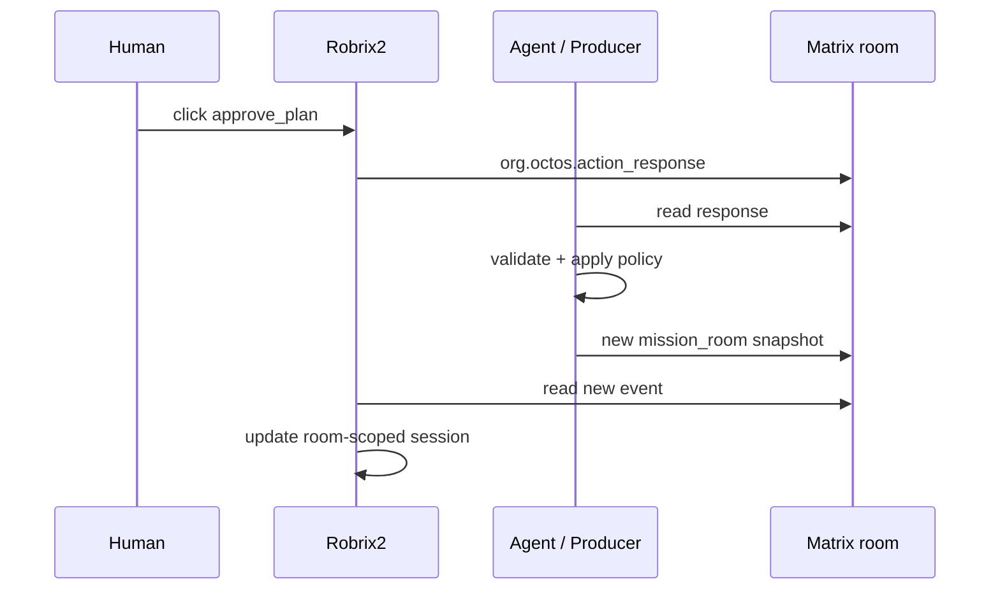

# Mission Room Profile

Mission Room is the first high-value room-scoped Agent2View app in Robrix2.

It turns a Matrix room into a human-supervised multi-Agent mission control surface.

## App Envelope

Mission Room must use `room` scope:

```json
{
  "org.octos.app": {
    "type": "mission_room",
    "version": 1,
    "scope": "room",
    "app_id": "mission.main",
    "initial_state": {}
  }
}
```

Default mission app id:

```text
mission.main
```

Unless a room explicitly hosts multiple missions, the producer should use this default id.

## Mission State V1

Mission state v1 should stay explicit and small:

```json
{
  "goal": {
    "title": "Ship room-scoped agent2view runtime",
    "status": "planning"
  },
  "phase": "planning",
  "tasks": [
    {
      "id": "task-1",
      "title": "Define AgentViewSession state model",
      "status": "planning",
      "owner_agent": "planner",
      "priority": "high",
      "requires_human_approval": true
    }
  ],
  "agents": [
    {
      "id": "planner",
      "role": "planner",
      "status": "waiting_human",
      "current_task_id": "task-1"
    }
  ],
  "pending_human_actions": [
    {
      "id": "approve-plan-1",
      "kind": "approve_plan",
      "label": "Approve proposed plan"
    }
  ],
  "decisions": [],
  "blockers": []
}
```

## Mission Model



## Status Values

`goal.status`:

```text
planning | active | paused | completed
```

`task.status`:

```text
planning | approved | doing | review | blocked | done
```

`agent.status`:

```text
idle | working | blocked | waiting_human
```

Agent role:

```text
planner | executor | reviewer | operator
```

Autonomy mode:

```text
manual | supervised | autonomous | paused
```

## Shared Actions

The first shared actions:

```text
approve_plan
request_plan_changes
pause_mission
resume_mission
```

Later task-level actions:

```text
reassign_task
change_priority
mark_blocked
request_review
approve_result
```

These actions change mission truth. They must flow through `org.octos.action_response`, after which the Agent produces a new mission snapshot event.



## Local View Actions

A mission card may support local actions:

- expand task details;
- select an agent;
- switch board/decision/blocker view;
- filter lanes.

These actions should not produce Matrix shared facts.
