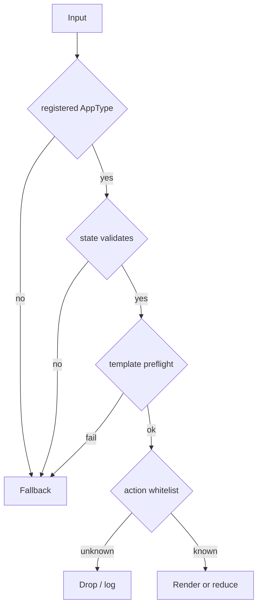

# Safety Model

The Agent2View v0.1 safety model should stay short and executable. Safety rules are split into protocol-kernel rules, binding rules, and profile rules.

## Shared Principles

Principles:

1. Rich UI renders only for registered AppTypes.
2. Each AppType validates its own state.
3. Template must pass profile-defined preflight.
4. Template preflight must reject unknown widgets, unknown helpers, and undeclared state paths.
5. Any failure falls back to the safe representation specified by the profile.
6. Action dispatch must use an AppType + action id whitelist.
7. Widget state must not become shared truth.

## Local Binding Safety Boundary

Local binding may accept LLM-generated templates, but it must:

- restrict the host action manifest;
- validate payload;
- limit callable APIs from the template;
- reject or degrade dangerous shaders, unknown widgets, and unknown helpers;
- never promote arbitrary Agent output to system authority.

aichat belongs to this boundary.

## Remote Binding Safety Boundary

Remote/event binding must be more conservative:

- do not trust runtime templates carried by events;
- render only locally registered AppTypes;
- use only locally registered templates;
- shared state must come from original event content or producer snapshot;
- shared actions must go through action response and be validated by the producer.

Robrix2 belongs to this boundary.

## Application Scenario Constraints

aichat profile:

- may accept LLM-generated `runsplash`;
- may use `agent.notify`;
- must restrict the host action manifest;
- must validate payload.

Robrix2 profile:

- does not accept event-supplied Splash templates;
- does not accept runtime-generated templates as the v1 production path;
- does not use `agent.notify` to express shared actions;
- does not silently modify mission truth through local reducers;
- does not read `m.replace` edits to change app state or action set.

## Fail Closed to Safe Rendering

Rich rendering is an enhancement, not the only readable form of a message.

Any validation failure must fall back to the safe representation defined by the profile. In Robrix2, that safe representation is `body`. In aichat, it can be an error view, log + ignore, or keeping the last usable view.
