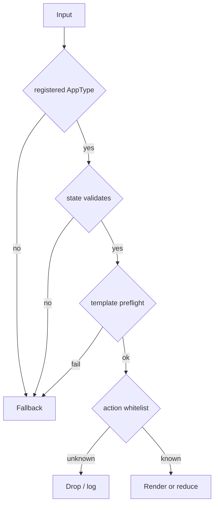

# Safety Model

The Agent2View v0.1 safety model should stay short and executable.

## General Principles

Principles:

1. Render rich UI only for registered AppTypes.
2. Each AppType validates its own state.
3. Robrix2 v1 templates must be local and static.
4. Template preflight must reject unknown widgets, unknown helpers, and undeclared state paths.
5. Any failure falls back to plain text.
6. Actions must dispatch through an AppType plus action id whitelist.
7. Widget state must not become shared truth.

## aichat Safety Boundary

aichat is a local demo/runtime:

- It may accept LLM-generated `runsplash`.
- It may use `agent.notify`.
- It must restrict the host action manifest.
- It must validate payloads.
- It should not elevate arbitrary Agent output to system privileges.

## Robrix2 Safety Boundary

Robrix2 is a Matrix client:

- It does not accept event-supplied Splash templates.
- It does not accept runtime-generated templates as the v1 production path.
- It does not use `agent.notify` to express shared actions.
- It does not silently modify mission truth through local reducers.
- It does not read `m.replace` edits to change app state or action sets.

## Failure Means Downgrade

Rich rendering in Robrix2 is an enhancement, not the only readable form of a message.

Any validation failure must downgrade to `body`. This keeps the Matrix timeline readable and prevents a second, unvalidated rich-render bypass.
