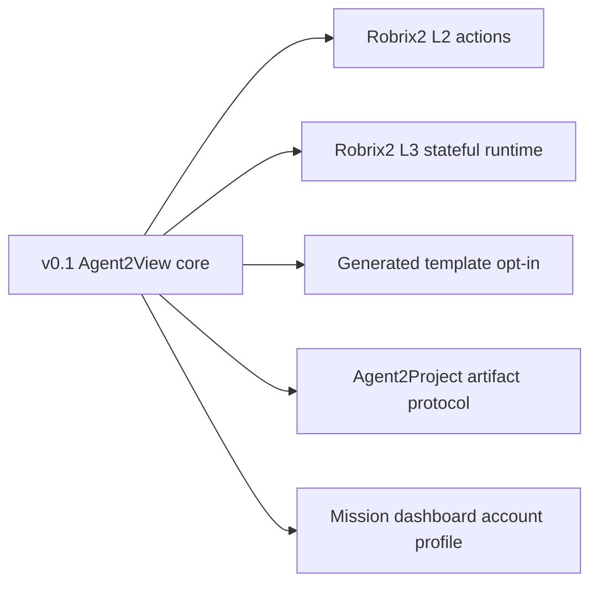

# Non-Goals and Roadmap

## Non-Goals

This v0.1 specification does not include:

- Agent2Project artifact manifest;
- running LLM-generated templates in the Robrix2 production path;
- plugin marketplace;
- dynamic capability discovery;
- automatic repair loop;
- multi-Agent resolver/template-author division-of-labor protocol;
- client persistence for room/account scoped state;
- full recursive subtask/project-management model.

## Future Extensions

Possible future protocols:

- Agent2Project artifact protocol;
- Robrix2 L2 action-capable cards;
- Robrix2 L3 stateful runtime;
- generated template opt-in profile;
- capability discovery protocol;
- Mission dashboard account scope profile;
- multi-mission room routing rules.

These extensions should each have their own spec. They should not be pushed into the v0.1 Agent2View core protocol.

