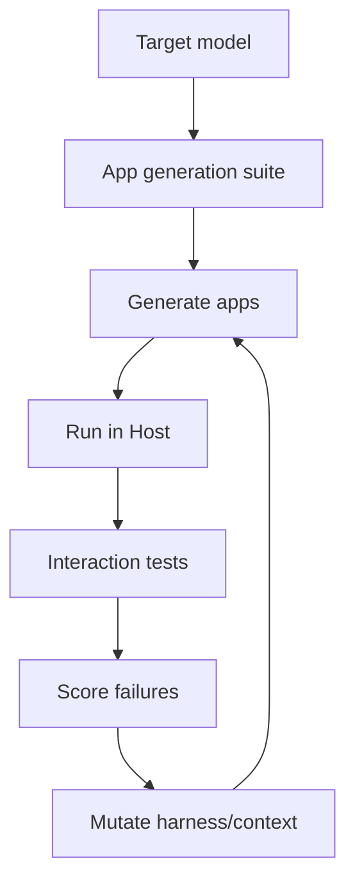
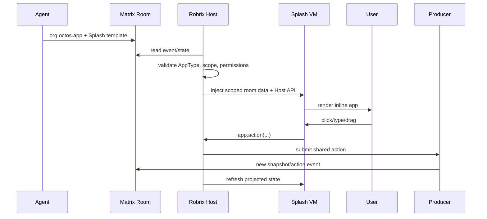
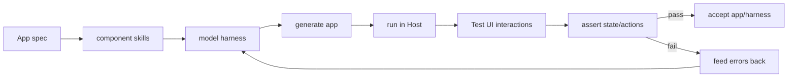
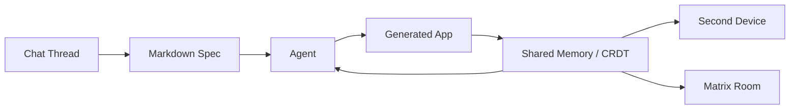
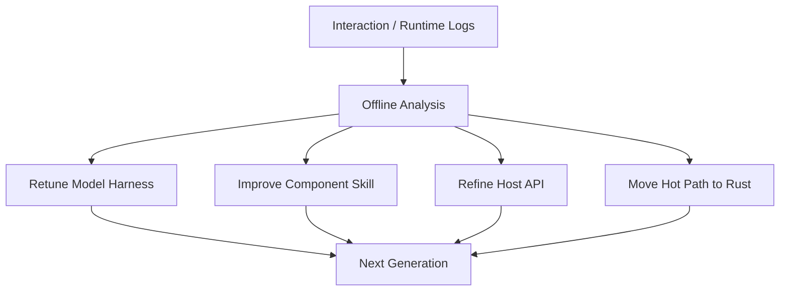

# Appendix: Meeting Notes and Roadmap Derivation

This appendix synthesizes the Makepad/Splash/Agent2App discussions starting from `Felo20260507094234.txt` and the later appended transcripts. The source material is automatic meeting transcription with mixed English, Chinese, and machine translation, and contains recognition errors. This appendix does not reproduce the transcript verbatim. Instead, it reconstructs the technical meaning, product judgments, disagreements, and engineering route that emerged from the discussion.

## 1. Core Question

The discussions revolve around one central question:

```text
Can Makepad move from a cross-platform UI/graphics framework
to an application runtime for the AI era?
```

The question breaks down into several practical issues:

- Is Splash a suitable target language for AI-generated apps?
- Is aichat inline `runsplash` only a demo, or a reusable Agent2App local binding?
- Can Robrix/Matrix host shared, persistent, collaborative AI-generated room apps?
- Should `agent.notify` remain public, or evolve into a clearer Splash Host API?
- Should app state live inside generated apps, or in the Host/Room?
- How can different models reliably generate working apps?
- How should generated UI and logic be tested?
- How can the product avoid mobile app store policy risks around dynamic app generation?

The resulting direction is:

```text
Makepad + Robius + Splash
    -> AI-native cross-platform app runtime
    -> local interactive generated views
    -> room-native collaborative mini apps
    -> software factory for verified generated apps
```

## 2. From Graphics Layer to AI-native App Runtime

The discussion starts by revisiting an earlier positioning of Makepad as a graphics layer that could replace Skia. That framing is too low-level for the current opportunity.

The stronger positioning is:

```text
Makepad as a cross-platform native app runtime for AI-generated applications.
```

The reasons are practical:

- OpenHarmony, Android, desktop, Web, and small-screen devices all need cross-platform UI.
- Developers do not want to rebuild the same app separately for every platform.
- Flutter, React Native, and KMP prove the demand for cross-platform development.
- Makepad/Robius can wrap platform APIs while keeping GPU-rendered UI.
- Splash can provide an AI-friendly dynamic app language.

The discussion distinguishes Makepad from existing cross-platform frameworks:

| Path | Character | Makepad Capability |
| --- | --- | --- |
| Flutter-like | self-contained UI runtime, cross-platform rendering | Makepad widgets + GPU renderer |
| React Native-like | native component wrapping | Robius / platform API wrappers |
| AI-native | model-generated UI/logic, Host runtime execution | Splash + Host API + harness |

The goal is not only to replace existing frameworks. The goal is to capture a new pattern where AI directly emits app views, templates, deltas, or component configuration that a Host can validate and run.

## 3. Splash: AI Target Language, Not a Rust Replacement

The group repeatedly notes that for baked apps, Rust is still preferred for much of the logic. Rust is faster, safer, and more maintainable for long-lived application code.

Splash is valuable in a different use case:

```text
AI-generated streaming app / inline app / room mini app
```

Its advantages are:

- shorter than a full Rust app;
- closer to Makepad runtime than HTML/CSS/JS;
- streamable, parseable, and incrementally renderable;
- embeddable inside chat or room contexts;
- able to receive controlled Host APIs;
- capable of expressing UI and lightweight logic.

One important conclusion is that Splash should be treated as the "lowest-token executable app representation". It does not need to be the most powerful language; it needs to let a model express a runnable app fragment with fewer tokens and a smaller error surface.

## 4. UI Generation and Working App Generation Are Different Problems

The discussion separates two stages:

```text
UI generation:
    the model generates a visible interface.

Functional app generation:
    the model generates an app that correctly handles events, state, and computation.
```

aichat UI generation is already fairly strong. With prompts, examples, and guards, models can generate cards, dashboards, calculators, todo UIs, heart-rate cards, and similar visual structures.

Functional app generation is harder:

- A calculator can render but mishandle operators or equals.
- A todo UI can render but fail add/delete/toggle.
- An input field can lose focus if every keypress rebuilds the `runsplash` source.
- The model can call Host APIs that do not exist.
- The model can emit shader/vector code the Splash VM cannot parse.

Therefore, Agent2App quality cannot be measured only by render success. The required loop is:

```text
click -> action -> state mutation -> template refresh -> UI remains usable
```

## 5. Harness: A Model-facing Constraint System

Harness is a key concept in the discussions. It is not a single prompt. It is the constraint package that puts a model in the best condition to generate a working app.

A harness can include:

- Splash grammar summaries;
- available widget examples;
- Host API manifests;
- component skills;
- AppType schema;
- state/data paths;
- restrictions such as "do not write shader callbacks";
- runtime error feedback;
- test failure reports.

Harnesses must vary by model:

- frontier models can generate more original structure;
- mid-tier models should compose templates and components;
- small or on-device models should fill config, select components, and emit small deltas.

The discussion reaches this judgment:

```text
The same harness will not naturally work for every model.
Every target model needs evaluation, compression, strengthening, or regeneration of the harness.
```

This leads to per-model harness eval:



## 6. Component Skills: Do Not Regenerate Everything

The discussion repeatedly mentions skills, component memory, and component libraries. The point is that common app types are finite, so the model should not regenerate full UI and logic from scratch every time.

Candidate component skills:

- Todo / collection
- Calculator
- Timer
- Calendar / agenda
- Weather card
- Poll
- Trip planner
- Barcamp scheduler
- Mission Room
- Dashboard / -1 screen card

Each component skill can include:

- Splash template;
- parameter schema;
- Host API requirements;
- state/data binding examples;
- allowed actions;
- tests;
- prompt examples.

Generation becomes selection and configuration:

```text
"make a trip planner"
    -> load trip_planner skill
    -> generate data schema + view config
    -> bind app.collection / calendar APIs
    -> run tests
```

This is more reliable than generating a full widget tree and is more suitable for smaller models.

## 7. From agent.notify to Splash Host API

`agent.notify` caused confusion in the discussion. The name sounds like the agent is notifying AI, or notifying the Host that content is ready to render. The actual mechanism is:

```text
generated Splash view
    -> emits user intent
    -> Host validates action and payload
    -> Host mutates data/state or calls AI
```

`agent.notify` is therefore a low-level live wire, not an ideal public API.

Recommended evolution:

```splash
app.action("inc", {})
app.input.set("new_item", text)
app.collection.add_from_input("items", "new_item")
ai.talk("explain this result")
```

Compatible implementation:

```text
app.collection.add_from_input("items", "new_item")
    -> app.action("app.collection.add_from_input", {...})
    -> internal SplashAction::Notify
    -> Host action dispatcher
```

The important change is not the function name itself. The important change is moving from free-form event strings to a structured Host API surface. Then the capability manifest can declare API families instead of arbitrary event strings.

## 8. State Ownership: Generated Widgets Must Not Own Business State

The discussion notes that PortalList or timelines may recycle widgets that scroll out of view. If business state lives in the generated widget instance, it will be lost when the view is recycled or regenerated.

The correct boundary is:

```text
Host / Matrix room:
    owns data and shared truth

HostState:
    owns local draft and local view state

Splash template:
    owns the current rendering expression

Widget instance:
    owns only transient rendering resources
```

In aichat, input draft state should live in HostState. Todo collections should live in Host data. Mission Room shared data should live in Matrix events/state. Splash projects state; it does not own it.

## 9. Robrix/Matrix: From Chat Message to Room App

The second major topic is whether a personal AI-generated app can be shared into a Matrix room so other people can see and collaborate on it.

Matrix already provides:

- room event log;
- room state;
- persistence;
- synchronization;
- membership / identity;
- real-time collaboration.

That makes Robrix/Matrix the natural remote Agent2App scenario.

Matrix already has a widget concept, but it is usually a webview/iframe app. It can access room state, but it is heavy, expensive for clients to support, and rarely used in the ecosystem.

Robrix + Splash can provide a lighter native room app:

```text
Agent sends app envelope
Robrix validates it
Robrix injects room data projection into Splash VM
Splash renders inline room app
User action goes through Host API
Producer writes Matrix update
All clients refresh view
```

Sequence:



## 10. Shared Data, Personalized Views

One important product point is that the same shared data can be rendered differently for different users.

Example: family trip planner.

```text
shared data:
    itinerary
    participants
    tasks
    decisions

User A view:
    calendar layout

User B view:
    compact checklist

User C view:
    map-first layout
```

This is stronger than a conventional Matrix widget. The Agent can generate personalized views while the room keeps one shared truth.

## 11. Room Artifact: Splash Script as Room Content

The later discussion confirms a concrete landing point: Splash script can be part of Matrix room content, not an external app package.

Example:

```json
{
  "org.octos.app": {
    "type": "room_poll",
    "scope": "room",
    "app_id": "poll.dinner",
    "data": {},
    "template": {
      "format": "splash",
      "code": "RoundedView{ ... }"
    },
    "capabilities": ["app.action", "app.collection"]
  }
}
```

This frames it as rich interactive room content rather than arbitrary installed software.

## 12. Software Factory: From Demo to Production Line

The later discussion introduces the software factory direction. The goal is to make app generation repeatable, evaluable, and self-correcting.

Core loop:



The tests must include interaction, not only static checks:

- Does click emit the right action?
- Does TextInput keep focus?
- Does payload match schema?
- Does state update correctly?
- Does view refresh preserve draft state?
- Does generated code trigger VM errors?

This is the correct route for stabilizing calculator, todo, timer, and similar demos.

## 13. One-shot and Iterative Generation

Rick notes that AI can generate working Makepad apps when it gets a feedback loop. One-shot remains harder. The goal is not to reject iteration; the goal is to move most iteration offline.

Recommended shape:

```text
offline:
    use automated tests to optimize harness

online:
    user request should succeed as often as possible in one shot
```

The model may iterate many times during harness development, but the user-facing path should feel immediate.

## 14. Splash Streaming Eval and VM Hardening

Current streaming eval is simple: keep feeding tokens into the VM, ignore errors, and retry until it works. That is enough for early demos, but it needs hardening.

Required improvements:

- evaluate only when scope/block is complete;
- incomplete code must not poison VM state;
- infinite loops must be interruptible;
- unrecoverable errors must be isolated;
- errors must be structured and returned to the harness;
- repeated eval should reduce flicker and focus loss.

This is central to AI streaming app UX.

## 15. Native Components and Platform Limits

The discussion also touches native components. Makepad/Robius can wrap platform components, but platform automation and compositing differ.

Apple platforms are especially constrained:

- native component contents often cannot be read by the application;
- custom shader glass cannot freely read Safari or banking views;
- transparent overlays are possible;
- readback-based blur/refraction usually requires system compositor support or screen capture permission.

Profiles should distinguish:

| Type | Strength | Limitation |
| --- | --- | --- |
| Makepad-native widget | unified rendering, unified testing, shader/vector/glass effects | component capabilities must be implemented in Makepad |
| Platform-native component | reuse system capability, React Native-like | lifecycle, testing, compositing, permissions are per-platform |

## 16. SVG, Vector, and Shader

The group discusses SVG, but the conclusion is not to depend on SVG. A Makepad-native vector/shader DSL is more appropriate.

Principles:

- small icons, arrows, and micro animations fit shaders;
- large complex graphics should not abuse shaders;
- complex logos or illustrations fit vector/raster pipelines better;
- Splash can define an expression simpler than SVG and friendlier to streaming parsing.

Template encoding can therefore be Makepad-native; it does not need to follow Web/SVG.

## 17. Web/WASM/WebGPU as Distribution Path

Makepad Web, WASM, and WebGPU appear in the discussion as a practical distribution route.

The value is not only technical. It reduces demo friction:

```text
protocol book
    + web AI chat demo
    + inline generated Splash app
    -> easier evangelism
```

If iOS App Store policy limits the native dynamic runtime, Web/WASM remains an important fallback.

## 18. Distribution and App Store Risk

The later discussion focuses on Apple policy. The risk is not interpretation itself. The risk is:

```text
download/generate/execute new code after review
change app functionality
bypass App Review
become an App Store replacement
```

High-risk framing:

```text
generate any app
AI app store
run arbitrary downloaded apps
build full apps from prompts
```

Lower-risk framing:

```text
AI chat with rich interactive content
room-native collaborative widgets
configurable mini apps
predeclared calendar/poll/dashboard capabilities
```

This is why the `agent2view` / `agent2project` distinction matters. aichat and Robrix should emphasize `agent2view`, not arbitrary full app generation.

## 19. Product Framing: Platform, Not a Single Killer App

One important sentence in the discussion is that the goal is not a single killer app, but a platform.

Possible product story:

```text
AI chat becomes a workspace.
Workspace can generate interactive mini apps.
Mini apps can be shared.
Shared apps collaborate on room data.
Users collect and personalize app views.
```

Better demos than a calculator include:

- family trip planner;
- room poll plus;
- barcamp scheduler;
- mission room dashboard;
- personal -1 screen dashboard;
- smart home card.

These require shared state, collaboration, persistence, or personalized views, and therefore show Agent2App's actual value.

## 20. Second Device, -1 Screen, and Personal App Collection

The source discussions also contain an important product line: Agent2App does not only happen inside a chat window. It can also happen on a second device, a personal dashboard, a `-1 screen`, or a small embedded display.

The `-1 screen` idea is similar to the personal information feed to the left of a phone home screen: schedule, weather, reminders, health, device status, travel plans, and other content are pushed by context instead of being opened manually as separate apps. The discussion also compared this with Huawei Atom Services, Android-style micro apps, and widget-like experiences on Apple and other systems.

This gives Agent2App a different surface from a chat message:

```text
chat inline app:
    the user asks inside a conversation, and the Agent returns an interactive view.

personal -1 screen:
    the Host organizes views automatically from user activity, room state, calendar, and device state.

second-device app:
    a small device continuously displays the most relevant generated view or control panel.
```

The product surface can therefore be split into three layers:

| Surface | Trigger | Typical Content | State Source |
| --- | --- | --- | --- |
| Chat inline | User request or Agent reply | calculator, todo, poll, trip card | message scope / local HostState |
| Room app | Room event or collaborative task | mission room, barcamp scheduler, shared planner | Matrix room state/event |
| Personal dashboard | Context-driven | -1 screen, health summary, home device card | account scope / device connectors |

This also explains why the discussions repeatedly emphasize platform instead of a single killer app. If users can keep, customize, and share Agent-generated views, they can form a personal app collection:

```text
Agent generates view
    -> user edits or personalizes it
    -> Host stores template + data binding
    -> user shares it to a room or device
    -> other users fork their own view while sharing data
```

The protocol should distinguish:

- shared data: facts shared by multiple people, such as trip plans, tasks, polls, and room state;
- personal view: a user's own layout, filter, language, and visualization;
- device projection: different renderings of the same AppInstance on phone, desktop, small screen, or Web.

## 21. Workspace, CRDT, and Multi-process Collaboration

The discussion also introduced a "chat app as workspace" idea. A complex app is not always a one-prompt interaction; it may need a workspace:

- chat thread: the collaboration record between user and Agent;
- markdown spec: continuously updated requirements, design, and constraints;
- generated code/template: the currently runnable artifact;
- shared memory: structured state readable and writable by both Agent and running app;
- open documents: documents, running apps, and stored values visible to the Agent.

The difference from a VS Code/browser harness is that the Agent2App Host is not merely a chat box. It is a workspace runtime. It can launch apps, read open documents, list stored values, inject context into apps, and feed runtime results back to the Agent.

The source discussion also mentioned CRDT/shared documents. This does not have to be part of the Agent2App kernel, but it is a good synchronization layer for multi-process and multi-device scenarios:



This explains two future extensions:

- the same workspace can drive a desktop app, mobile preview, and second-device display;
- a complex app can evolve inside a spec workspace before becoming a shareable Agent2App artifact.

For this little book, this should remain roadmap material rather than core kernel material. Future `agent2project` or complex `agent2view` flows will need workspace artifacts, spec documents, shared-memory bindings, and artifact lifecycle rules.

### Agent2App Studio and Host Should Be Separate

The appended discussion clarified a product boundary: the mini app generation harness should not be directly embedded into Robrix. Robrix can consume, run, share, and collaborate on generated apps, but it does not need to own the full generator, tester, and spec workspace.

A better split is:

```text
Agent2App Studio:
    chat with Agent
    edit spec / PRD / markdown workspace
    generate Splash template or app artifact
    run tests and produce receipt
    package/share the result

Agent2App Host:
    import artifact
    validate manifest and capabilities
    inject state/data
    render view
    dispatch actions
```

Robrix is a Host and a room/collaboration surface; aichat is a local demo Host; future Hosts may include Web Hosts, Android Hosts, WeChat-like Hosts, or dedicated runners. Separating the creator from the Host has several benefits:

- Robrix does not become overloaded by the full app factory.
- A standalone Studio can focus on harnesses, tests, specs, and trust receipts.
- The same artifact can be opened or shared by multiple Hosts.
- The protocol can become a standard instead of a private Robrix feature.

The clearer product relation is:

```text
Studio creates.
Host runs.
Room shares.
Protocol connects them.
```

## 22. Device Connectors, Local AI, and Privacy Boundaries

A large part of the discussion concerns personal AI, encrypted rooms, local models, and smart home devices. The core question is: if data lives in encrypted rooms, local devices, a home network, or private user services, a remote Agent may not be allowed to read it.

Agent2App should therefore distinguish three Agent types:

| Agent Type | Location | Data It Can Reasonably Access | Risk |
| --- | --- | --- | --- |
| Remote Agent | Cloud model service | Explicit user prompt, redacted context, public APIs | Strong privacy boundary; cannot directly read encrypted rooms |
| Local Agent | User device | Local files, encrypted room cache, personal calendar summaries | Weaker compute, platform limits |
| Home/Edge Agent | Home server, Home Assistant, Raspberry Pi-like device | Smart home, sensors, LAN devices | Device heterogeneity, many protocols, complex permissions |

This matters for Robrix/Molly-like scenarios. If a user wants a morning summary of what happened across encrypted rooms, the natural implementation is a local model reading the user's local room cache on a trusted device or home server, not sending plaintext to a remote service.

Smart home is another typical case. The discussion mentions washing machines, dishwashers, power meters, e-ink displays, Home Assistant, and open-protocol devices. Agent2App's value is not to replace every device app, but to combine device protocols, data connectors, and dynamic views:

```text
device connector:
    read status / submit command

Agent:
    understand user intent
    generate or select view

Host:
    enforce permission
    execute action
    render device dashboard
```

A reasonable abstraction is:

```text
Data Source:
    Matrix room, calendar, health data, home device, file, MCP connector

Action Sink:
    room event, calendar update, Home Assistant call, device command

View:
    Splash template / A2UI compatible plan / native component projection
```

Small devices should be treated separately. Makepad fits desktop, mobile, Web/WASM, and devices with a GPU or stronger CPU. It is not directly a UI runtime for microcontrollers. For controllers with only a few hundred KB of RAM, a more realistic path is:

```text
microcontroller:
    specialized firmware / thin client / screen driver

phone or home server:
    Agent + Host runtime + state owner

small screen:
    receives projected view or simple command UI
```

This does not weaken Makepad's role. It places Makepad at the layer it fits best: cross-platform native UI, interactive views, device dashboards, Web/WASM demos, and richer second-device experiences.

### Rooted Android / Linux-box Phone as Research Device

The appended discussion also mentions a freer experimentation shape: using a rooted or unlocked Android phone as a Linux-box-like research device. This is not the default product shape for normal users; it is a way to explore next-generation Agent UI, system APIs, background execution, microphone usage, device control, and second-device experiences.

This research device profile is useful because it can:

- bypass some normal mobile app sandbox limits for rapid system-level experiments;
- run local Agents, voice listeners, or device control flows for longer periods;
- access more system APIs and explore "Agent UI as operating environment";
- serve as a high-freedom experiment surface before Web, desktop, or standard Android products.

It should not be mixed into the core protocol. The protocol should describe artifacts, capabilities, state/actions, and Host validation; rooted Android is only an implementation profile:

```text
Standard Host:
    follows mobile platform rules
    uses declared capabilities
    suitable for product distribution

Research Device Host:
    has elevated device access
    useful for UI/system experiments
    not a baseline requirement
```

## 23. Trust Delivery: Spec, Test Receipt, and Hash

The source discussion contains another important point: how does a user trust an Agent-generated app?

A complex app should not only present a nice UI. It should also provide a delivery receipt, similar to a consumer product warranty card or a software supply-chain build/test receipt:

```text
This is what the app is supposed to do.
This is what input was given to the Agent.
This is what artifact was generated.
This is what tests passed.
This is what permissions it needs.
This is what changed since the last version.
```

For `agent2view`, this receipt can be lightweight:

```json
{
  "app_id": "trip.family",
  "template_hash": "sha256:...",
  "data_schema_hash": "sha256:...",
  "input_summary": "family trip planner with shared tasks",
  "model": "frontier-model-x",
  "capabilities": ["app.action", "app.collection", "room.write"],
  "tests": [
    {"name": "add_task", "status": "pass"},
    {"name": "toggle_task", "status": "pass"}
  ]
}
```

For `agent2project`, the receipt should be heavier and may include PRD, spec, source hash, dependencies, test recording, generation logs, human review notes, and release targets.

This connects to the workspace direction: complex apps should have a readable markdown spec that is updated as the Agent builds. Users or reviewers should not have to trust a black-box output. They can inspect:

- original requirement;
- Agent decomposition;
- generated template/code;
- permission declaration;
- test results;
- change history.

This is also valuable for explaining Agent2App externally: not "AI generated a black-box app", but "AI generated an interactive artifact with spec, permissions, tests, and traceable hashes".

### Splash App Artifact: Share and Open Like a File

The most important new concept in the appended discussion is that a Splash app should not only live inside a chat message or markdown code block. It should become a savable, draggable, shareable artifact that multiple Hosts can implement.

The discussion uses an image-file analogy:

```text
drag image into browser
    -> browser displays image

drag Splash app into Robrix
    -> Robrix validates and renders app
```

This implies an Agent2App artifact envelope. It may be a `.splashapp` file, Matrix event content, share-sheet payload, URL payload, zip/package, or Host internal stored object, but the core fields should remain consistent:

```json
{
  "agent2app_artifact": {
    "version": "0.1",
    "kind": "agent2view",
    "app_id": "trip.family",
    "title": "Family Trip Planner",
    "template": {
      "format": "splash",
      "hash": "sha256:...",
      "code": "RoundedView{ ... }"
    },
    "data_schema": {
      "hash": "sha256:...",
      "schema": {}
    },
    "capabilities": [
      "app.action",
      "app.collection",
      "room.write"
    ],
    "initial_data": {},
    "receipt": {
      "input_hash": "sha256:...",
      "tests": [
        {"name": "render", "status": "pass"},
        {"name": "add_task", "status": "pass"}
      ]
    }
  }
}
```

The artifact should support several entry points:

- Drag-and-drop: into Robrix, aichat, Agent2App Studio, or another Host.
- Share sheet: from Studio to room, chat, device, or file.
- Matrix event: persisted as room content.
- Local file: saved, versioned, copied, reviewed.
- URL/deep link: Web demo or mobile preview.

The key point is that Robrix is only one Host implementation, not the protocol itself. If a WeChat-like client, Web client, desktop runner, or another Makepad app implements the same artifact contract, it should be able to open the same Agent2App artifact.

This also reinforces the boundary between `agent2view` and `agent2project`:

```text
agent2view artifact:
    template + data schema + capabilities + receipt
    imported by an existing Host
    Host owns permission and execution boundary

agent2project artifact:
    file tree + package metadata + resources + build/run/export targets
    becomes an independent software project
    needs a heavier lifecycle and review process
```

## 24. Self-evolution: Distilling Runtime and Components from Logs

The current appendix already describes harness eval, but the source discussion goes further into self-evolution or "dreaming": the Host does not merely run an app once; it can improve the system from interaction history, errors, and performance data in the background.

The system can distill:

- which generated views users keep, delete, or modify;
- which Host APIs are often called together and should become a higher-level API;
- which Splash function hot paths should move into native Rust components;
- which component skill examples cause more VM/runtime errors;
- which models fail more often on a given AppType and need a stronger harness;
- which UIs render visually but fail interaction tests.

The loop is:



There are two feedback types:

- online repair: when a user request fails, the Agent retries from the error;
- offline evolution: at night, during charging, or in CI, the system analyzes many logs and improves harnesses, skills, Host APIs, and runtime.

The source discussion also notes that "looking only at code is blind"; screenshot or vision-based evaluation may be needed. The software factory should therefore test more than structure and actions:

- whether visuals actually render;
- whether important content is inside the viewport;
- whether generated visuals such as waveforms, charts, and icons match intent;
- whether shader/vector errors degrade the visual output.

This directly addresses aichat demo failures: UI code was generated, but a drawing did not appear; or the view rendered, but click, input, focus, and state refresh were unstable.

## 25. More Granular App Store Boundary

The current appendix already covers Apple policy risk, but the discussion makes the boundary more granular. The issue is not only whether interpreted code is allowed; it is about primary purpose, dynamic functionality changes, review bypass, and whether the product looks like an App Store replacement.

The operational split is:

| Shape | Risk Judgment | Reason |
| --- | --- | --- |
| Rich interactive content inside a chat app | Lower | Primary purpose remains chat/collaboration |
| Matrix room app / poll / calendar picker | Low to medium | Similar to rich content inside messages; capabilities should be predeclared |
| Predeclared configurable mini app | Lower | Host declares capability; Agent configures data/view |
| Arbitrary prompt to full running app | High | Easy to read as bypassing App Review |
| AI app store / generated project runner | High | Close to replacing the App Store |
| Web/WASM demo | Lower | Browser/Web is already a dynamic-content environment |
| Standalone runner app | Uncertain | Depends on platform review, distribution shape, and primary purpose |

For iOS, product language should avoid:

```text
Make any app.
Run arbitrary downloaded apps.
AI App Store.
```

Safer language is:

```text
Rich interactive chat content.
Room-native collaborative widgets.
Configurable mini apps inside a declared Host.
Personal dashboard views over user-approved data.
```

Android, Web/WASM, desktop, and TestFlight can carry more aggressive experiments. iOS App Store builds should emphasize chat/collaboration primary purpose, predeclared capabilities, user-authorized data sources, and configurable views.

This reinforces the `agent2view` / `agent2project` split: `agent2view` can be interactive content inside a Host; `agent2project` involves a full project, binary, publishing, and review, and therefore needs a separate protocol and product story.

Native clients should also follow this split. A full Agent2App Studio/native client can create, test, and manage artifacts; Robrix or an iOS chat Host should import, validate, and run artifacts only within declared capabilities. This helps preserve primary purpose:

```text
Agent2App Studio:
    primary purpose = create and verify app artifacts

Robrix:
    primary purpose = chat / room collaboration
    Agent2App = rich interactive room content

Runner / Preview:
    primary purpose = preview declared app artifacts
    distribution risk depends on platform policy
```

## 26. Promotion Route: Problem Statement, Demo, and Community

The discussions repeatedly note that Agent2App is a problem many people have not fully seen yet. Industry attention is still mostly on coding agents, text chat, and tool calling, rather than "Agents directly generate, run, test, and share app views".

Promotion therefore needs three things together:

```text
problem statement:
    Why are text-only Agents insufficient?
    Why do AI-generated apps need Host/runtime/protocol?

spec:
    Agent2App core kernel
    bindings and scenarios
    safety and validation

demo:
    aichat local inline app
    Robrix room app
    Web/WASM public demo
```

Potential showcase directions include OpenHarmony, Matrix, European markets, second devices, and smart home. Rather than writing oral meeting dates as a plan, the product strategy can be:

- use Web/WASM demo to reduce trial friction;
- use Matrix/Robrix demo to show shared apps and persistence;
- use `-1 screen` / smart home card to show personal dashboard;
- use component skills and test receipts to show trustworthy generation;
- use A2UI compatibility to show ecosystem alignment instead of isolated invention.

Community strategy can start with enthusiast communities: Home Assistant, Matrix, open-source Android ROMs, Makepad/Rust developers, and AI coding power users. These users are more likely to value local control, open protocols, privacy, dynamic UI, and verifiable generation.

The appended discussion also sharpens the standardization story: do not say "Robrix has a feature"; say "Robrix implements the Agent2App artifact/protocol". If WeChat-like Hosts, Web clients, native chat clients, or room app Hosts can implement the protocol, the external value becomes clearer.

A useful framing is:

```text
Agent2App is a portable artifact and host protocol.
Robrix is one implementation.
aichat is one local development host.
Agent2App Studio is one creation environment.
Other hosts can implement the same import/render/action contract.
```

This matches the A2UI compatibility direction: the protocol should define kernel, artifact, capability, and binding, rather than be tied to one product name.

## 27. Recommended Route

The combined route can be split into these phases:

```text
Phase 0: Local AppGen
    aichat reliably generates inline runsplash.

Phase 1: Host API
    app.* API replaces public agent.notify.

Phase 2: Verification Harness
    calculator/todo/timer/poll/calendar enter automated tests.

Phase 3: Component Skills
    common mini apps become componentized.

Phase 4: Robrix Room App
    Matrix events carry app envelope + Splash template.

Phase 5: Shared Collaboration
    actions write back to Matrix, all members sync data, each member owns a view.

Phase 6: Distribution Strategy
    Web/Android show dynamic runtime aggressively; iOS uses rich chat content + predeclared capabilities.

Phase 7: Workspace and Trust Receipts
    spec workspace, test receipt, hash, and permission card enter artifact lifecycle.

Phase 8: Device and Local AI Scenarios
    second device, -1 screen, Home Assistant, and encrypted-room local summaries enter profile exploration.

Phase 9: Self-evolution
    logs, tests, and visual evaluation continuously improve harnesses, skills, Host APIs, and native components.

Phase 10: Portable Artifact
    define .splashapp / Agent2App artifact manifest with drag-and-drop, share sheet, Matrix event, and local file support.

Phase 11: Multi-Host Standardization
    Robrix, aichat, Web Host, native runner, and WeChat-like Host share the import/render/action contract.
```

## 28. Items to Add to Protocol or Implementation

Protocol:

- Define Agent2App artifact envelope / `.splashapp` manifest.
- State that Robrix is a Host implementation, not the protocol itself.
- Add import/render/action contract for other Hosts.
- Add artifact transport through drag-and-drop, share sheet, deep link, and Matrix event.
- Matrix Splash app binding.
- Template as a room artifact.
- Host API capability families.
- Generated views do not own shared state.
- App Store risk belongs mainly to `agent2project`, not every `agent2view`.
- Extension points for workspace artifact, test receipt, and template/data hash.
- Data Source / Action Sink / View connector model.

Implementation:

- `app.action` / `app.input` / `app.collection` / `ai.talk`.
- VM resource limits.
- Streaming eval scope detection.
- Structured runtime errors.
- Remote/headless widget interaction tests.
- Screenshot/vision-based visual evaluation.
- Per-model harness eval suite.
- Component skill registry.
- Self-evolution log pipeline.
- Local Agent profile for encrypted room data.
- Standalone Agent2App Studio prototype.
- Artifact import/export in Robrix and aichat.
- Multi-client Host API profiles: native, web, text/TUI, messaging, room Host.
- Research device Host profile for rooted/unlocked Android.

Documentation and promotion:

- Agent2App problem statement.
- Makepad/Splash vs A2UI vs Matrix widget comparison.
- Web/WASM demo.
- Trip planner / room poll / mission room as the main demo, not calculator.
- `-1 screen`, second-device, and smart home dashboard demo story.
- iOS/Android/Web/desktop distribution boundary.
- Product responsibility split between Agent2App Studio, Host, Room, and Runner.
- Promotion language that says "Robrix implements the protocol", not "the protocol equals Robrix".

## 29. Final Judgment

The discussions converge on a clear position:

```text
Agent2App is not "let AI generate arbitrary apps and bypass platform review".

Agent2App is the ability for Agents to generate, update, and personalize
interactive views inside Host-owned data/state/action/permission boundaries.
```

Splash is Makepad's key tool for this direction. It needs Host APIs, component skills, harness eval, VM hardening, trust receipts, portable artifacts, workspace artifacts, local Agent profiles, multi-Host import/render/action contracts, and Robrix/Matrix binding to move from demo to platform capability.
