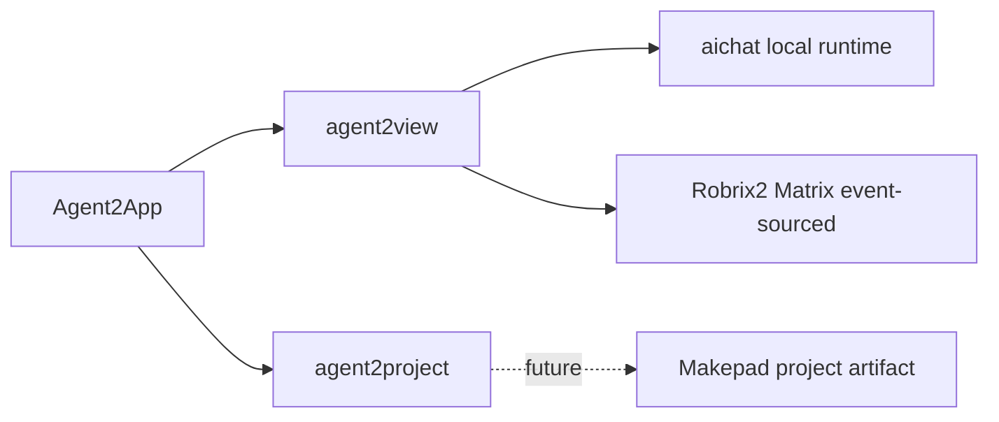

# Preface

This little book defines the Agent2App protocol for `agent2view`.

It places two implementation directions that already exist under the same semantic frame:

- `makepad-example-aichat`: a local LLM generates interactive `runsplash` UI, and the host receives actions through `agent.notify` before updating local state.
- Robrix2: an Agent sends an `org.octos.app` envelope through a Matrix event, and the client renders a native app card inside IM by using registered AppTypes and static Splash templates.

The shared idea is simple: the Agent produces an app view; the Host owns rendering, state boundaries, and action boundaries.

The key difference is authority. In aichat, state authority lives in the local Host. In Robrix2, shared truth lives in the Matrix event.

This book defines only `agent2view`. `agent2project` needs a separate artifact protocol.

**How to read this book**

Read Part I for the protocol core.

Read Part II for the current host profiles.

Read Part III for safety, versioning, and validation.
