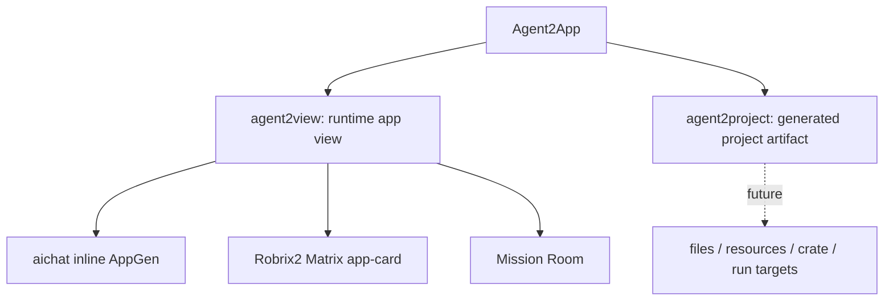
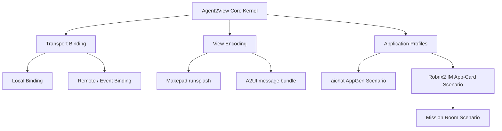

# Preface

[English](../en/) | [中文](../zh/)

Agent2App is an umbrella term for cases where an Agent returns more than text and hands some form of application capability to a Host. There are two product tracks under that umbrella, and they must stay separate:

- `agent2view`: the Agent generates or declares a **live app view inside an existing Host**. The Host owns rendering, state boundaries, permission boundaries, and action dispatch. aichat inline `runsplash` UI, Robrix2 Matrix app-cards, and Mission Room all belong to this track.
- `agent2project`: the Agent generates an **independent project or application artifact**. The output is no longer an in-host live view; it is a file tree, resources, crate/package metadata, state modules, event handler code, and run/export/package targets.

This little book defines `agent2view`: the protocol where an Agent produces an app view and the Host safely renders it while enforcing state and action boundaries. `agent2project` needs a separate artifact protocol and must not reuse the `agent2view` capability manifest as-is.

The central revision in this edition is that `agent2view` first defines a **shared protocol kernel**, then defines transport bindings, view encodings, and application scenarios. Remote Agents and local Agents use the same kernel semantics; they differ only in message carrying, permission boundaries, state submission paths, and Host profiles.

**How to read this book**

Read Part I for the protocol core. It defines the object model, state model, and action semantics shared by local and remote Agents.

Read Part II for the current Host profiles. aichat and Robrix2 are application scenarios built on top of the shared kernel.

Read Part III for safety, versioning, and validation.
