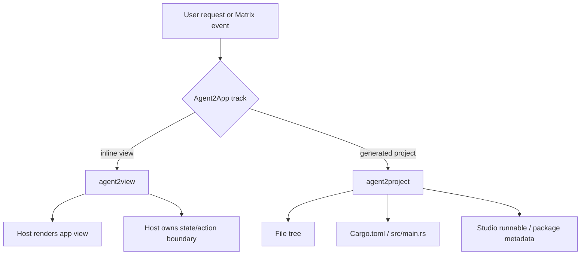

# 目标与边界

Agent2App 的核心目标是定义 Agent 如何把结构化应用视图交给宿主渲染，以及用户在视图中的操作如何回到宿主或 Agent。

本规范当前只覆盖 `agent2view`。

## 目标

`agent2view` 需要解决四个问题：

1. Agent 如何声明要渲染的 app view。
2. Host 如何校验 app type、state、template 与 action。
3. Host 如何保存状态，避免 widget 销毁后丢失权威状态。
4. 用户 action 如何回到 Host 或 Agent，并保持共享事实边界清晰。

## 两条轨道

## Agent2View

`agent2view` 表示 Agent 输出的内容最终成为宿主内的 live view。它不是独立项目，也不拥有自己的完整进程、文件树或打包生命周期。

它适合：

- aichat inline `runsplash` demo。
- Robrix2 weather/news card。
- Robrix2 mission room control surface。

## Agent2Project

`agent2project` 表示 Agent 生成独立 Makepad 项目或应用产物。

它至少需要定义：

- 文件树。
- `Cargo.toml`。
- `src/main.rs`。
- 资源文件。
- 状态模块。
- 事件/action handler。
- Studio runnable item。
- 导出和打包元数据。

Agent2Project 不得复用 Agent2View 的 runtime capability manifest。前者是构建产物合同，后者是宿主运行能力边界。

## 本版非边界

本版不定义：

- 代码生成项目协议。
- 插件市场。
- LLM 生成模板在 Robrix2 生产路径的执行协议。
- 多 Agent resolver/template-author 分工。
- 自动 repair loop。
