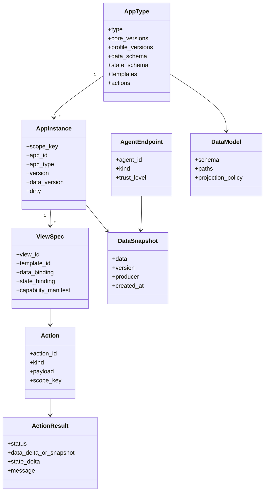
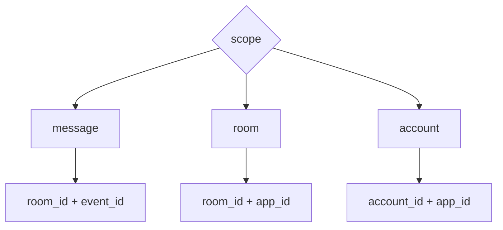

# 通用协议内核

Agent2App Core Kernel 是本地 Agent 和远程 Agent 共享的协议内核。它定义对象模型、数据模型、状态模型、view 模型、action 语义和校验顺序，但不绑定具体 transport。

## AgentEndpoint

AgentEndpoint 表示产生 app view 或处理 shared action 的 Agent 端点。

它可以是：

- 本地 LLM session。
- 本地工具 Agent。
- Matrix room 中的远程 Agent。
- 服务端 producer。

AgentEndpoint 的位置不改变协议对象模型。远程 Agent 和本地 Agent 都产生相同语义的 `ViewSpec`、`DataSnapshot` 和 `Action`。

## AppType

AppType 是应用类型的全局定义，例如：

- `counter`
- `timer`
- `calculator`
- `collection`
- `weather`
- `news`
- `mission_room`
- `mission_dashboard`

AppType 决定：

- 支持的 core protocol version。
- 支持的 profile version。
- `data` 或 legacy `initial_state` snapshot 的 schema。
- 可暴露给 view 的 Host state path。
- 可用模板。
- 可用 action。
- 本地 reducer 或 shared action response 的路由规则。

## AppInstance

AppInstance 是某个 AppType 在某个 scope 下的具体运行实体。

它不等同于单条消息。`room` scoped app 可以被多条消息渲染并指向同一个实例。

## ScopeKey

ScopeKey 是 AppInstance 的稳定身份。

本地场景可以把 `room_id` 映射为 local workspace 或 session id；远程场景可以直接使用 Matrix room/account/event id。映射不同，ScopeKey 语义不变。

## ViewSpec

ViewSpec 是 Agent 希望 Host 渲染的 view 描述。

ViewSpec 至少包含：

- AppType。
- ScopeKey。
- Template 或 template id。
- Data binding。
- State binding。
- Capability manifest。
- 可触发 action 列表。

aichat 可以把 ViewSpec 编码为 `appplan json` + `runsplash`。Robrix2 可以把 ViewSpec 编码为 `org.octos.app` envelope + 本地 template id。

## DataModel

DataModel 描述 AppInstance 的业务事实结构。

它至少包括：

- `data_schema`。
- 可绑定的 data path。
- data 到 render data model 的投影规则。
- 哪些 action 可以改变 data。

DataModel 不包含 hover、focus、输入法 composition、当前滚动位置等 renderer 状态。输入 draft 默认属于 Host state；只有提交 action 通过校验后，才可能进入 data。

## DataSnapshot

DataSnapshot 是 AppInstance 的权威数据快照。

本地 Agent 场景中，DataSnapshot 可以由 HostState 或本地 reducer 维护，并在每次渲染时投影到 view。

远程 Agent 场景中，DataSnapshot 通常由远程 producer 写入共享事件日志，例如 Matrix timeline。

无论来源如何，DataSnapshot 都必须满足 AppType data schema。旧 binding 中名为 `state` 或 `initial_state` 的字段，如果承载业务事实，应按 DataSnapshot 语义处理。

## Template

Template 是把 data 和允许暴露的 Host state 渲染成 UI 的描述。

协议内核只要求 Template 可被 Host 预检，并且只能绑定 capability manifest 允许的 data/state path。它不规定 Template 必须由 LLM 生成或必须本地静态。

具体 profile 决定 Template 来源：

- aichat profile 允许 LLM-generated `runsplash`，但要受 capability manifest 限制。
- Robrix2 v1 profile 只允许本地静态 `.splash` template，不允许 Matrix event 或 LLM 直接提供运行时模板。

## Action

Action 是用户或 view 发出的意图。

Action 分两类：

- Local View Action：只影响当前本地 view/session。
- Shared Fact Action：改变共享 data，必须由 Agent/producer 验证后产生新 DataSnapshot。

Action 的类型由 AppType action schema 和 profile policy 决定，不由 transport 决定。`agent.notify` 可以承载 local action，`org.octos.action_response` 可以承载 shared action；未来其它 transport 也应承载同样的 Action 语义。
