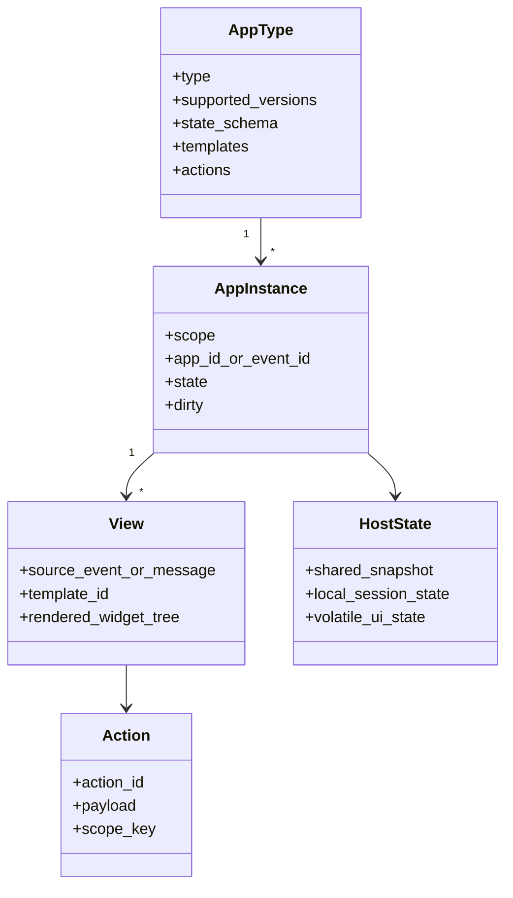

# 术语模型

Agent2View 协议的核心对象如下。

## AppType

AppType 是应用类型的全局定义，例如：

- `counter`
- `timer`
- `calculator`
- `collection`
- `weather`
- `news`
- `mission_room`
- `mission_dashboard`

AppType 决定：

- 支持的协议版本。
- `initial_state` 的 schema。
- 可用模板。
- 可用 action。
- 本地 reducer 或共享 action response 的路由规则。

## AppInstance

AppInstance 是某个 AppType 在某个 scope 下的具体运行实体。

它不等同于单条消息。`room` scoped app 可以被多条消息渲染并指向同一个实例。

## View

View 是 AppInstance 的一次可见渲染。

在 aichat 中，一个 assistant message 里的 `runsplash` block 是一个 view。

在 Robrix2 中，一个 Matrix timeline item 渲染出的 Splash card 是一个 view。

## HostState

HostState 是宿主持有的状态。

它可以是：

- aichat 的 `APP_DEMO_STATE`。
- Robrix2 的 `AgentViewSession.state`。
- Matrix event snapshot 投影出的 session state。

Widget 内部状态不是 HostState，不能作为共享事实来源。

## Template

Template 是把 state 渲染成 UI 的描述。

aichat 支持 LLM 生成的 `runsplash`。

Robrix2 v1 只允许本地静态 `.splash` template，不允许 Matrix event 或 LLM 直接提供运行时模板。

## Action

Action 是用户或 view 发出的意图。

Action 分两类：

- Local View Action：只影响当前本地 view/session。
- Shared Fact Action：改变共享事实，必须由 Agent/producer 验证后产生新 snapshot。
