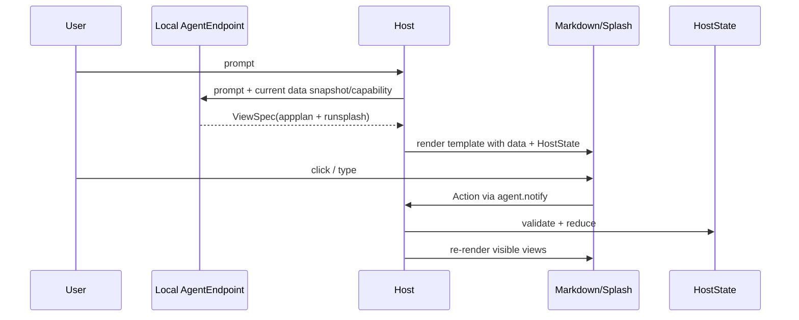
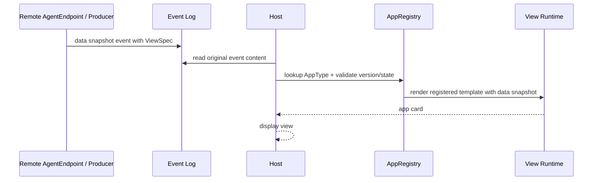

# 传输绑定

传输绑定把通用协议内核映射到具体消息承载。它不改变协议语义，只改变数据如何传输、谁能观察、失败如何降级。

## 内核到绑定的映射

| Core Concept | Local Binding | Remote/Event Binding |
|---|---|---|
| AgentEndpoint | 当前 LLM session / 本地工具 Agent | Matrix room Agent / 服务端 producer |
| ViewSpec | `appplan json` + `runsplash` | `org.octos.app` envelope + template id |
| DataSnapshot | Host-owned data / APP_DEMO_STATE | Matrix event content |
| Host State | local session state / input drafts | in-memory AgentViewSession |
| Template | LLM-generated runsplash 或本地模板 | 本地注册静态模板 |
| Action | `agent.notify(event_id, payload)` | `org.octos.action_response` |
| ActionResult | Host local reducer 结果或新 DataSnapshot | Agent 产生的新 snapshot event |
| Failure | log/ignore 或显示错误 view | fallback 到 `body` |

## Local Binding

Local binding 用于 aichat 这类本地 AppGen 场景。

特征：

- Agent 与 Host 在同一个本地交互闭环里。
- Host 拥有当前 Agent session。
- Host 可以直接维护本地 data 和 HostState。
- Host 可以立即处理 local action 并更新 UI。
- `agent.notify` 是 local binding 的 reverse channel，不是通用协议内核本身。

## Remote/Event Binding

Remote/Event binding 用于 Robrix2 这类远程、可审计、事件源场景。

特征：

- 共享事件日志是审计来源。
- Agent/producer 是共享 data 的来源。
- Host 是 event consumer，不是 Agent 的私有 RPC peer。
- 共享变更必须通过 action response，再由 Agent 发送新 DataSnapshot。
- Host 可以做 optimistic local view update，但不得把 optimistic state 当作 shared truth。

## Binding 不是应用场景

Local binding 与 Remote/Event binding 是传输绑定，不是业务场景。aichat 使用 Local binding；Robrix2 使用 Remote/Event binding；未来其它宿主可以使用同一个内核绑定到 HTTP、WebSocket 或文件同步。

## 应用场景矩阵

| 场景 | 使用内核 | Binding | Profile 重点 |
|---|---|---|---|
| aichat AppGen | Agent2View Core | Local Binding | LLM-generated UI、本地 HostState、快速交互 |
| Robrix2 IM Card | Agent2View Core | Remote/Event Binding | Matrix timeline、静态模板、plain text fallback |
| Mission Room | Agent2View Core | Remote/Event Binding | room-scoped data、shared action、human supervision |
