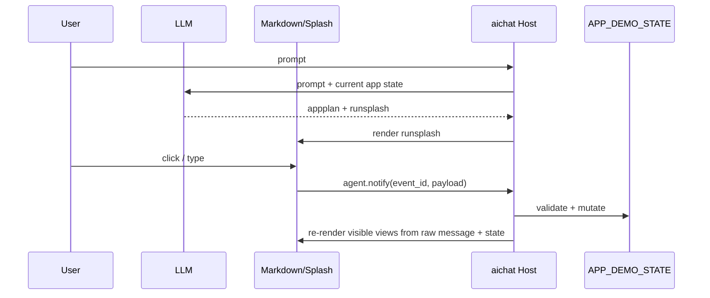
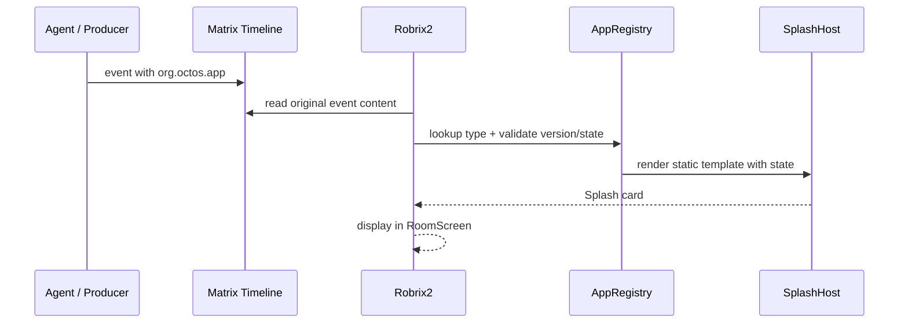

# 两种运行模式

Agent2View 有两种已经落地或计划落地的模式。

## Local Runtime

Local Runtime 模式用于 aichat。

特征：

- Agent 与 Host 在同一个本地交互闭环里。
- Host 拥有当前 LLM session。
- Host 拥有 local state。
- Host 可以立即处理按钮事件并更新 UI。
- `agent.notify` 是可接受的本地 reverse channel。

## Matrix Event-Sourced

Matrix Event-Sourced 模式用于 Robrix2。

特征：

- Matrix timeline 是共享审计日志。
- Agent/producer 是共享事实的来源。
- Robrix2 是 event consumer，不是 Agent 的私有 RPC peer。
- 共享变更必须通过 Matrix/OctOS action response，再由 Agent 发送新 snapshot event。
- Robrix2 v1 不接受 LLM 生成的运行时 Splash template。

## 模式差异

| 维度 | aichat Local Runtime | Robrix2 Matrix Event-Sourced |
|---|---|---|
| 视图来源 | LLM response 中的 `runsplash` | Matrix event 中的 `org.octos.app` |
| 模板来源 | LLM 生成 | 本地静态模板 |
| 状态权威 | 本地 HostState | Agent-produced Matrix event |
| action 回路 | `agent.notify` | `org.octos.action_response` |
| 失败策略 | log/ignore 或显示错误 | fallback 到 `body` |
| 适合场景 | 本地 demo、快速交互原型 | IM 中可审计、可回放的 app card |
