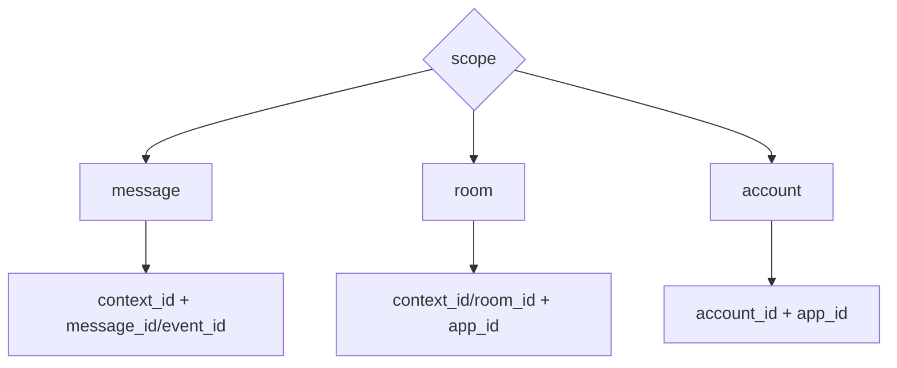
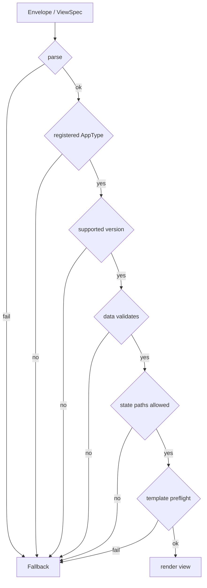

# Envelope 与 Scope

Envelope 是 Transport Binding 对 ViewSpec/DataSnapshot 的具体编码。Scope 是协议内核概念，不属于某个特定 transport。

## 通用 Envelope 语义

一个 Agent2View envelope 至少需要表达：

```json
{
  "type": "mission_room",
  "core_version": 1,
  "profile_version": 1,
  "scope": "room",
  "app_id": "mission.main",
  "data": {},
  "state": {},
  "template_id": "mission_room.v1",
  "capabilities": {}
}
```

字段语义：

- `type` 必须匹配本地注册的 AppType。
- `core_version` 表示通用协议内核版本。
- `profile_version` 表示 AppType/profile 版本。
- `scope` 定义 AppInstance 的身份范围。
- `app_id` 在 `room` 和 `account` scope 下必须提供。
- `data` 必须是完整 DataSnapshot 内容，不是 patch。
- `state` 是可选的 Host/render state 初值或投影，不得默认视为共享事实。
- `template_id` 指向 profile 允许的模板。
- `capabilities` 声明 view 可用 data path、state path、action 和 helper。

不同 binding 可以用不同字段名编码这些语义，但不得改变语义。

## Matrix Binding Envelope

Robrix2 / Matrix binding 使用 `org.octos.app` envelope：

```json
{
  "body": "Plain text fallback",
  "msgtype": "m.text",
  "org.octos.app": {
    "type": "mission_room",
    "version": 1,
    "scope": "room",
    "app_id": "mission.main",
    "initial_state": {}
  }
}
```

`body` 必须提供。它是富渲染失败时的 fallback，也应该能独立表达消息摘要。

当前 `version` 是 AppType/profile version。若后续引入显式 `core_version`，旧宿主可以继续按 `version` 兼容处理。

`initial_state` 是当前 Matrix binding 的 legacy 字段名。若它承载 mission、weather、news、dashboard 等业务事实，Host 应把它映射为 Agent2App Core DataSnapshot 的 `data`，而不是 Host view state。

## Local Binding Envelope

aichat / Local binding 把 envelope 拆成：

- `appplan json`：描述 AppType、data path、state path、action、required controls。
- `runsplash`：描述 Template。
- Host-owned data：提供当前 DataSnapshot。
- HostState：提供输入 draft、selection、filter 等本地运行状态。

这三者组合后等价于通用 ViewSpec。

当 `appplan` 选择 A2UI 兼容格式时，`runsplash` 不再是必需的协议组成。`appplan` 可以在 `view.messages` 中携带 A2UI `createSurface`、`updateComponents` 和 `updateDataModel` message bundle。此时 `appplan` 仍负责 Agent2App 外层语义，A2UI 只负责 view encoding。

## ScopeKey



## Message Scope

`message` scope 表示一条消息或一次响应拥有一个独立 app instance。

适用场景：

- weather card。
- news card。
- 单条消息内的静态信息视图。
- aichat 中某条 assistant message 的独立 demo view。

## Room Scope

`room` scope 表示同一房间内多条消息可以指向同一个 app instance。

适用场景：

- `mission_room`。
- 房间级任务面板。
- 房间级 agent roster。

## Account Scope

`account` scope 表示同一账号下跨房间共享一个 app instance。

适用场景：

- `mission_dashboard`。
- 全局 agent operations overview。

Account scope 不应替代 room-scoped truth。它只能汇总多个 room 的状态。

## Fallback 规则

任一环节失败，宿主必须渲染 profile 定义的安全表示。


