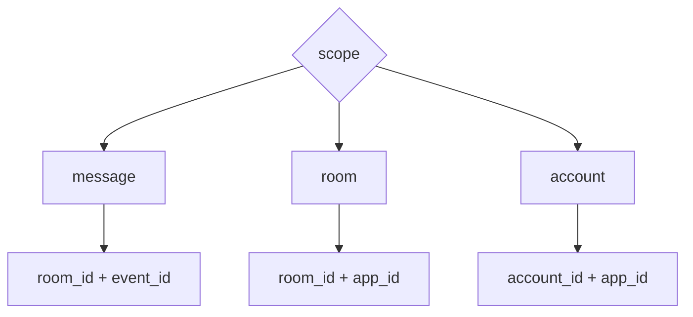
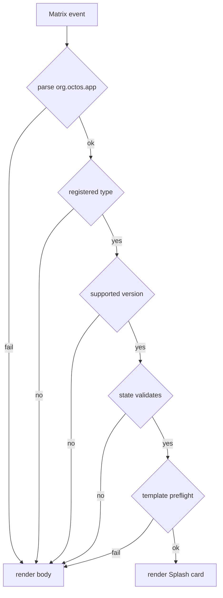

# Envelope 与 Scope

Robrix2 / Matrix Event-Sourced 模式使用 `org.octos.app` envelope。

## 标准 Envelope

```json
{
  "body": "Plain text fallback",
  "msgtype": "m.text",
  "org.octos.app": {
    "type": "mission_room",
    "version": 1,
    "scope": "room",
    "app_id": "mission.main",
    "initial_state": {}
  }
}
```

## 字段语义

`body` 必须提供。它是富渲染失败时的 fallback，也应该能独立表达消息摘要。

`org.octos.app.type` 必须匹配本地注册的 AppType。

`org.octos.app.version` 表示该 AppType 的协议版本。宿主必须拒绝不支持的版本并 fallback 到 `body`。

`org.octos.app.scope` 可选，默认 `message`。允许值：

```text
message | room | account
```

`org.octos.app.app_id` 在 `message` scope 可省略，在 `room` 和 `account` scope 必须提供。

`org.octos.app.initial_state` 必须是完整 snapshot，不是 patch。

## ScopeKey



## Message Scope

`message` scope 表示一个 Matrix event 拥有一个独立 app instance。

适用场景：

- weather card。
- news card。
- 单条消息内的静态信息视图。

## Room Scope

`room` scope 表示同一房间内多条消息可以指向同一个 app instance。

适用场景：

- `mission_room`。
- 房间级任务面板。
- 房间级 agent roster。

## Account Scope

`account` scope 表示同一账号下跨房间共享一个 app instance。

适用场景：

- `mission_dashboard`。
- 全局 agent operations overview。

Account scope 不应替代 room-scoped truth。它只能汇总多个 room 的状态。

## Fallback 规则

任一环节失败，宿主必须渲染 `body`。


