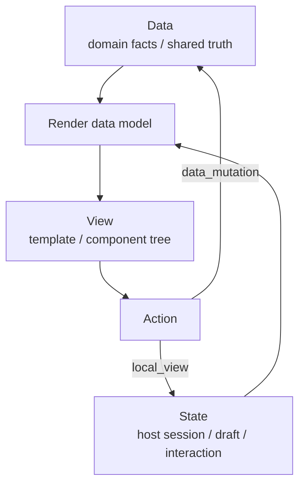
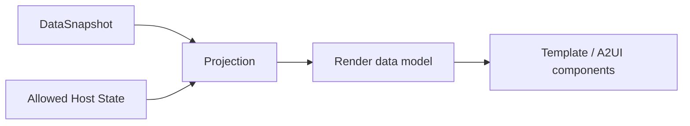
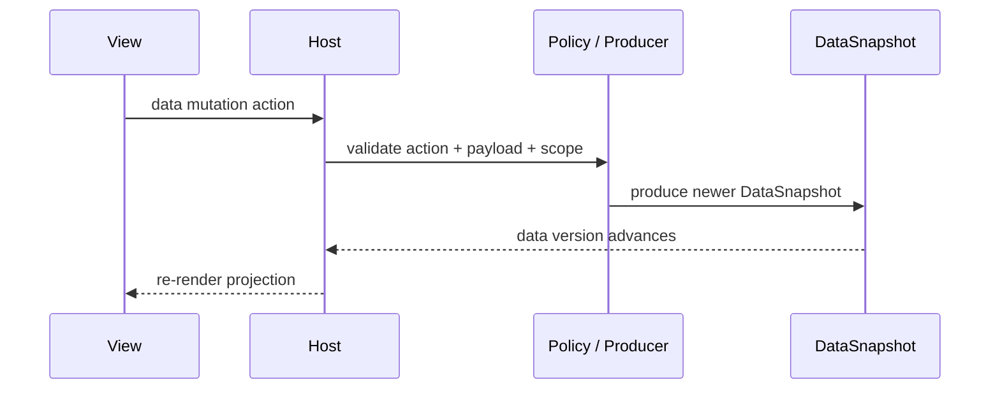

# 数据模型

Agent2App 应明确区分 `data`、`state` 和 `view` 三层。



三层定义：

- Data：AppInstance 的业务数据和共享事实，可以被校验、同步、审计和复现。
- State：Host 或 renderer 为当前交互保留的运行状态，不默认进入共享事实。
- View：把 data 和必要 state 投影成 UI 的模板或组件树。

`Snapshot` 应优先理解为 `DataSnapshot`。旧文档或旧 binding 中名为 `state`、`initial_state` 的字段，如果承载的是业务事实，应在语义上映射到 `data`。

## Data

Data 是 AppType 定义的业务事实层。它回答“这个 app 当前事实是什么”，而不是“某个客户端正在如何显示它”。

典型 data：

- counter 的当前数值。
- timer 的目标时长、剩余时间、运行标记。
- collection 的 item 列表和完成状态。
- mission room 的目标、阶段、任务、决策、阻塞项。
- account dashboard 汇总出的任务摘要。

Data 必须满足 AppType 的 `data_schema`。当某个 binding 还使用 `state_schema` 命名权威业务事实时，profile 必须声明该字段是 legacy alias，并按 `data_schema` 校验。

## DataSnapshot

DataSnapshot 是 AppInstance 在某个版本上的完整 data 文档。

```json
{
  "data": {
    "goal": {
      "title": "Ship room-scoped agent2app runtime",
      "status": "planning"
    },
    "phase": "planning",
    "tasks": []
  },
  "version": 7,
  "producer": "@agent:example.org",
  "created_at": "2026-05-07T10:00:00Z"
}
```

规则：

- 远程/event binding 中，DataSnapshot 必须来自 producer event 或可审计事件日志。
- 本地 binding 中，Host 可以临时作为 data owner，例如 aichat demo 的本地 reducer。
- `room` 和 `account` scoped app 推荐传完整 DataSnapshot，而不是只传 patch。
- 局部 patch 只适合有严格顺序、幂等和冲突处理保证的 binding。

## Render Data Model

Render data model 是渲染器实际绑定的文档。它可以由 Core Data 加上允许暴露的 Host State 投影而来。



Render data model 不等于共享事实。它可以包含：

- `data.*`：业务事实投影。
- `state.*`：允许暴露给 view 的本地状态，例如输入 draft、当前 tab、filter。
- `meta.*`：Host 注入的安全元信息，例如只读 attribution、capability label。

模板和组件树只能访问 capability manifest 允许的路径。

推荐路径约定：

```text
/data/count
/data/collections/items/rows
/state/inputs/new_item/value
/state/ui/selected_tab
/meta/producer/display_name
```

旧的 `{{state.count}}` 写法在 aichat legacy runsplash binding 中可以继续支持，但应被视为 legacy path alias。新的通用文档和 A2UI 兼容路径应优先使用 `/data/*` 与 `/state/*` 分开表达。

## Data Mutation

只有 AppType policy 标记为 data mutation 的 action 能改变 data。当前 core kind 中，这类 action 通常表现为 `shared_fact`；本地 binding 可以用 Host reducer 作为 producer loopback，但语义仍然是 data mutation，而不是普通 `local_view` state update。



`local_view` action 只能改变 state。它可以影响当前渲染结果，但不得静默提升为 data。

## 与 A2UI Data Model 的关系

A2UI 的 `updateDataModel` 是 view encoding 的 render data model 更新，不是 Agent2App Core Data 的唯一来源。

推荐映射：

- Agent2App `DataSnapshot` 投影到 A2UI data model 的 `/data`。
- Host 允许暴露的 local state 投影到 A2UI data model 的 `/state`。
- A2UI 输入组件更新 client-side data model 时，只更新 `/state` 下的 draft。
- 用户提交后，Host 根据 action schema 决定是否把 `/state` 中的 draft 作为 payload 提交给 data mutation。

这样可以同时支持 A2UI 的本地双向绑定和 Agent2App 的共享事实边界。
