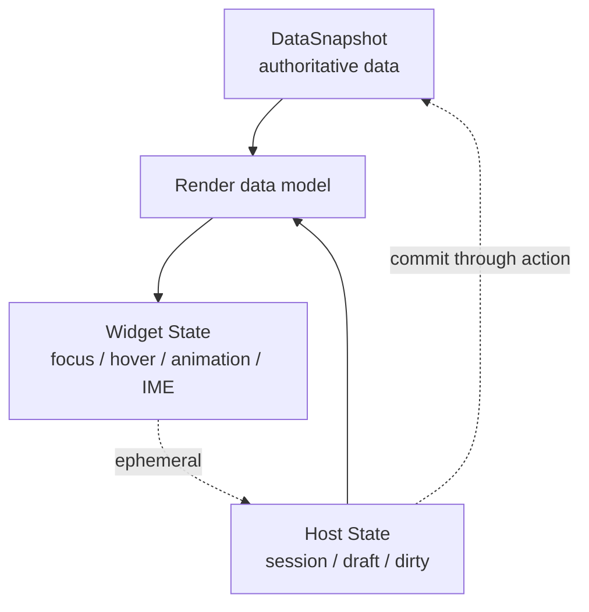
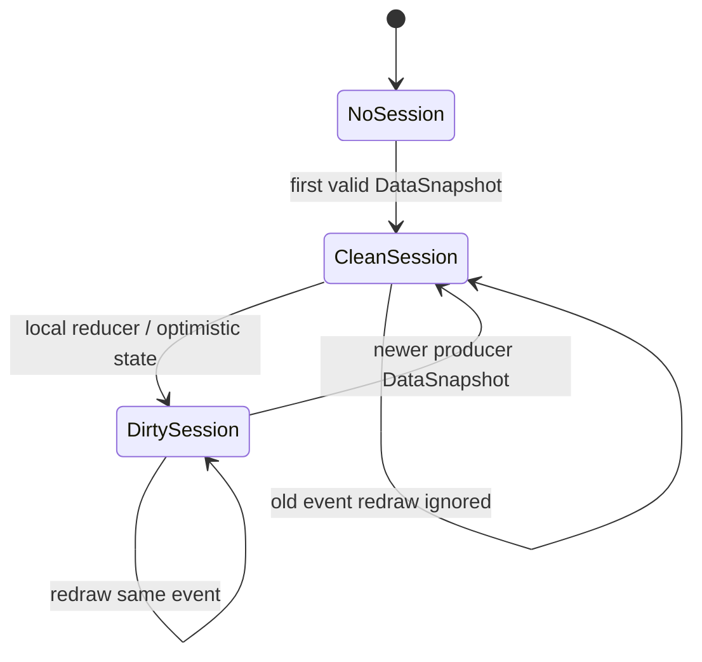

# 状态模型

Agent2App 的 state 层只表示 Host、view runtime 或 widget 为当前交互保留的运行状态。业务事实属于 [数据模型](05-data-model.md)，不应再混称为 state。

## Host State

Host state 是宿主为渲染和交互保留的本地状态。

它用于：

- 抵抗 `PortalList` virtualization 导致的 widget 销毁。
- 支持本地 UI reducer。
- 支持 room/account scoped instance 的可见 view 同步重绘。
- 保存 volatile input、selection、filter、expanded/collapsed、当前 tab 等 UI 状态。
- 记录 optimistic update、dirty 标记和本地 pending action。

Host state 可以参与 render data model 投影，但不默认进入 DataSnapshot。只有经过 AppType action schema 和 profile policy 校验的提交，才可以把 Host state 中的值转为 data mutation。

Robrix2 初版可只在内存中保存 Host state。持久化是后续工作。

## Widget State

Widget state 只能是临时渲染状态，例如：

- 输入法 composition。
- hover/focus。
- scroll offset。
- animation progress。
- pointer capture。

Widget state 不得作为 AppInstance 的权威 data。若 widget 被销毁后仍需要恢复某些交互上下文，应由 Host 明确把它提升到 Host state，并受 path allowlist 限制。

## Data Projection

对 `room` 和 `account` scoped app，producer event 应提供完整 DataSnapshot。Host 再把 DataSnapshot 和允许暴露的 Host state 投影成 render data model。

投影规则：

- 较新的合法 DataSnapshot 替换 session data。
- 较旧 timeline item 被重绘时不得回滚 session data。
- 同一 event 的重复 redraw 不得清空本地 dirty reducer state。
- 新 producer DataSnapshot 到达时清除对应 dirty，因为共享事实已经前进。
- Host state 中未提交的 draft 可保留，但必须避免覆盖更新后的 data。

## Volatile Input

输入框 draft state 应属于 Host state，而不是 Template source，也不是 DataSnapshot。

在 aichat legacy runsplash 中，`{{state.input.*.value}}` 显示时不应每次被替换成新源码，否则每个字符都会触发 Markdown/Splash `set_text` 并重建 UI。新路径应优先写作 `/state/inputs/*/value`。

正确模型是：

- TextInput 把 draft 写入 Host state。
- Template 保持稳定。
- Add/Submit action 从 Host state 读取 draft。
- action 通过校验后，Host 或 producer 决定是否写入 data。
- 渲染层只在必要时投影显示值。
