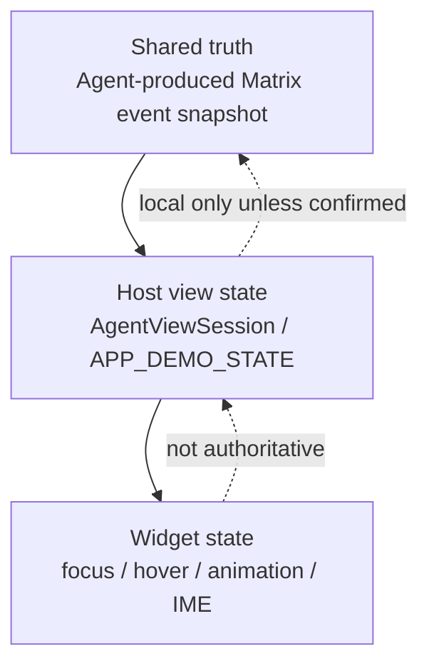
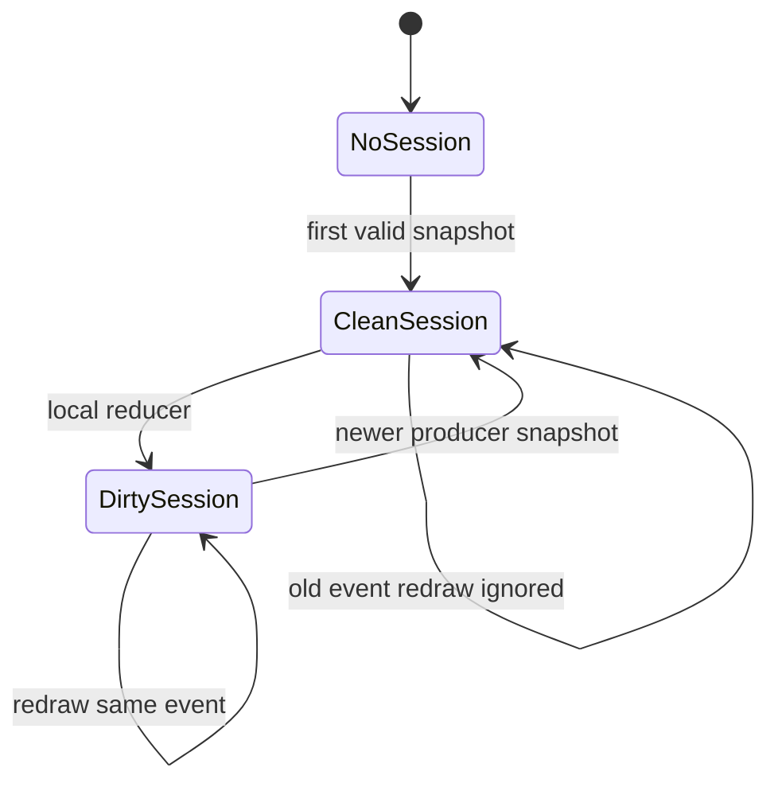

# 状态模型

Agent2View 必须区分三层状态。

## Shared Truth

Shared truth 是可以被房间参与者审计和同步的事实。

在 Robrix2 中，Shared truth 必须来自 Matrix event 的原始 content。

共享状态变更必须由 Agent/producer 发送新 snapshot event，不得由本地 widget 静默改写 Matrix 历史。

## Host View State

Host view state 是宿主为渲染和交互保留的本地状态。

它用于：

- 抵抗 `PortalList` virtualization 导致的 widget 销毁。
- 支持本地 UI reducer。
- 支持 room/account scoped instance 的可见 view 同步重绘。
- 保存 volatile input、selection、filter、expanded/collapsed 等 UI 状态。

Robrix2 初版可只在内存中保存 Host view state。持久化是后续工作。

## Widget State

Widget state 只能是临时渲染状态，例如：

- 输入法 composition。
- hover/focus。
- scroll offset。
- animation progress。

Widget state 不得作为 AppInstance 的权威状态。

## Snapshot Projection

对 `room` 和 `account` scoped app，Matrix event 是完整 snapshot。

投影规则：

- 较新的合法 snapshot 替换 session shared state。
- 较旧 timeline item 被重绘时不得回滚 session。
- 同一 event 的重复 redraw 不得清空本地 dirty reducer state。
- 新 producer snapshot 到达时清除 dirty，因为共享事实已经前进。
