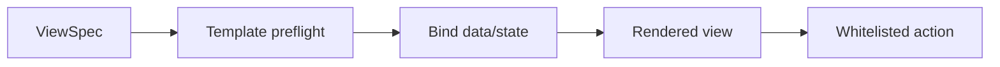
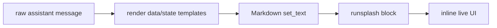
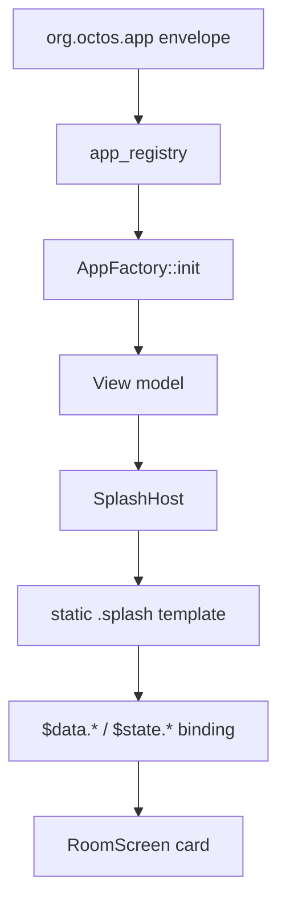

# 渲染与模板

协议内核只定义 Template 的语义：Template 把 DataSnapshot 和允许暴露的 Host state 投影成 UI，并暴露经过白名单校验的 Action。

Template 的来源由 profile 决定。

Template 的编码也由 profile 决定。当前可用编码包括 Makepad `runsplash` 和 A2UI component tree。前者面向 aichat 当前实现，后者面向跨 renderer 的通用 declarative UI。

## Core Rendering Contract



规则：

- Template 必须能被 Host 预检。
- Template 只能引用 AppType 声明过的 data path 和 profile 允许暴露的 state path。
- Template 只能触发 AppType 声明过的 action。
- Template 不得设置 host-owned attribution 字段。
- 失败时必须降级到 profile 定义的安全表示。

## aichat Rendering

aichat profile 允许 LLM 生成：

````markdown
```runsplash
View {
    Label { text: "Count: {{data.count}}" }
    Button { text: "+1" on_click: || agent.notify("inc", {}) }
}
```
````

渲染流程：



规则：

- 原始 assistant message 必须保留。
- 显示时执行 data/state path 替换。
- data 或 Host state mutation 后只重绘可见 assistant message。
- offscreen message 由 PortalList 在重新进入视口时从 raw message + current data/state 渲染。
- LLM-generated template 必须受 capability manifest 限制。

若 aichat 使用 A2UI view encoding，则渲染流程变为：校验 `appplan` 外层语义，校验 A2UI message bundle，把 A2UI component tree 映射到 Makepad widgets，并把 A2UI action 映射回 Agent2App action dispatcher。

## Stable Template and Volatile Input

输入框 draft state 不得每个字符写回 `runsplash` 源码。

```splash
TextInput {
    text: "{{state.inputs.new_item.value}}"
    on_change: |text| agent.notify("app.input.set", {key: "new_item", text: text})
}
```

宿主显示渲染时应该把 `/state/inputs/*/value` 当作 volatile placeholder，避免每次输入导致 Markdown/Splash `set_text` 看到新源码并重建整个 UI。aichat legacy `{{state.input.*.value}}` 可以继续作为兼容别名。

HostState 仍然保存 draft text；添加 item 等 action 可以从 HostState 读取该 input。只有提交成功后，collection rows 这类业务事实才进入 data。

## Robrix2 Rendering

Robrix2 v1 profile 使用本地静态 `.splash` template。



模板允许：

- 使用 `widget_manifest` 中允许的 Makepad widget。
- 使用 AppType 声明过的 `$data.path` 和 profile 允许暴露的 `$state.path`。
- 使用注册过的 local render helper。

模板禁止：

- 由 Matrix event 提供。
- 由 LLM 运行时生成。
- 引用未知 widget。
- 引用未知 helper。
- 引用未声明 data/state path。
- 设置 host-owned attribution 字段，例如 `capability_id`、`display_name`、`icon`、`trust_badge`。
