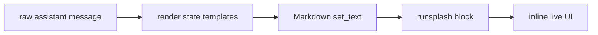
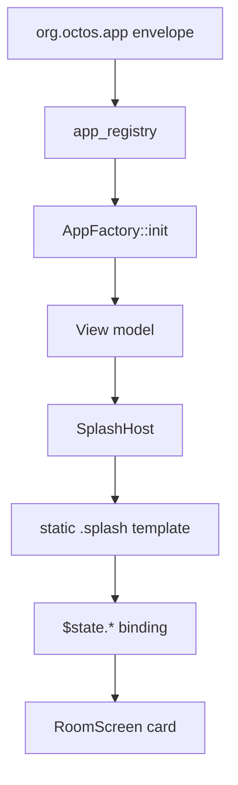

# 渲染与模板

Agent2View 有两条渲染路径：aichat 的动态 `runsplash`，Robrix2 的静态 Splash template。

## aichat Rendering

aichat 支持 LLM 生成：

````markdown
```runsplash
View {
    Label { text: "Count: {{state.count}}" }
    Button { text: "+1" on_click: || agent.notify("inc", {}) }
}
```
````

渲染流程：



规则：

- 原始 assistant message 必须保留。
- 显示时执行 `{{state.path}}` 替换。
- state mutation 后只重绘可见 assistant message。
- offscreen message 由 PortalList 在重新进入视口时从 raw message + current state 渲染。

## Volatile Input

输入框 draft state 不得每个字符写回 `runsplash` 源码。

```splash
TextInput {
    text: "{{state.input.new_item.value}}"
    on_change: |text| agent.notify("app.input.set", {key: "new_item", text: text})
}
```

宿主显示渲染时应该把 `{{state.input.*.value}}` 当作 volatile placeholder，避免每次输入导致 Markdown/Splash `set_text` 看到新源码并重建整个 UI。

HostState 仍然保存 draft text；添加 item 等 action 可以从 HostState 读取该 input。

## Robrix2 Rendering

Robrix2 v1 使用本地静态 `.splash` template。



模板允许：

- 使用 `widget_manifest` 中允许的 Makepad widget。
- 使用 AppType 声明过的 `$state.path`。
- 使用注册过的 local render helper。

模板禁止：

- 由 Matrix event 提供。
- 由 LLM 运行时生成。
- 引用未知 widget。
- 引用未知 helper。
- 引用未声明 state path。
- 设置 host-owned attribution 字段，例如 `capability_id`、`display_name`、`icon`、`trust_badge`。
