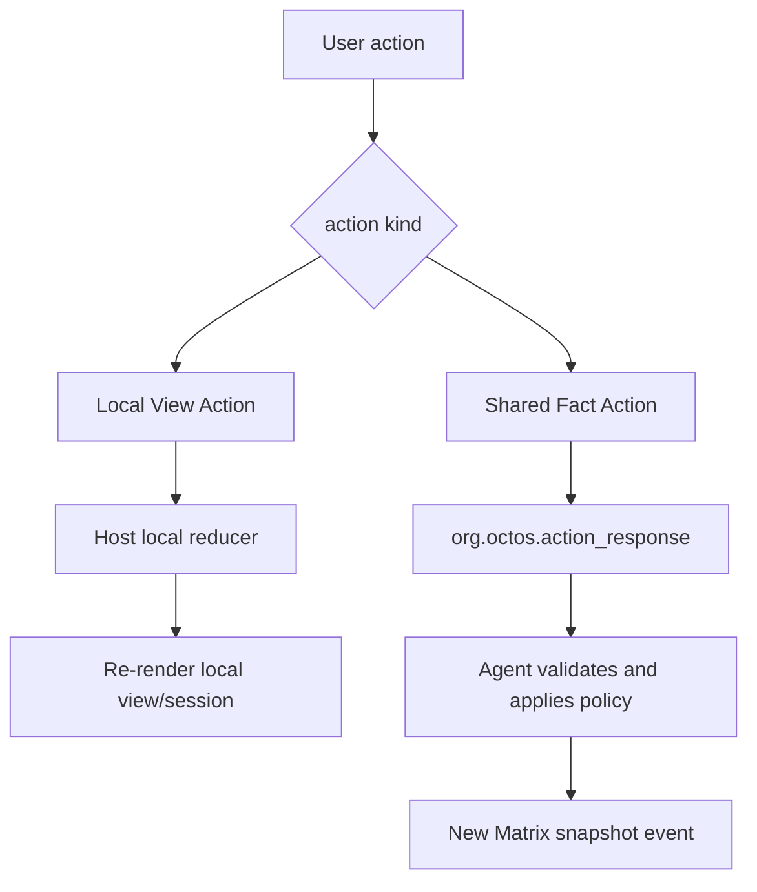

# Action 协议

Action 是用户或 view 发出的意图。协议必须区分本地视图动作和共享事实动作。



## Local View Action

Local View Action 适用于：

- 展开/折叠任务详情。
- 选择 agent。
- filter/sort/tab 切换。
- aichat counter/timer/calculator/collection 操作。

Local reducer lookup 必须按 AppType + action id 白名单分发。

Robrix2 不应使用无限字符串的全局 `agent.notify("anything")` 作为生产 action 面。

## aichat agent.notify

aichat 使用 `agent.notify(event_id, payload)`：

```splash
agent.notify("inc", {})
agent.notify("app.collection.add_from_input", {collection: "items", input: "new_item"})
```

实现边界：

- `agent.notify` 注册在 `widgets/src/splash.rs`。
- `SplashAction` 定义在 `widgets/src/splash.rs`。
- `SplashAction::Notify` 是 bare action，不是 widget action。
- aichat 在 `handle_actions` 中直接遍历 `actions` 并 cast。

宿主必须：

- 校验 event id。
- 校验 payload JSON。
- 对未知 event log + ignore。
- 对非法 payload log + ignore。

## Robrix2 Shared Action

Robrix2 的共享 action 使用 `org.octos.action_response`。

```json
{
  "org.octos.action_response": {
    "action_id": "approve_plan",
    "source_event_id": "$mission123",
    "app": {
      "type": "mission_room",
      "version": 1,
      "scope": "room",
      "app_id": "mission.main"
    }
  }
}
```

规则：

- `source_event_id` 指向产生该 action 的原始 Matrix event。
- `app` 字段用于在同一房间多 app 实例时明确路由。
- Producer 负责验证 action response。
- Producer 应用策略后发送新的 app snapshot event。
- Robrix2 可以做 optimistic local view update，但不得把 optimistic state 当作 shared truth。
