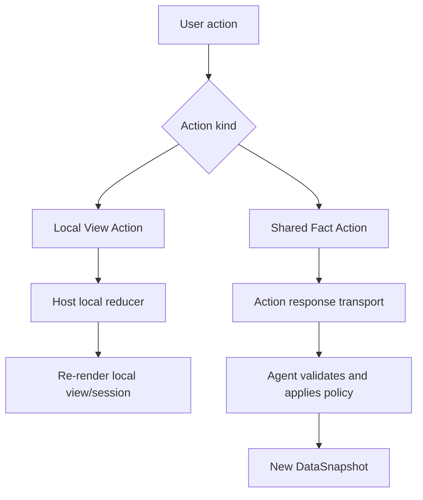
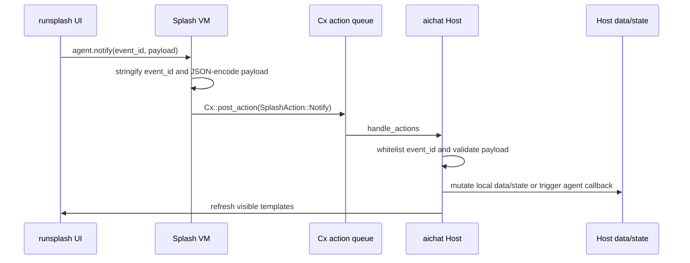

# Action 协议

Action 是用户或 view 发出的意图。协议内核先定义 action 语义，再由 transport binding 决定如何承载。



## Core Action

通用 Action 至少包含：

```json
{
  "action_id": "approve_plan",
  "kind": "shared_fact",
  "scope_key": {
    "scope": "room",
    "app_id": "mission.main"
  },
  "payload": {}
}
```

`action_id` 必须在 AppType action schema 中注册。

`kind` 由 AppType policy 决定，可为：

```text
local_view | shared_fact | agent_callback
```

`scope_key` 指向被操作的 AppInstance。

`payload` 必须按 action schema 校验。

## Local View Action

Local View Action 适用于：

- 展开/折叠任务详情。
- 选择 agent。
- filter/sort/tab 切换。
- aichat 中声明为 local-only 的 demo 操作。

Local reducer lookup 必须按 AppType + action id 白名单分发。

Local View Action 可以更新 HostState。若本地 profile 把 counter、timer、calculator、collection 这类 demo data 也交给 Host reducer 管理，必须在 AppType policy 中明确标注为 local data owner 模式；它不得自动扩展到远程 shared data。

## Shared Fact Action

Shared Fact Action 会改变共享 data。它必须经过 Agent/producer 验证，然后产生新的 DataSnapshot。

在本地 binding 中，Host reducer 可以临时扮演 producer。此时 action 仍应按 data mutation 语义校验，只是提交路径是本地 loopback，而不是远程事件日志。

例如 Mission Room 中的：

```text
approve_plan
request_plan_changes
pause_mission
resume_mission
```

这些 action 不能只靠本地 reducer 静默修改 mission truth。

## Local Binding: agent.notify

aichat 使用 `agent.notify(event_id, payload)` 承载 Action：

```splash
agent.notify("inc", {})
agent.notify("app.collection.add_from_input", {collection: "items", input: "new_item"})
```

`agent.notify` 是 aichat Local Binding 的 reverse channel。它不是通用协议内核本身，而是把 Template 内部的用户意图映射回 Host action dispatcher 的本地承载方式。

实现边界：

- `agent.notify` 注册在 `widgets/src/splash.rs`。
- `SplashAction` 定义在 `widgets/src/splash.rs`。
- `SplashAction::Notify` 是 bare action，不是 widget action。
- aichat 在 `handle_actions` 中直接遍历 `actions` 并 cast。

调用约定：

- 第一个参数是 `event_id`。它必须能转换为字符串；缺失或非法值会变成空字符串。
- 第二个参数是 `payload`。它可以是任意 Splash value，运行时会把它序列化为 JSON 字符串。
- `agent.notify` 不返回业务值。调用后返回 `nil`。
- 它可以出现在 `Button.on_click`、`TextInput.on_change` 等 generated `runsplash` 回调中。

运行时路径：



宿主必须：

- 校验 event id。
- 校验 payload JSON。
- 对未知 event log + ignore。
- 对非法 payload log + ignore。

状态刷新规则：

- Host 是 data/state owner。`runsplash` 只是当前 view template。
- 合法 action 改变 Host data/state 后，Host 重新投影可见模板。
- 输入框 draft state 不应每个 keypress 重写 `runsplash` 源码。输入应通过 `agent.notify("app.input.set", ...)` 写入 HostState，再由提交 action 消费。

边界：

- `agent.notify` 可以承载 `local_view` 和 aichat 本地 `agent_callback` action。
- 它不得作为 Robrix2 这类远程 shared fact action 的生产协议。
- 远程共享 action 应使用对应 transport binding，例如 Matrix 中的 `org.octos.action_response`。

## Remote Binding: action_response

Robrix2 使用 `org.octos.action_response` 承载 Shared Fact Action。

```json
{
  "org.octos.action_response": {
    "action_id": "approve_plan",
    "source_event_id": "$mission123",
    "app": {
      "type": "mission_room",
      "version": 1,
      "scope": "room",
      "app_id": "mission.main"
    }
  }
}
```

规则：

- `source_event_id` 指向产生该 action 的原始 Matrix event。
- `app` 字段用于在同一房间多 app 实例时明确路由。
- Producer 负责验证 action response。
- Producer 应用策略后发送新的 app DataSnapshot event。
- Robrix2 可以做 optimistic local view update，但不得把 optimistic state 当作 shared truth。
