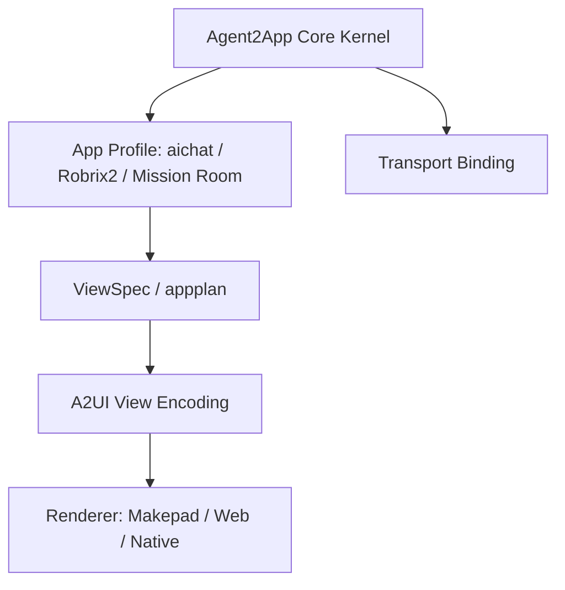
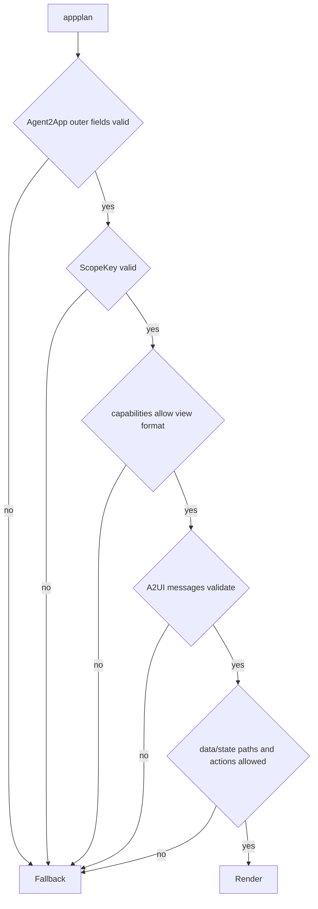

# A2UI 兼容 Profile

[A2UI](https://github.com/google/A2UI/) 可以作为 Agent2App 的 View Encoding，而不是替代 Agent2App Core Kernel。

Agent2App 负责定义应用实例语义：AppType、Scope、DataSnapshot、Host State、ViewSpec、Action、Capability、Validation 与应用场景 profile。A2UI 负责定义可流式渲染的 UI 表达：Surface、Component、Data Model 和用户 action。

因此，兼容策略是：

```text
Agent2App appplan = Agent2App 外层语义 + A2UI message bundle
```

不要把 Agent2App 的 `scope`、`app_type`、profile policy、权限边界等字段直接塞进 A2UI message。[A2UI v0.9 server-to-client envelope](https://github.com/google/A2UI/blob/main/specification/v0_9/json/server_to_client.json) 是严格消息结构，每条消息只能表达一种 A2UI 操作。

## 参考链接

- [A2UI GitHub 仓库](https://github.com/google/A2UI/)
- [A2UI v0.9 协议说明](https://github.com/google/A2UI/blob/main/specification/v0_9/docs/a2ui_protocol.md)
- [A2UI v0.9 Server-to-Client Schema](https://github.com/google/A2UI/blob/main/specification/v0_9/json/server_to_client.json)
- [A2UI v0.9 Client-to-Server Schema](https://github.com/google/A2UI/blob/main/specification/v0_9/json/client_to_server.json)
- [A2UI v0.9 Common Types](https://github.com/google/A2UI/blob/main/specification/v0_9/json/common_types.json)
- [A2UI v0.9 Standard Catalog](https://github.com/google/A2UI/blob/main/specification/v0_9/json/standard_catalog.json)
- [A2UI v0.9 Evolution Guide](https://github.com/google/A2UI/blob/main/specification/v0_9/docs/evolution_guide.md)

## 分层关系



三层职责必须分开：

- Agent2App Core Kernel：定义跨本地 Agent 与远程 Agent 一致的 data/state/view/action 语义。
- A2UI View Encoding：定义 UI surface、component tree、render data model update 和 client action。
- Application Profile：定义某个宿主如何解释 AppType、Scope、权限、模板来源、data 提交流程和 state 保存策略。

## A2UI v0.9 映射

A2UI v0.9 的 server-to-client 消息包括：

- `createSurface`：创建一个可渲染 surface。
- `updateComponents`：更新该 surface 的组件列表。
- `updateDataModel`：更新该 surface 的 data model。
- `deleteSurface`：删除 surface。

Agent2App 到 A2UI 的推荐映射：

| Agent2App 概念 | A2UI 概念 | 说明 |
| --- | --- | --- |
| `app_id` | `surfaceId` | `message` scope 可由 Host 分配；`room`/`account` scope 应使用稳定 app id。 |
| `DataSnapshot` | `updateDataModel.value.data` | 推荐在 render data model 的 `/data` 下提交完整 data snapshot；局部 patch 只适合有强顺序保证的 binding。 |
| Host State | `updateDataModel.value.state` | 输入 draft、filter、tab 等本地状态放在 `/state` 下，不默认成为 shared truth。 |
| `Template` / `ViewSpec` | `updateComponents.components` | 使用 A2UI component catalog 表达可验证的 UI 结构。 |
| `CapabilityManifest` | `catalogId` + client capabilities | A2UI catalog 表达组件/函数能力，Agent2App manifest 继续表达 data/state/action 权限。 |
| Local View Action | `action.functionCall` | 只用于宿主明确注册的本地函数，例如 `openUrl`。 |
| Shared Fact Action | `action.event` | 发送给 Host/Agent 验证，再产生新的 DataSnapshot。 |
| `ActionResult` | client-to-server `action` 后的新 envelope | A2UI action 本身不是 shared truth；truth 仍由 Agent2App DataSnapshot 收敛。 |

## appplan 格式

当 `appplan` 兼容 A2UI 时，它仍然是 Agent2App artifact，而不是单条 A2UI message。

推荐格式：

```json
{
  "agent2app": {
    "core_version": 1,
    "binding_version": 1,
    "profile": "aichat",
    "profile_version": 1,
    "app_type": "todo",
    "scope": "message",
    "app_id": "todo.main"
  },
  "view": {
    "format": "a2ui",
    "version": "v0.9",
    "messages": [
      {
        "version": "v0.9",
        "createSurface": {
          "surfaceId": "todo.main",
          "catalogId": "https://a2ui.org/specification/v0_9/standard_catalog.json",
          "sendDataModel": true
        }
      },
      {
        "version": "v0.9",
        "updateComponents": {
          "surfaceId": "todo.main",
          "components": [
            {
              "id": "root",
              "component": "Column",
              "children": ["new_item", "add_button", "items"]
            },
            {
              "id": "new_item",
              "component": "TextField",
              "label": "New item",
              "value": {
                "path": "/state/inputs/new_item/value"
              },
              "variant": "shortText"
            },
            {
              "id": "add_button_label",
              "component": "Text",
              "text": "Add"
            },
            {
              "id": "add_button",
              "component": "Button",
              "child": "add_button_label",
              "variant": "primary",
              "action": {
                "event": {
                  "name": "app.collection.add_from_input",
                  "context": {
                    "collection": "items",
                    "input": "new_item"
                  }
                }
              }
            },
            {
              "id": "items",
              "component": "List",
              "children": {
                "path": "/data/collections/items/rows",
                "componentId": "item_template"
              }
            },
            {
              "id": "item_template",
              "component": "Text",
              "text": {
                "path": "text"
              }
            }
          ]
        }
      },
      {
        "version": "v0.9",
        "updateDataModel": {
          "surfaceId": "todo.main",
          "path": "/",
          "value": {
            "data": {
              "collections": {
                "items": {
                  "rows": []
                }
              }
            },
            "state": {
              "inputs": {
                "new_item": {
                  "value": ""
                }
              }
            }
          }
        }
      }
    ]
  },
  "permissions": {
    "data_paths": [
      "/data/collections/items/rows"
    ],
    "state_paths": [
      "/state/inputs/new_item/value"
    ],
    "actions": [
      "app.collection.add_from_input"
    ]
  }
}
```

这个结构有两个重要边界：

- `view.messages[*]` 必须是合法 A2UI v0.9 message。
- `agent2app` 与 `permissions` 是 Agent2App 外层语义，不能要求 A2UI renderer 原生理解。

## 输入与本地 Data Model

A2UI 的输入组件采用本地双向绑定：`TextField`、`CheckBox`、`Slider`、`ChoicePicker` 等组件在用户交互时立即更新 client-side data model。

这与 Agent2App 的输入原则一致：

- 输入过程不应重写 template source。
- 每次 keypress 不应重新生成 `runsplash` 或 `updateComponents`。
- 用户提交时，通过 action context 或 `sendDataModel` 把当前 render data model 交给 Host/Agent。

对 aichat 来说，A2UI 兼容路径可以避免“输入一个字母重建一次 UI”的问题。输入框 draft state 属于 Host/client data model 的 `/state` 分支；业务数据属于 `/data` 分支；模板只绑定路径。

## aichat 兼容路径

aichat 可以同时支持两种 local view encoding：

| `view.format` | Template 来源 | 渲染路径 |
| --- | --- | --- |
| `runsplash` | LLM-generated Splash | 现有 Markdown + SplashHost 路径 |
| `a2ui` | A2UI component tree | A2UI component tree 映射到 Makepad widgets |

`runsplash` 可以继续作为当前实现路径。A2UI 则作为更通用、更容易跨 renderer 的 appplan 格式。

当 `view.format = "a2ui"` 时：

1. Host 校验 Agent2App 外层字段。
2. Host 校验 A2UI message bundle。
3. Host 根据 `catalogId` 选择 renderer。
4. Host 把 A2UI components 映射到 Makepad widgets。
5. Host 把 A2UI action 映射回 Agent2App action dispatcher。

## Robrix2 兼容路径

Robrix2 不应直接信任远程事件中携带的任意 Makepad template。

若使用 A2UI：

- Matrix event 可以携带 Agent2App envelope。
- envelope 的 view 部分可以是 A2UI message bundle，或者是 profile 注册的 `template_id`。
- Host 必须校验 `catalogId`、component catalog、data path、state path 和 action。
- shared action 仍然写回事件系统，由 Agent/producer 验证后生成新的 DataSnapshot。

Robrix2 的生产默认路径仍可使用本地静态 template。A2UI 更适合作为安全的动态 UI 表达，前提是 renderer 只支持受信 catalog。

## Mission Room 兼容路径

Mission Room 是 room-scoped shared app。它的 `surfaceId` 应稳定映射到：

```text
room_id + app_id
```

推荐：

- `scope = "room"`。
- `app_id = "mission.main"`。
- A2UI `surfaceId = "mission.main"`，Host 内部用 ScopeKey 隔离不同 room。
- `updateDataModel` 使用完整 Mission Room DataSnapshot，投影到 `/data`。
- 用户操作使用 A2UI `action.event`，再映射到 Agent2App shared fact action。

## 校验顺序

A2UI 兼容 profile 的校验顺序：



Host 必须先校验 Agent2App 外层语义，再校验 A2UI 内层消息。否则 A2UI renderer 可能渲染了一个语法正确但越权的 UI。

## 兼容结论

`appplan` 可以兼容 A2UI，但兼容方式应该是“包含 A2UI message bundle”，而不是“变成 A2UI message”。

这样可以同时满足：

- A2UI schema 的严格性。
- Agent2App 对 Scope、权限、profile、data/state 边界和 shared truth 的建模。
- aichat 本地 Agent 与 Robrix2 远程 Agent 使用同一协议内核。
- Makepad、Web、Native renderer 共享同一种 declarative UI encoding。
