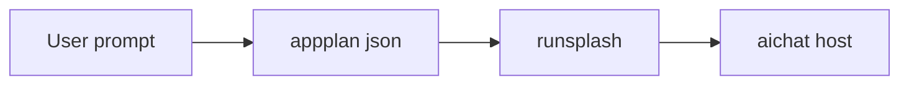
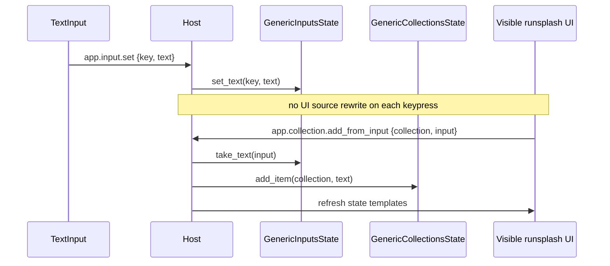

# aichat Profile

aichat 是 Local Runtime profile。它证明了从 LLM 生成 UI 到 host state mutation 的最小 live wire。

## Response Contract

aichat AppGen response 应包含一个 `appplan json` block 和一个 `runsplash` block。

`appplan` 是生成 UI 的计划与能力声明，不是独立项目 artifact。



## Host State

当前 aichat HostState 包含：

- `count`
- `timer`
- `calculator`
- `collections`
- `inputs`

示例 state path：

```text
{{state.count}}
{{state.timer.display}}
{{state.calculator.display}}
{{state.collection.items.rows}}
{{state.collection.items.count}}
{{state.input.new_item.value}}
```

## Actions

Counter：

```text
inc
dec
reset
```

Timer：

```text
timer.start
timer.pause
timer.toggle
timer.reset
timer.add_minute
timer.subtract_minute
```

Calculator：

```text
calculator.digit.0 ... calculator.digit.9
calculator.decimal
calculator.operator.add
calculator.operator.subtract
calculator.operator.multiply
calculator.operator.divide
calculator.equals
calculator.clear
calculator.backspace
calculator.sign
calculator.percent
```

Collection：

```text
app.input.set
app.collection.add_from_input
app.collection.add
app.collection.toggle
app.collection.delete
app.collection.clear
```

AI callback：

```text
ask_ai
```

## Collection Flow



## Boundary

aichat 可以接收 LLM-generated `runsplash`，但必须使用 host capability manifest 限制 action 与 state path。

未知 action 必须 log + ignore。

非法 payload 必须 log + ignore。
