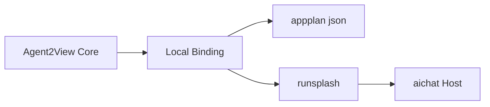
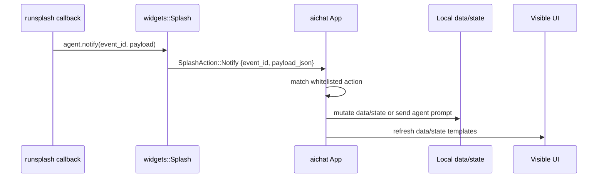
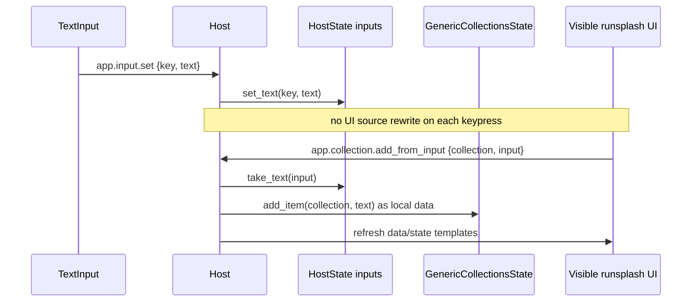

# aichat 应用场景

aichat 是 Agent2App Core Kernel 上的 Local AppGen 场景。它不是一套独立协议，而是通用内核使用 Local Binding 的一个宿主 profile。

## 场景定位

aichat 证明了从 LLM 生成 UI 到 HostState mutation 的最小 live wire。



## Response Contract

aichat AppGen response 应包含一个 `appplan json` block 和一个 `runsplash` block。

`appplan` 是 ViewSpec 的本地编码。它描述生成 UI 的计划、AppType、可用 data path、可用 state path、可用 action 与 required controls。

`runsplash` 是 Template 的本地编码。它可以由 LLM 生成，但必须受 capability manifest 限制。

后续兼容 A2UI 时，`appplan` 可以包含 `view.format = "a2ui"` 和 A2UI message bundle。此时 `runsplash` 是 aichat 的 legacy/local renderer binding，不再是通用协议必需项。

## Data 与 Host State

当前 aichat demo 中，Host 同时维护 local data 和 Host state。

Local data 包含：

- `count`
- `timer`
- `calculator`
- `collections`

Host state 包含：

- `inputs`

示例 data/state path：

```text
{{data.count}}
{{data.timer.display}}
{{data.calculator.display}}
{{data.collection.items.rows}}
{{data.collection.items.count}}
{{state.input.new_item.value}}
```

这些 path 是通用内核 Data Binding 和 State Binding 在 aichat profile 中的具体表达。当前 legacy runsplash 可以继续支持 `{{state.count}}` 这类旧别名，但协议文档应优先使用 data/state 分离后的路径。

## Actions

Counter：

```text
inc
dec
reset
```

Timer：

```text
timer.start
timer.pause
timer.toggle
timer.reset
timer.add_minute
timer.subtract_minute
```

Calculator：

```text
calculator.digit.0 ... calculator.digit.9
calculator.decimal
calculator.operator.add
calculator.operator.subtract
calculator.operator.multiply
calculator.operator.divide
calculator.equals
calculator.clear
calculator.backspace
calculator.sign
calculator.percent
```

Collection：

```text
app.input.set
app.collection.add_from_input
app.collection.add
app.collection.toggle
app.collection.delete
app.collection.clear
```

AI callback：

```text
ask_ai
```

## Notify Live Wire

generated `runsplash` 不能直接修改 aichat 内部结构。它只能通过 `agent.notify(event_id, payload)` 发送用户意图，Host 再根据 action whitelist 和 payload schema 决定如何处理。

```splash
Button {
    text: "+1"
    on_click: || agent.notify("inc", {})
}

TextInput {
    text: "{{state.input.new_item.value}}"
    on_change: |text| agent.notify("app.input.set", {key: "new_item", text: text})
}
```

aichat 的处理流程：



当前 aichat 支持的典型 dispatch：

- `inc`、`dec`、`reset` 更新 counter。
- `timer.*` 更新 timer。
- `calculator.*` 更新 calculator。
- `app.input.set` 更新 HostState 中的 input draft。
- `app.collection.*` 更新本地 collection data。
- `ask_ai` 把当前交互包装成 prompt 发送给所选 backend。

`agent.notify` 的关键设计点是：Template 发出 intent，Host 拥有 state mutation。它使 LLM 生成的 UI 可以交互，但不会把任意脚本提升为宿主权限。

## Collection Flow



## 场景边界

aichat 可以接收 LLM-generated `runsplash`，但必须：

- 使用 host capability manifest 限制 action、data path 与 state path。
- 校验 event id。
- 校验 payload。
- 对未知 action log + ignore。
- 对非法 payload log + ignore。
- 不把任意 Agent 输出提升为系统权限。

这些约束属于 aichat 应用场景。通用内核只要求 Template 可预检、Action 可校验、State 可投影。
