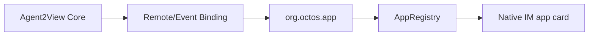
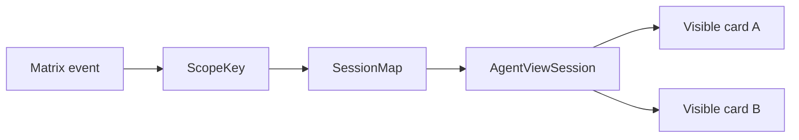

# Robrix2 应用场景

Robrix2 是 Agent2App Core Kernel 上的 Matrix IM app-card 场景。它使用 Remote/Event Binding 渲染 Matrix event 历史，不拥有生产 Agent 的私有 RPC 会话。

## 场景定位



Robrix2 的职责是消费事件、校验 AppType、投影 DataSnapshot、渲染本地模板，并把用户 shared action 写回事件系统。

## V1 Display Cards

Robrix2 v1 card 应保持 display-only：

- Weather。
- News。
- Static mission room phase 1。

这些 app 不需要 LLM-generated template，不需要 local reducer。

## AgentViewSession

Robrix2 interactive runtime 应使用类似结构：

```rust
struct AgentViewSession {
    scope_key: AgentViewScopeKey,
    source_event_id: OwnedEventId,
    app_type: String,
    version: u32,
    template_id: String,
    data: serde_json::Value,
    state: serde_json::Value,
    dirty: bool,
}
```

`data` 保存从 Matrix event 投影出的业务事实，`state` 保存本地 interaction state。Session map 负责在 room open 期间保存运行状态。



## Local Reducer Loop

Robrix2 可以支持 local view reducer，但第一批 reducer 应保持窄：

```text
counter.inc
counter.dec
counter.reset
timer.toggle
timer.reset
```

Click loop：

```text
button action
  -> action carries scope key + action_id + payload
  -> lookup AgentViewSession
  -> run whitelisted local reducer
  -> re-render affected views
```

`message` scope 只重绘一张 card。

`room` scope 重绘所有指向同一 `room_id + app_id` 的可见 card。

## 与 aichat 的关系

Robrix2 可以借鉴 aichat 的窄 live wire，但不能直接复制 `agent.notify` 作为生产共享 action 协议。

aichat 的闭环成立，是因为它同时拥有：

- LLM session。
- local data/state。
- Splash VM。
- immediate event loop。

Robrix2 的共享事实必须留在 Matrix timeline 中。Robrix2 场景的额外约束是：不接受 event-supplied template，不读取 `m.replace` edit 改变 app data，不用本地 reducer 静默修改 shared truth。
