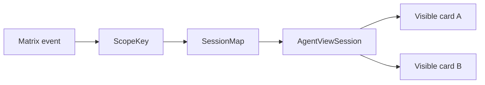

# Robrix2 Profile

Robrix2 是 Matrix Event-Sourced profile。它渲染 Matrix event 历史，不拥有生产 Agent 的私有 RPC 会话。

## V1 Display Cards

Robrix2 v1 card 应保持 display-only：

- Weather。
- News。
- Static mission room phase 1。

这些 app 不需要 LLM-generated template，不需要 local reducer。

## AgentViewSession

Robrix2 interactive runtime 应使用类似结构：

```rust
struct AgentViewSession {
    scope_key: AgentViewScopeKey,
    source_event_id: OwnedEventId,
    app_type: String,
    version: u32,
    template_id: String,
    state: serde_json::Value,
    dirty: bool,
}
```

Session map 负责在 room open 期间保存状态。



## Local Reducer Loop

第一批 local reducer 应保持窄：

```text
counter.inc
counter.dec
counter.reset
timer.toggle
timer.reset
```

Click loop：

```text
button action
  -> action carries scope key + action_id + payload
  -> lookup AgentViewSession
  -> run whitelisted local reducer
  -> re-render affected views
```

`message` scope 只重绘一张 card。

`room` scope 重绘所有指向同一 `room_id + app_id` 的可见 card。

## Relationship to aichat

Robrix2 可以借鉴 aichat 的窄 live wire，但不能直接复制 `agent.notify` 作为生产共享 action 协议。

aichat 的闭环成立，是因为它同时拥有：

- LLM session。
- local state。
- Splash VM。
- immediate event loop。

Robrix2 的共享事实必须留在 Matrix timeline 中。
