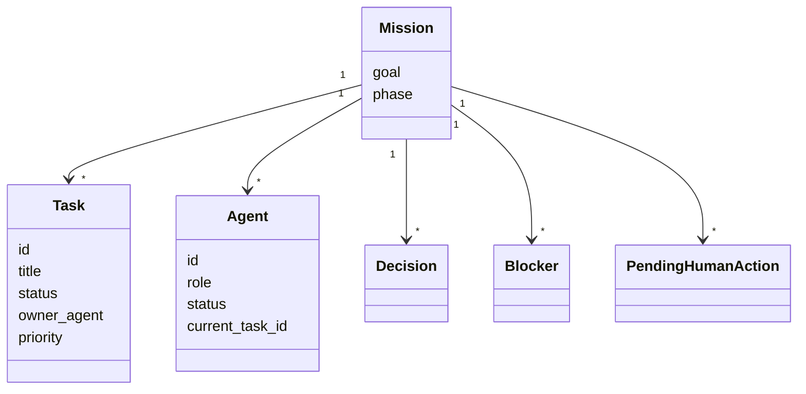
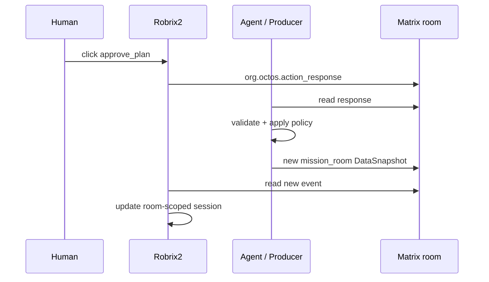

# Mission Room 应用场景

Mission Room 是 Robrix2 场景下的第一个高价值 room-scoped Agent2View AppType。

它把 Matrix room 变成由人类监督的多 Agent mission control surface。

## AppType 场景配置

Mission Room 使用通用内核对象：

- AppType：`mission_room`
- Scope：`room`
- 默认 AppInstance：`mission.main`
- Binding：Remote/Event Binding
- Shared action transport：`org.octos.action_response`

## App Envelope

Mission Room 必须使用 `room` scope：

```json
{
  "org.octos.app": {
    "type": "mission_room",
    "version": 1,
    "scope": "room",
    "app_id": "mission.main",
    "initial_state": {}
  }
}
```

默认 mission app id：

```text
mission.main
```

除非一个 room 明确承载多个 mission，否则 producer 应使用该默认 id。

## Mission Data V1

Mission data v1 应保持显式且小。当前 Matrix envelope 中的 `initial_state` 是 legacy 字段名，语义上承载 Mission DataSnapshot 的 `data`。

```json
{
  "goal": {
    "title": "Ship room-scoped agent2view runtime",
    "status": "planning"
  },
  "phase": "planning",
  "tasks": [
    {
      "id": "task-1",
      "title": "Define AgentViewSession data/state model",
      "status": "planning",
      "owner_agent": "planner",
      "priority": "high",
      "requires_human_approval": true
    }
  ],
  "agents": [
    {
      "id": "planner",
      "role": "planner",
      "status": "waiting_human",
      "current_task_id": "task-1"
    }
  ],
  "pending_human_actions": [
    {
      "id": "approve-plan-1",
      "kind": "approve_plan",
      "label": "Approve proposed plan"
    }
  ],
  "decisions": [],
  "blockers": []
}
```

## Mission Model



## Status Values

`goal.status`：

```text
planning | active | paused | completed
```

`task.status`：

```text
planning | approved | doing | review | blocked | done
```

`agent.status`：

```text
idle | working | blocked | waiting_human
```

Agent role：

```text
planner | executor | reviewer | operator
```

Autonomy mode：

```text
manual | supervised | autonomous | paused
```

## Shared Actions

第一批共享 action：

```text
approve_plan
request_plan_changes
pause_mission
resume_mission
```

后续 task-level actions：

```text
reassign_task
change_priority
mark_blocked
request_review
approve_result
```

这些 action 改变 mission truth，必须通过 `org.octos.action_response`，由 Agent 产生新的 mission DataSnapshot event。



## Local View Actions

Mission card 可以支持本地 action：

- 展开任务详情。
- 选择 agent。
- 切换 board/decision/blocker view。
- 过滤 lane。

这些 action 不应产生 Matrix 共享事实。
