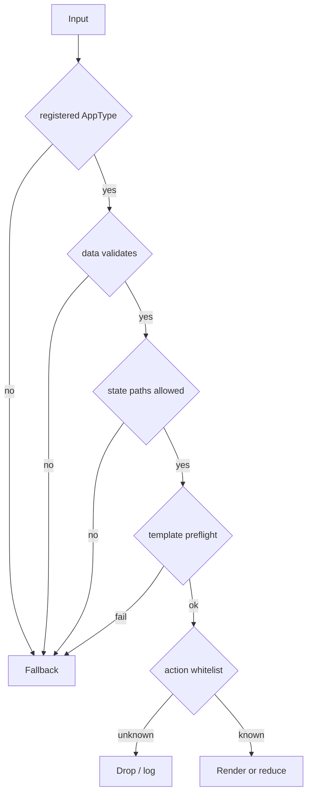

# 安全模型

Agent2View v0.1 的安全模型应保持短而可执行。安全规则分为协议内核规则、binding 规则和 profile 规则。

## 通用原则

原则：

1. Rich UI 只为注册 AppType 渲染。
2. 每个 AppType 校验自己的 data。
3. Template 必须经过 profile-defined preflight。
4. Template preflight 必须拒绝未知 widget、未知 helper、未声明 data/state path。
5. 任意失败 fallback 到 profile 指定的安全表示。
6. Action 必须按 AppType + action id 白名单分发。
7. Host state 和 widget state 不得静默提升为共享事实。

## 本地 Binding 安全边界

本地 binding 可以接收 LLM-generated template，但必须：

- 限制 host action manifest。
- 校验 payload。
- 限制 template 可调用 API。
- 拒绝或降级危险 shader、未知 widget、未知 helper。
- 不把任意 Agent 输出提升为系统权限。

aichat 属于这个边界。

## 远程 Binding 安全边界

远程/event binding 必须更保守：

- 不信任事件中携带的 runtime template。
- 只渲染本地注册 AppType。
- 只使用本地注册 template。
- 共享 data 必须来自原始事件 content 或 producer DataSnapshot。
- shared action 必须通过 action response 交给 producer 验证。

Robrix2 属于这个边界。

## 应用场景额外约束

aichat profile：

- 可以接收 LLM-generated `runsplash`。
- 可以使用 `agent.notify`。
- 必须限制 host action manifest。
- 必须校验 payload。

Robrix2 profile：

- 不接受 event-supplied Splash template。
- 不接受 runtime-generated template 作为 v1 生产路径。
- 不用 `agent.notify` 表达 shared action。
- 不通过本地 reducer 静默修改 mission truth。
- 不读取 `m.replace` edit 来改变 app data、Host state 或 action set。

## 失败即降级

Rich rendering 是增强体验，不是消息可读性的唯一来源。

任何验证失败都必须降级到 profile 定义的安全表示。Robrix2 中这个安全表示是 `body`。aichat 中可以是错误 view、log + ignore，或保留上一份可用 view。
