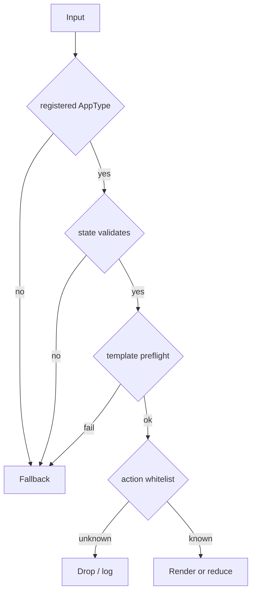

# 安全模型

Agent2View v0.1 的安全模型应保持短而可执行。

## 通用原则

原则：

1. Rich UI 只为注册 AppType 渲染。
2. 每个 AppType 校验自己的 state。
3. Robrix2 v1 template 必须本地静态。
4. 模板 preflight 必须拒绝未知 widget、未知 helper、未声明 state path。
5. 任意失败 fallback 到 plain text。
6. Action 必须按 AppType + action id 白名单分发。
7. Widget state 不得作为共享事实。

## aichat 安全边界

aichat 是本地 demo/runtime：

- 可以接收 LLM-generated `runsplash`。
- 可以使用 `agent.notify`。
- 必须限制 host action manifest。
- 必须校验 payload。
- 不应把任意 Agent 输出提升为系统权限。

## Robrix2 安全边界

Robrix2 是 Matrix client：

- 不接受 event-supplied Splash template。
- 不接受 runtime-generated template 作为 v1 生产路径。
- 不用 `agent.notify` 表达共享 action。
- 不通过本地 reducer 静默修改 mission truth。
- 不读取 `m.replace` edit 来改变 app state 或 action set。

## 失败即降级

Robrix2 的 rich rendering 是增强体验，不是消息可读性的唯一来源。

任何验证失败都必须降级到 `body`。这条规则让 Matrix timeline 保持可读，也避免出现第二条未经验证的 rich-render bypass。
