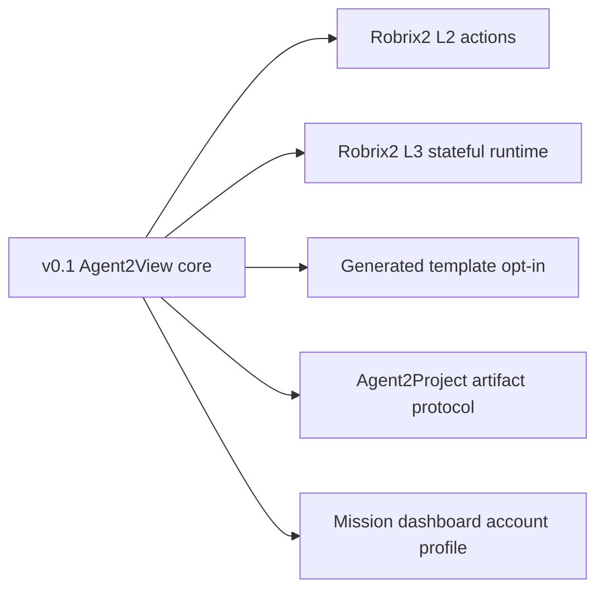

# 非目标与后续扩展

## 非目标

本规范 v0.1 不包含：

- Agent2Project artifact manifest。
- LLM-generated template 在 Robrix2 生产路径中运行。
- 插件市场。
- 动态 capability discovery。
- 自动 repair loop。
- 多 Agent resolver/template-author 分工协议。
- 客户端持久化 room/account scoped state。
- 递归 subtask/project-management 全功能模型。

## 后续扩展

可能的后续协议：

- Agent2Project artifact protocol。
- Robrix2 L2 action-capable cards。
- Robrix2 L3 stateful runtime。
- Generated template opt-in profile。
- Capability discovery protocol。
- Mission dashboard account scope profile。
- Multi-mission room routing rules。

这些扩展应各自有独立 spec，不应塞进 v0.1 Agent2View 核心协议。

