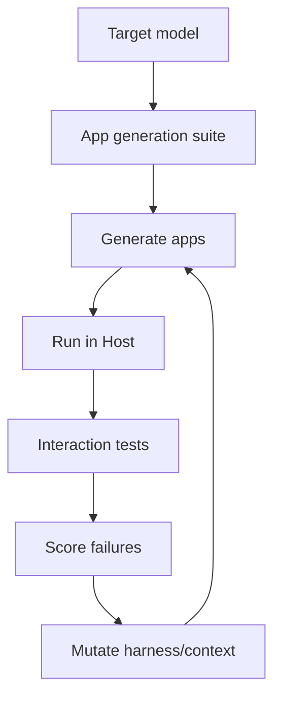
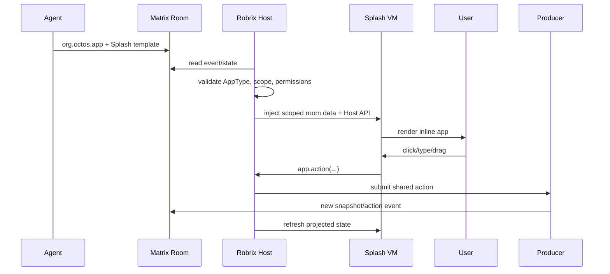
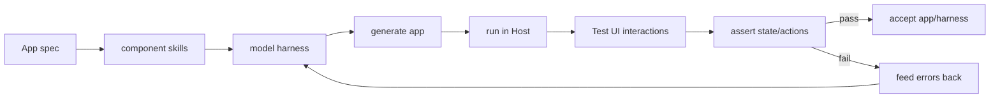
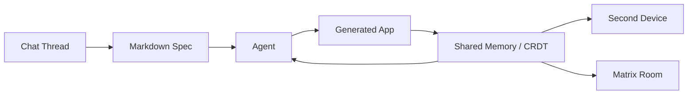
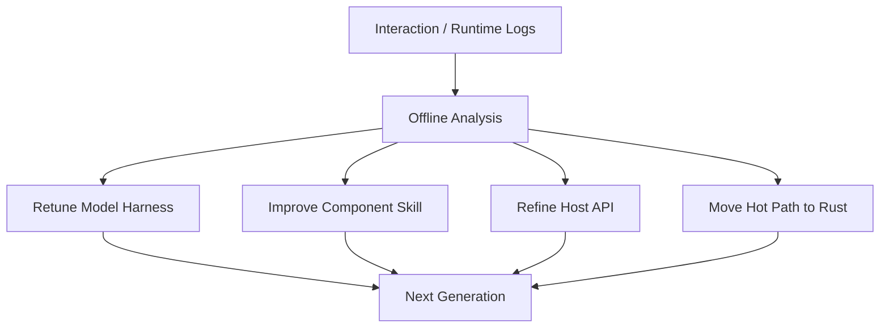

# 附录：会议讨论纪要与路线推导

本附录整理从 `Felo20260507094234.txt` 开始到后续多次追加的 Makepad/Splash/Agent2App 讨论。原始材料是会议自动转写，包含英文、中文与机器翻译混排，且存在误听词。本附录不逐字复刻转写，而是按讨论主线重建其技术含义、产品判断、分歧点和后续工程路线。

## 1. 讨论的核心问题

这组讨论围绕一个核心判断展开：

```text
Makepad 是否可以从跨平台 UI/图形框架，上升为 AI 时代的应用运行时？
```

这个问题被拆成多个子问题：

- Splash 是否适合作为 AI 生成 app 的目标语言？
- aichat 里的 inline `runsplash` 是否只是 demo，还是一个通用 Agent2App local binding？
- Robrix/Matrix 是否可以承载可共享、可协作、可持久的 AI-generated room app？
- `agent.notify` 是否应该继续暴露，还是演进为更明确的 Splash Host API？
- App state 应该在 generated app 内，还是由 Host/Room 持有？
- 如何让不同模型稳定生成可工作的 app？
- 如何测试生成出来的 UI/logic？
- 如何规避移动应用商店对“动态生成应用”的政策风险？

最终形成的方向是：

```text
Makepad + Robius + Splash
    -> AI-native cross-platform app runtime
    -> local interactive generated views
    -> room-native collaborative mini apps
    -> software factory for verified generated apps
```

## 2. 从图形层到 AI-native app runtime

讨论开始时回顾了 Makepad 的早期定位：它曾被介绍为可以替代 Skia 的图形层。这一定位太低层，难以完整表达 Makepad 在 AI coding 时代的价值。

新的定位更接近：

```text
Makepad as a cross-platform native app runtime for AI-generated applications.
```

原因包括：

- OpenHarmony、Android、桌面、Web、嵌入式屏幕都需要跨平台 UI 能力。
- 开发者不希望为不同平台重复开发同一应用。
- Flutter / React Native / KMP 已经证明跨平台需求真实存在。
- Makepad/Robius 能封装平台 API，又能保留自绘 GPU UI 能力。
- Splash 可以提供 AI 友好的动态应用语言。

讨论中把 Makepad 与 Flutter、React Native 做了区分：

| 路线 | 特点 | Makepad 的对应能力 |
| --- | --- | --- |
| Flutter-like | 自包含 UI runtime，自绘跨平台 | Makepad widgets + GPU renderer |
| React Native-like | 包装 native components | Robius / platform API wrappers |
| AI-native | 模型生成 UI/logic，Host runtime 执行 | Splash + Host API + harness |

这个定位不是简单替换现有框架，而是试图抓住一个新范式：AI 不只是辅助人写代码，而是直接生成运行时可接受的 app view、template、delta 或 component config。

## 3. Splash 的角色：不是替代 Rust，而是 AI 目标语言

会议中多次强调：对于 baked app，很多逻辑仍然更适合 Rust。Rust 更快、更安全，也更适合长期维护的应用代码。

Splash 的价值在另一个场景：

```text
AI-generated streaming app / inline app / room mini app
```

它的优势是：

- 比完整 Rust app 更短。
- 比 HTML/CSS/JS 更贴近 Makepad runtime。
- 可以流式生成、流式解析、逐步渲染。
- 可以作为 chat/room 中的 inline template。
- 可以注入 Host API，受控访问 data/state/actions。
- 可以表达 UI，也可以表达轻量逻辑。

讨论中的一个重要说法是：Splash 应成为 “最小 token 成本的可执行 app 表达”。这意味着 Splash 的目标不是功能最全，而是让模型能以尽量少的 token 表达一个可以被 Host 运行和验证的 view/app fragment。

## 4. AI 生成 UI 和生成可工作逻辑是两类问题

讨论中区分了两个阶段：

```text
UI generation:
    模型生成可看的界面。

Functional app generation:
    模型生成能正确响应事件、修改状态、计算结果的应用。
```

aichat 中 UI generation 已经比较成熟。通过 prompt、示例和 guard，模型可以较稳定生成漂亮的 card、dashboard、calculator UI、todo UI、heart-rate UI 等。

但 functional app generation 仍然暴露问题：

- calculator UI 能画出来，但 operator/equals 逻辑可能错。
- todo UI 能画出来，但 add/delete/toggle 不一定接通。
- input 如果每个字符触发整段 `runsplash` 重建，会失焦。
- LLM 可能生成 Host 不存在的 API。
- LLM 可能生成 Splash VM 不能解析的 shader/vector 代码。

因此，Agent2App 的评价标准不能停留在 “能画出来”。必须测试：

```text
click -> action -> state mutation -> template refresh -> UI still usable
```

## 5. Harness：面向模型的运行约束系统

讨论中 “harness” 是一个核心概念。它不是单个 prompt，而是让模型在最佳条件下生成 app 的约束包。

一个 harness 可以包含：

- Splash grammar 摘要。
- 可用 widget 示例。
- 可用 Host API manifest。
- component skills。
- AppType schema。
- state/data path。
- 禁止事项，例如不要写 shader callback、不要直接改 Host state。
- 运行时错误反馈。
- 测试失败信息。

Harness 应按模型动态调整。不同模型能力差距很大：

- Frontier model 可以生成复杂 UI 和部分新组件。
- 中等模型适合组合模板与组件。
- 小模型或 on-device model 应只填配置、选择组件、生成小 delta。

讨论里形成的判断是：

```text
同一个 harness 不会天然适配所有模型。
每个模型都需要评估、压缩、强化或重新生成 harness。
```

这引出 per-model harness eval：



## 6. Component skills：不要每次从零生成组件

讨论中多次提到 “skills”、“component memory”、“component library”。核心意思是：常见 app 类型有限，没必要每次让模型从零生成完整 UI 和逻辑。

候选 component skills：

- Todo / collection
- Calculator
- Timer
- Calendar / agenda
- Weather card
- Poll
- Trip planner
- Barcamp scheduler
- Mission Room
- Dashboard / -1 screen card

每个 component skill 可以包含：

- Splash template。
- 参数 schema。
- Host API 需求。
- state/data binding 示例。
- allowed actions。
- tests。
- prompt examples。

模型生成时只需要选择组件并填配置：

```text
"make a trip planner"
    -> load trip_planner skill
    -> generate data schema + view config
    -> bind app.collection / calendar APIs
    -> run tests
```

这比生成完整 widget tree 更可靠，也更适合小模型。

## 7. 从 agent.notify 到 Splash Host API

讨论里有人对 `agent.notify` 命名产生困惑。它听起来像 “agent 通知 AI” 或 “agent 通知 Host 有内容要渲染”。实际机制是：

```text
generated Splash view
    -> emits user intent
    -> Host validates action and payload
    -> Host mutates data/state or calls AI
```

因此，`agent.notify` 是当前低层 live wire，不是理想公开 API。

推荐演进：

```splash
app.action("inc", {})
app.input.set("new_item", text)
app.collection.add_from_input("items", "new_item")
ai.talk("explain this result")
```

兼容实现：

```text
app.collection.add_from_input("items", "new_item")
    -> app.action("app.collection.add_from_input", {...})
    -> internal SplashAction::Notify
    -> Host action dispatcher
```

这里的关键不是替换函数名，而是把自由字符串事件提升成结构化 Host API surface。这样 capability manifest 可以声明 API family，而不是只暴露任意事件字符串。

## 8. State ownership：状态不能放在 generated widget 里

会议中讨论到 PortalList/timeline 会回收不可见 widget。如果业务状态保存在 generated widget 实例里，滚动、重渲染或重新生成 view 都会丢状态。

正确边界是：

```text
Host / Matrix room:
    owns data and shared truth

HostState:
    owns local draft and local view state

Splash template:
    owns current rendering expression

Widget instance:
    owns only transient rendering resources
```

因此 aichat 的 input draft 应在 HostState，todo list 应在 Host data，Mission Room shared data 应在 Matrix event/state。Splash 只投影这些状态，不拥有它们。

## 9. Robrix/Matrix：从 chat message 到 room app

讨论的第二大主题是：如果 AI 生成了一个 personal app，能不能分享到 Matrix room，让别人也能看到并协作？

Matrix 提供了天然能力：

- room event log
- room state
- persistence
- synchronization
- membership / identity
- real-time collaboration

这使 Robrix/Matrix 成为 Agent2App 的远程场景。

现有 Matrix 已有 widget 概念，但它通常是 webview/iframe 风格。它能访问 room state，但重、客户端支持成本高、生态使用少。

Robrix + Splash 的机会是做轻量 native room app：

```text
Agent sends app envelope
Robrix validates it
Robrix injects room data projection into Splash VM
Splash renders inline room app
User action goes through Host API
Producer writes Matrix update
All clients refresh view
```

时序：



## 10. 共享数据，个性化视图

讨论里提出一个重要产品点：同一个 shared data 可以被不同用户用不同 view 呈现。

例如家庭 trip planner：

```text
shared data:
    itinerary
    participants
    tasks
    decisions

User A view:
    calendar layout

User B view:
    compact checklist

User C view:
    map-first layout
```

这比普通 Matrix widget 更强，因为 view 可以由 agent 为每个用户个性化生成，但数据仍是同一份 room truth。

## 11. Room artifact：Splash script 可以成为房间内容

新增讨论中确认了一个落点：Splash script 可以作为 Matrix room 内容的一部分存在，而不是外部 app package。

示例：

```json
{
  "org.octos.app": {
    "type": "room_poll",
    "scope": "room",
    "app_id": "poll.dinner",
    "data": {},
    "template": {
      "format": "splash",
      "code": "RoundedView{ ... }"
    },
    "capabilities": ["app.action", "app.collection"]
  }
}
```

这使它更像 rich interactive room content，而不是任意安装应用。

## 12. Software Factory：从 demo 到生产线

讨论后段提出 software factory。它的目标是把 app generation 做成可重复、可评估、可自动修复的流程。

核心闭环：



这里的测试必须包含交互，不只是静态检查：

- click 是否触发 action。
- TextInput 是否保留 focus。
- payload 是否符合 schema。
- state 是否正确更新。
- view refresh 是否保持输入状态。
- generated code 是否触发 VM 错误。

这也是解决 calculator/todo/timer 这类 demo 不稳定的正确路径。

## 13. One-shot 与迭代生成

讨论中 Rick 提到：AI 可以通过反馈循环生成可工作的 Makepad app，但 one-shot 仍然困难。目标不是否认迭代，而是为用户体验优化 one-shot 成功率。

思路是：

```text
offline:
    用自动测试循环优化 harness

online:
    用户请求时尽量 one-shot 成功
```

也就是说，迭代不一定发生在用户面前。可以在开发/评测阶段大量迭代，把结果沉淀成更强 harness、component skill 和 examples。

## 14. Splash streaming eval 与 VM hardening

当前 streaming eval 比较粗糙：持续把 token 塞进 VM，出错就忽略并继续。这能快速 demo，但需要 hardening。

讨论中提到的改进：

- 只在 scope/block 完整时 eval。
- incomplete code 不应污染 VM 状态。
- 无限循环要能中断。
- 不可恢复错误要隔离。
- 错误要结构化返回给 harness。
- 重复 eval 应减少闪烁和焦点丢失。

这对 AI streaming app 很关键。如果用户看到 UI 一边生成一边崩，体验会很差。

## 15. Native components 与平台限制

讨论中也涉及 native components。Makepad/Robius 可以包装平台组件，但不同平台的自动化和合成边界不同。

Apple 平台的限制尤其重要：

- native component 内容通常不能被应用读取。
- 自定义 shader glass warp 不能随意读取 Safari/银行页等内容。
- 透明 overlay 可以，但 readback-based blur/refraction 通常需要系统合成器或 screen capture 权限。

因此要区分：

| 类型 | 优点 | 限制 |
| --- | --- | --- |
| Makepad-native widget | 统一渲染、统一测试、可做 shader/vector/glass | 需要自己实现组件能力 |
| Platform-native component | 复用系统能力，与 React Native 类似 | 生命周期、测试、合成、权限 per-platform |

## 16. SVG、vector 与 shader

讨论中提到 SVG，但结论不是要依赖 SVG。更合理的是 Makepad-native vector/shader DSL。

原则：

- 小 icon、arrow、micro animation 适合 shader。
- 大面积复杂图形不应滥用 shader。
- 复杂 logo/插画更适合 vector/raster pipeline。
- Splash 可以定义比 SVG 更简洁、更适合 streaming parser 的表达。

这说明 Template encoding 可以是 Makepad-native，不必迁就 Web/SVG。

## 17. Web/WASM/WebGPU 是传播路径

讨论中提到 Makepad Web、WASM、WebGPU。Web 版本的意义不只是技术炫耀，而是降低体验门槛：

```text
protocol book
    + web AI chat demo
    + inline generated Splash app
    -> easier evangelism
```

如果 iOS App Store 对动态 runtime 有限制，Web/WASM 也是重要 fallback。

## 18. 分发与 App Store 风险

讨论后段集中在 Apple policy。核心风险不在“解释型语言”本身，而在：

```text
初审后下载/生成/执行会改变应用功能的新代码
绕过 App Review
变成 App Store 替代物
```

高风险宣传：

```text
generate any app
AI app store
run arbitrary downloaded apps
build full apps from prompts
```

低风险宣传：

```text
AI chat with rich interactive content
room-native collaborative widgets
configurable mini apps
predeclared calendar/poll/dashboard capabilities
```

因此 book 中的 `agent2view` / `agent2project` 分类很重要。aichat/Robrix 应优先讲 `agent2view`，不要把 App Store 版本包装成任意 app 生成器。

## 19. Product framing：不是 killer app，而是平台

讨论中有一句很关键：不是构建单个 killer app，而是构建 platform。

可能的 product story：

```text
AI chat becomes a workspace.
Workspace can generate interactive mini apps.
Mini apps can be shared.
Shared apps collaborate on room data.
Users collect and personalize app views.
```

这比 calculator demo 更有感染力。更好的 demo 是：

- family trip planner
- room poll plus
- barcamp scheduler
- mission room dashboard
- personal -1 screen dashboard
- smart home card

这些都需要共享状态、协作、持久化或个性化视图。

## 20. 第二设备、-1 screen 与个人 app collection

原始讨论中还有一条重要产品线：Agent2App 不只发生在聊天窗口里，也可能发生在用户随身携带的第二设备、个人仪表盘、`-1 screen` 或嵌入式小屏上。

这里提到的 `-1 screen` 类似手机主屏左侧的个人信息流：日程、天气、提醒、健康、设备状态、旅行安排等内容不是用户主动打开 app 后才出现，而是根据上下文自动推送。讨论中也类比了华为 Atom Services、Android 上的微应用、Apple/其他系统上的 widget 化体验。

这给 Agent2App 带来一个不同于 “chat message” 的视角：

```text
chat inline app:
    用户在对话中请求，Agent 返回一个可交互 view。

personal -1 screen:
    Host 根据用户活动、房间状态、日历、设备状态自动组织 view。

second-device app:
    一个小屏设备持续显示当前最相关的 generated view 或控制面板。
```

因此，Agent2App 的 product surface 可以分成三层：

| Surface | 触发方式 | 典型内容 | 状态来源 |
| --- | --- | --- | --- |
| Chat inline | 用户请求或 Agent 回复 | calculator、todo、poll、trip card | message scope / local HostState |
| Room app | 房间事件或协作任务 | mission room、barcamp scheduler、shared planner | Matrix room state/event |
| Personal dashboard | 上下文自动触发 | -1 screen、健康摘要、家庭设备卡片 | account scope / device connectors |

这也解释了为什么讨论中多次强调 “不是 killer app，而是 platform”。如果用户可以把 Agent 生成的 view 收藏、改造、分享，就会形成一个 personal app collection：

```text
Agent generates view
    -> user edits or personalizes it
    -> Host stores template + data binding
    -> user shares it to a room or device
    -> other users fork their own view while sharing data
```

这个方向要求协议区分：

- shared data：多人共享的事实，例如旅行计划、任务、投票、房间状态。
- personal view：每个用户自己的布局、过滤器、语言、可视化方式。
- device projection：同一 AppInstance 在手机、桌面、小屏、Web 上的不同呈现。

## 21. Workspace、CRDT 与多进程协作

讨论里还展示了一个 “chat app as workspace” 的思路。复杂 app 不是一次 prompt 就结束，而是需要一个工作区：

- chat thread：用户与 Agent 的协作记录。
- markdown spec：持续更新的需求、设计、约束。
- generated code/template：当前可运行 artifact。
- shared memory：Agent 与运行中 app 可以读写的结构化状态。
- open documents：Agent 能查看当前文档、运行中的 app 和 stored values。

这与 VS Code/浏览器式 harness 的区别是：Agent2App 的 Host 不只是聊天框，而是一个 workspace runtime。它可以启动 app、读取开放文档、列出 stored values、给 app 注入上下文，也可以把运行结果反馈给 Agent。

原始讨论中还提到了 CRDT/shared document 的方向。它不一定是 Agent2App 内核的一部分，但适合做多进程、多设备同步层：



这能解释两个后续扩展：

- 同一个 workspace 可以同时驱动桌面 app、移动端 preview、第二设备显示。
- 复杂 app 可以先从 spec workspace 演进，再变成可分享的 Agent2App artifact。

对于协议小册而言，这一段暂时不应进入核心内核，但应进入 roadmap：未来 `agent2project` 或复杂 `agent2view` 需要定义 workspace artifact、spec document、shared memory binding 和 artifact lifecycle。

### Agent2App Studio 与 Host 应分离

追加讨论进一步明确了一个产品边界：mini app generation harness 不应直接塞进 Robrix。Robrix 可以消费、运行、分享和协作 generated app，但不必承担完整的生成器、测试器和 spec workspace。

更合理的分层是：

```text
Agent2App Studio:
    chat with Agent
    edit spec / PRD / markdown workspace
    generate Splash template or app artifact
    run tests and produce receipt
    package/share the result

Agent2App Host:
    import artifact
    validate manifest and capabilities
    inject state/data
    render view
    dispatch actions
```

Robrix 是一个 Host，也是一个 room/collaboration surface；aichat 是一个 local demo Host；未来也可以有 Web Host、Android Host、WeChat-like Host 或 dedicated runner。把生成器与 Host 分开有几个好处：

- Robrix 不会因为集成完整 app factory 而变得过重。
- 独立 Studio 可以专注 harness、测试、spec、可信交付。
- 同一个 artifact 可以被多个 Host 打开或分享。
- 协议可以成为标准，而不是 Robrix 私有功能。

因此，讨论中形成的更清晰产品关系是：

```text
Studio creates.
Host runs.
Room shares.
Protocol connects them.
```

## 22. 设备连接器、本地 AI 与隐私边界

原始讨论中很大一部分围绕 personal AI、encrypted room、本地模型和智能家居展开。核心问题是：如果数据在加密房间、本地设备、家庭网络或用户私有服务里，远程 Agent 不一定有权读取。

因此 Agent2App 需要区分三类 Agent：

| Agent 类型 | 运行位置 | 适合访问的数据 | 风险 |
| --- | --- | --- | --- |
| Remote Agent | 云端模型服务 | 用户明确发送的 prompt、脱敏上下文、公开 API | 隐私边界强，不能直接读加密房间 |
| Local Agent | 用户设备 | 本地文件、加密 room cache、个人日历摘要 | 算力弱、平台限制多 |
| Home/Edge Agent | 家庭服务器、Home Assistant、Raspberry Pi 类设备 | 智能家居、传感器、局域网设备 | 设备异构、协议多、权限复杂 |

这对 Robrix/Molly 类场景很关键：如果用户希望 “早上醒来总结所有房间发生了什么”，而这些房间是端到端加密的，那么更自然的实现是本地模型在用户设备或可信 home server 上读取本地 room cache，而不是把明文发送给远程服务。

智能家居也是典型场景。讨论中提到洗衣机、洗碗机、电表、电子墨水屏、Home Assistant、开放协议设备等例子。这里 Agent2App 的价值不是替代所有设备 app，而是把设备协议、数据连接器和动态 view 组合起来：

```text
device connector:
    read status / submit command

Agent:
    understand user intent
    generate or select view

Host:
    enforce permission
    execute action
    render device dashboard
```

一个合理的抽象是：

```text
Data Source:
    Matrix room, calendar, health data, home device, file, MCP connector

Action Sink:
    room event, calendar update, Home Assistant call, device command

View:
    Splash template / A2UI compatible plan / native component projection
```

小设备要单独看待。Makepad 适合桌面、移动端、Web/WASM 和有 GPU/较强 CPU 的设备；它不是直接面向微控制器的 UI runtime。对几百 KB RAM 的控制器，更现实的路线是：

```text
microcontroller:
    specialized firmware / thin client / screen driver

phone or home server:
    Agent + Host runtime + state owner

small screen:
    receives projected view or simple command UI
```

这不是削弱 Makepad 的定位，而是让 Makepad 负责更适合它的层：跨平台 native UI、可交互 view、设备控制面板、Web/WASM demo 和 richer second-device experience。

### Rooted Android / Linux-box phone 作为研究设备

追加讨论中还提到一种更自由的实验形态：使用 rooted/unlocked Android phone，把手机当成接近 Linux box 的研究设备。它不是面向普通用户的首选产品形态，而是为了探索下一代 Agent UI、系统 API、后台运行、麦克风、设备控制和第二设备体验。

这种 research device profile 的价值是：

- 绕开部分普通移动应用沙箱限制，快速验证系统级体验。
- 可以长时间运行本地 Agent、语音监听或设备控制流程。
- 可以访问更多系统 API，探索 “Agent UI as operating environment”。
- 可以作为 Web/桌面/标准 Android 之前的高自由度实验场。

但它不应混入核心协议。协议应只描述 artifact、capability、state/action、Host validation；rooted Android 只是一个实现 profile：

```text
Standard Host:
    follows mobile platform rules
    uses declared capabilities
    suitable for product distribution

Research Device Host:
    has elevated device access
    useful for UI/system experiments
    not a baseline requirement
```

## 23. 可信交付：spec、测试凭证与 hash

原始讨论中还有一个很重要但此前附录没有展开的点：用户如何信任 Agent 生成的 app？

复杂 app 不能只给用户一个漂亮 UI。它还应该给出某种 “交付凭证”，类似消费品的 warranty card 或软件供应链里的 build/test receipt：

```text
This is what the app is supposed to do.
This is what input was given to the Agent.
This is what artifact was generated.
This is what tests passed.
This is what permissions it needs.
This is what changed since the last version.
```

对 `agent2view`，这个凭证可以很轻：

```json
{
  "app_id": "trip.family",
  "template_hash": "sha256:...",
  "data_schema_hash": "sha256:...",
  "input_summary": "family trip planner with shared tasks",
  "model": "frontier-model-x",
  "capabilities": ["app.action", "app.collection", "room.write"],
  "tests": [
    {"name": "add_task", "status": "pass"},
    {"name": "toggle_task", "status": "pass"}
  ]
}
```

对 `agent2project`，凭证应更重，可能包含 PRD、spec、源码 hash、依赖、测试录像、生成日志、人工审核记录和发布目标。

这与 workspace 方向相连：复杂 app 的 spec 应该是一个可读 markdown 文档，随着 Agent 构建过程更新。用户或审查者不必信任黑盒输出，而可以查看：

- 原始需求。
- Agent 对需求的分解。
- 生成的 template/code。
- 权限声明。
- 测试结果。
- 变更历史。

这也是推广 Agent2App 时很有价值的叙事：不是 “AI 生成了一个黑盒 app”，而是 “AI 生成了一个带规格、权限、测试和可追溯 hash 的可交互 artifact”。

### Splash app artifact：像文件一样分享和打开

追加讨论中最重要的新概念是：Splash app 不应只存在于 chat message 或 markdown code block 中。它应该能成为一种可保存、可拖拽、可分享、可由多个 Host 实现的 artifact。

讨论中用了图片文件的类比：

```text
drag image into browser
    -> browser displays image

drag Splash app into Robrix
    -> Robrix validates and renders app
```

这意味着 Agent2App 需要一个 artifact envelope。它可以是 `.splashapp` 文件、Matrix event content、share sheet payload、URL payload、zip/package，或 Host 内部存储对象，但核心字段应保持一致：

```json
{
  "agent2app_artifact": {
    "version": "0.1",
    "kind": "agent2view",
    "app_id": "trip.family",
    "title": "Family Trip Planner",
    "template": {
      "format": "splash",
      "hash": "sha256:...",
      "code": "RoundedView{ ... }"
    },
    "data_schema": {
      "hash": "sha256:...",
      "schema": {}
    },
    "capabilities": [
      "app.action",
      "app.collection",
      "room.write"
    ],
    "initial_data": {},
    "receipt": {
      "input_hash": "sha256:...",
      "tests": [
        {"name": "render", "status": "pass"},
        {"name": "add_task", "status": "pass"}
      ]
    }
  }
}
```

这个 artifact 应支持几种入口：

- Drag-and-drop：拖入 Robrix、aichat、Agent2App Studio 或其他 Host。
- Share sheet：从 Studio 分享到 room、聊天、设备或文件。
- Matrix event：作为 room content 持久化。
- Local file：保存、版本化、复制、审查。
- URL/deep link：Web demo 或移动端 preview。

关键点是：Robrix 只是其中一个 Host implementation，不是协议本身。如果 WeChat-like client、Web client、desktop runner 或其他 Makepad app 也实现同一 artifact contract，它们都应该能打开同一个 Agent2App artifact。

这也补强了 `agent2view` 与 `agent2project` 的边界：

```text
agent2view artifact:
    template + data schema + capabilities + receipt
    imported by an existing Host
    Host owns permission and execution boundary

agent2project artifact:
    file tree + package metadata + resources + build/run/export targets
    becomes an independent software project
    needs a heavier lifecycle and review process
```

## 24. Self-evolution：从日志中沉淀 runtime 和组件

当前附录已经提到 harness eval，但原始讨论还进一步提出了 self-evolution 或 “dream” 的概念：Host 不只是运行一次 app，而是可以在后台从历史交互、错误和性能数据里改进系统。

可以沉淀的内容包括：

- 哪些 generated view 被用户保留、删除、修改。
- 哪些 Host API 经常一起调用，是否应合并为更高层 API。
- 哪些 Splash function 热路径性能差，是否应下沉为 native Rust component。
- 哪些 component skill 的示例导致更多 VM/runtime 错误。
- 哪些模型在某类 AppType 上失败率高，需要更强 harness。
- 哪些 UI 在视觉上生成成功，但交互测试失败。

形成的闭环是：



这里要区分两种反馈：

- online repair：用户当前请求失败时，让 Agent 根据错误重试。
- offline evolution：夜间、充电时或 CI 中分析大量日志，改进 harness、skills、Host API 和 runtime。

原始讨论还提到 “只看代码是盲的”，必要时应引入视觉模型或截图评估。也就是说，软件工厂的测试不应只有结构和 action，还应覆盖：

- 视觉是否实际渲染出来。
- 关键内容是否在视口内。
- 波形、图表、图标等 generated visual 是否符合预期。
- 视觉效果是否因为 shader/vector 错误退化。

这能直接回应 aichat demo 中出现过的问题：UI code 生成了，但图没有画出；或者 view 能渲染，但点击、输入、焦点和 state refresh 不稳定。

## 25. App Store 边界的更细分判断

当前附录已经写了 Apple policy 风险，但原始讨论还有更细的判断：问题不只是 “解释型代码可不可以”，而是 primary purpose、动态功能变化、是否绕过审核、是否像 app store 替代物。

讨论中形成的可操作分层是：

| 形态 | 风险判断 | 原因 |
| --- | --- | --- |
| Chat app 中的 rich interactive content | 较低 | primary purpose 仍是 chat/collaboration |
| Matrix room app / poll / calendar picker | 较低到中等 | 类似消息内富内容，功能需预声明 |
| Predeclared configurable mini app | 较低 | Host 已声明能力，Agent 只配置数据/view |
| 任意 prompt 生成完整 app 并运行 | 高 | 容易被理解为绕过 App Review |
| AI app store / generated project runner | 高 | 接近替代 App Store |
| Web/WASM demo | 较低 | 浏览器/网页本身就是动态内容环境 |
| 单独 runner app | 不确定 | 取决于平台审核、分发方式和 primary purpose |

因此对 iOS 的落地叙事应避免：

```text
Make any app.
Run arbitrary downloaded apps.
AI App Store.
```

更稳妥的叙事是：

```text
Rich interactive chat content.
Room-native collaborative widgets.
Configurable mini apps inside a declared Host.
Personal dashboard views over user-approved data.
```

Android、Web/WASM、桌面和 TestFlight 可以承担更激进的实验展示；iOS App Store 版本应优先强调 chat/collaboration primary purpose、predeclared capabilities、用户授权数据源和可配置 view。

这个判断也强化了 `agent2view` / `agent2project` 的边界：`agent2view` 可以作为 Host 内的可交互内容；`agent2project` 涉及完整项目、二进制、发布和审核，必须另建协议与产品叙事。

Native client 也应按这个边界拆分。一个完整的 Agent2App Studio/native client 可以承担生成、测试和 artifact 管理；Robrix/iOS chat Host 则只承担导入、验证和运行已声明能力内的 artifact。这样更容易维持 primary purpose：

```text
Agent2App Studio:
    primary purpose = create and verify app artifacts

Robrix:
    primary purpose = chat / room collaboration
    Agent2App = rich interactive room content

Runner / Preview:
    primary purpose = preview declared app artifacts
    distribution risk depends on platform policy
```

## 26. 推广路线：problem statement、demo 与社区

原始讨论中多次提到，Agent2App 是一个很多人还没真正看见的问题。行业关注点仍多在 coding agent、text chat、tool calling，而不是 “Agent 直接生成、运行、测试、分享 app view”。

因此推广上需要三件东西同时出现：

```text
problem statement:
    为什么 text-only agent 不够？
    为什么 AI-generated app 需要 Host/runtime/protocol？

spec:
    Agent2App core kernel
    bindings and scenarios
    safety and validation

demo:
    aichat local inline app
    Robrix room app
    Web/WASM public demo
```

讨论中提到的潜在展示方向包括 OpenHarmony、Matrix、欧洲市场、第二设备和智能家居。这里不宜把会议中的口头日期当成正式计划写死，但可以提炼成产品策略：

- 用 Web/WASM demo 降低体验门槛。
- 用 Matrix/Robrix demo 展示 shared app 与 persistence。
- 用 `-1 screen` / smart home card 展示 personal dashboard。
- 用 component skills 和 test receipt 展示可信生成。
- 用 A2UI compatibility 展示生态兼容，而不是孤立发明。

社区策略上，可以先面向 enthusiast community：Home Assistant、Matrix、open-source Android ROM、Makepad/Rust 开发者、AI coding power users。这些用户更能理解本地控制、开放协议、隐私、动态 UI 和可验证生成的价值。

追加讨论还强调了标准化叙事：不要把它说成 “Robrix 有一个功能”，而要说成 “Robrix 实现了 Agent2App artifact/protocol”。如果协议能被 WeChat-like Host、Web client、native chat client、room app Host 实现，它的外部价值会更清楚。

可推广的表述是：

```text
Agent2App is a portable artifact and host protocol.
Robrix is one implementation.
aichat is one local development host.
Agent2App Studio is one creation environment.
Other hosts can implement the same import/render/action contract.
```

这与 A2UI 兼容方向一致：协议应该尽量定义 kernel、artifact、capability 和 binding，而不是绑定在某个具体产品名字上。

## 27. 推荐路线

综合讨论，可以把路线拆成以下阶段：

```text
Phase 0: Local AppGen
    aichat 稳定生成 inline runsplash。

Phase 1: Host API
    app.* API 替代 public agent.notify。

Phase 2: Verification Harness
    calculator/todo/timer/poll/calendar 进入自动测试。

Phase 3: Component Skills
    常见 mini app 组件化。

Phase 4: Robrix Room App
    Matrix event 承载 app envelope + Splash template。

Phase 5: Shared Collaboration
    action 写回 Matrix，所有成员同步 data，各自拥有 view。

Phase 6: Distribution Strategy
    Web/Android 激进展示；iOS 用 rich chat content + predeclared capabilities。

Phase 7: Workspace and Trust Receipts
    spec workspace、test receipt、hash、权限卡片进入 artifact lifecycle。

Phase 8: Device and Local AI Scenarios
    second device、-1 screen、Home Assistant、本地加密 room 总结进入 profile 探索。

Phase 9: Self-evolution
    用日志、测试和视觉评估持续改进 harness、skills、Host API 和 native components。

Phase 10: Portable Artifact
    定义 .splashapp / Agent2App artifact manifest，支持 drag-and-drop、share sheet、Matrix event、local file。

Phase 11: Multi-Host Standardization
    Robrix、aichat、Web Host、native runner、WeChat-like Host 共享 import/render/action contract。
```

## 28. 需要补进协议或实现的事项

协议侧：

- 定义 Agent2App artifact envelope / `.splashapp` manifest。
- 明确 Robrix 是 Host implementation，不是协议本身。
- 增加 import/render/action contract，支持其他 Host 实现。
- 增加 drag-and-drop、share-sheet、deep-link、Matrix event 等 artifact transport。
- 增加 Matrix Splash app binding。
- 明确 Template 可以是 room artifact。
- 明确 Host API capability family。
- 明确 generated view 不拥有 shared state。
- 明确 App Store 风险来自 `agent2project`，而不是所有 `agent2view`。
- 增加 workspace artifact、test receipt、template/data hash 的扩展点。
- 增加 Data Source / Action Sink / View 的连接器模型。

实现侧：

- `app.action` / `app.input` / `app.collection` / `ai.talk`。
- VM resource limit。
- streaming eval scope detection。
- structured runtime errors。
- remote/headless widget interaction test。
- screenshot/vision-based visual evaluation。
- per-model harness eval suite。
- component skill registry。
- self-evolution log pipeline。
- local Agent profile for encrypted room data。
- standalone Agent2App Studio prototype。
- artifact import/export in Robrix and aichat。
- multi-client Host API profiles：native、web、text/TUI、messaging、room Host。
- research device Host profile for rooted/unlocked Android。

文档/推广侧：

- 写 Agent2App problem statement。
- 准备 Makepad/Splash vs A2UI vs Matrix widget 对比。
- 做 Web/WASM 可体验 demo。
- 用 trip planner / room poll / mission room 替代 calculator 作为主 demo。
- 准备 `-1 screen`、second-device、smart home dashboard 的 demo story。
- 说明 iOS/Android/Web/desktop 的不同分发边界。
- 明确区分 Agent2App Studio、Host、Room、Runner 的产品职责。
- 把 “Robrix 实现协议” 而不是 “协议等于 Robrix” 写进推广材料。

## 29. 讨论形成的最终判断

这组讨论实际形成了一个清晰判断：

```text
Agent2App 不是“让 AI 生成任意 app 并绕过平台审核”。

Agent2App 是让 Agent 在 Host 的 data/state/action/permission 边界内，
生成、更新和个性化可交互 view。
```

Splash 是 Makepad 在这个方向上的关键工具。它需要 Host API、component skills、harness eval、VM hardening、trust receipt、portable artifact、workspace artifact、local Agent profile、多 Host import/render/action contract 和 Robrix/Matrix binding 才能从 demo 变成平台能力。
