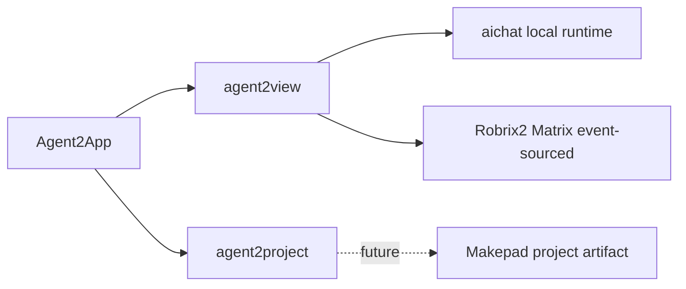

# 前言

[English](../en/) | [中文](../zh/)

这是一份面向 `agent2view` 的 Agent2App 协议小册。

它把两个已经出现的实现方向放在同一个语义框架下：

- `makepad-example-aichat`：本地 LLM 生成 `runsplash` 交互 UI，宿主用 `agent.notify` 接收动作并更新本地状态。
- Robrix2：Agent 通过 Matrix event 发送 `org.octos.app` envelope，客户端用注册 AppType 与静态 Splash template 渲染 IM 内原生应用卡片。

二者共同点是：Agent 产生 app view，Host 负责渲染、状态边界和动作边界。

二者关键差异是：aichat 的状态权威在本地 Host；Robrix2 的共享事实权威在 Matrix event。

本小册只定义 `agent2view`。`agent2project` 需要单独的 artifact protocol。

**阅读方式**

如果你关心协议核心，阅读第一部分。

如果你关心现有宿主如何落地，阅读第二部分。

如果你关心安全、版本与验证，阅读第三部分。
