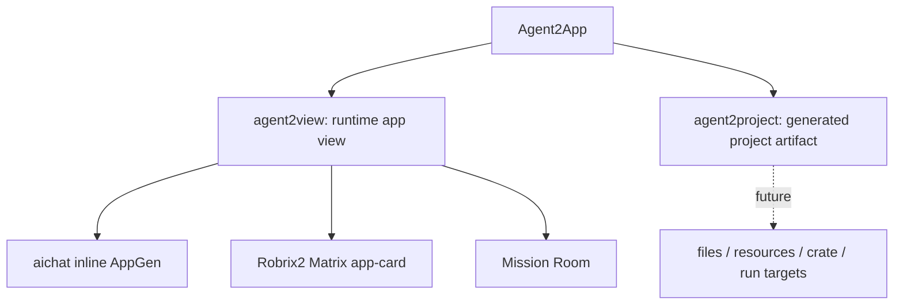
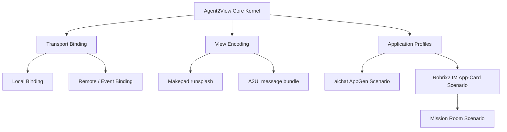

# 前言

[English](../en/) | [中文](../zh/)

Agent2App 是一个总称，表示 Agent 不只返回文本，而是把某种“应用能力”交给 Host。这个总称下面有两条产品路径，必须先分清：

- `agent2view`：Agent 生成或声明一个**宿主内的实时应用视图**。Host 拥有 data/state/view 边界、权限边界和 action 分发。aichat 的 inline `runsplash` UI、Robrix2 的 Matrix app-card、Mission Room 都属于这一路径。
- `agent2project`：Agent 生成一个**独立项目或应用工件**。输出不再是宿主内的一张 live view，而是文件树、资源、crate/package 元数据、状态模块、事件处理代码、运行/导出/打包目标等。

这份小册定义的是 `agent2view`，也就是“Agent 产生 app view，Host 负责安全渲染与 data/state/action 边界”的协议。`agent2project` 需要单独的 artifact protocol，不能直接复用 `agent2view` 的 capability manifest。

本版的核心修订是：`agent2view` 先定义一个**通用协议内核**，再定义不同 transport binding、view encoding 和应用场景。远程 Agent 与本地 Agent 使用同一个协议内核；差异只体现在消息承载、权限边界、data 提交流程、state 保存策略和宿主 profile 上。

**阅读方式**

如果你关心协议核心，阅读第一部分。这里定义本地 Agent 和远程 Agent 共享的对象模型、数据模型、状态模型、view 模型和 action 语义。

如果你关心现有宿主如何落地，阅读第二部分。aichat 与 Robrix2 都是通用内核上的应用场景。

如果你关心安全、版本与验证，阅读第三部分。
